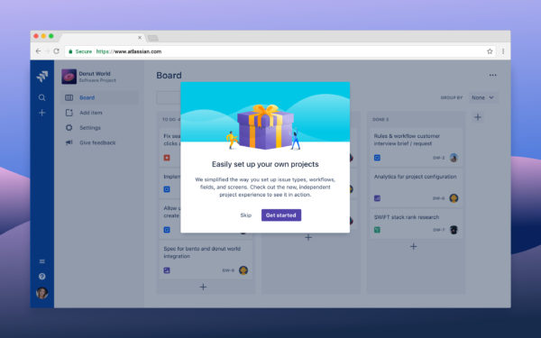
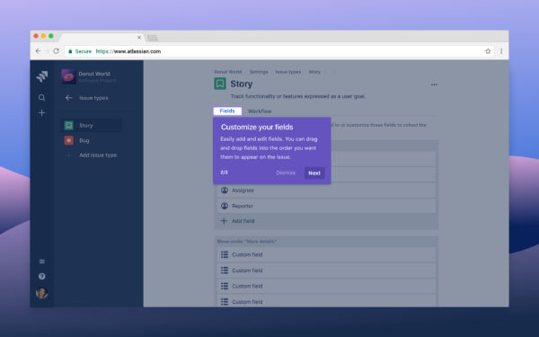
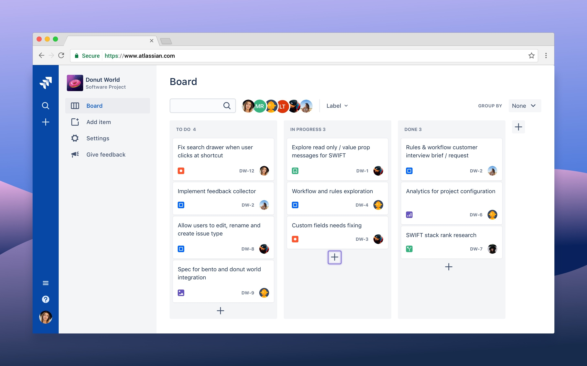
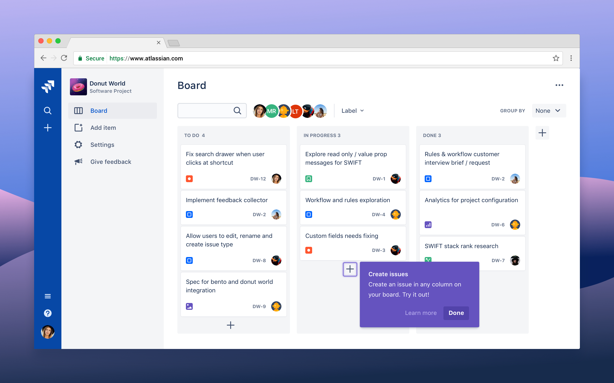
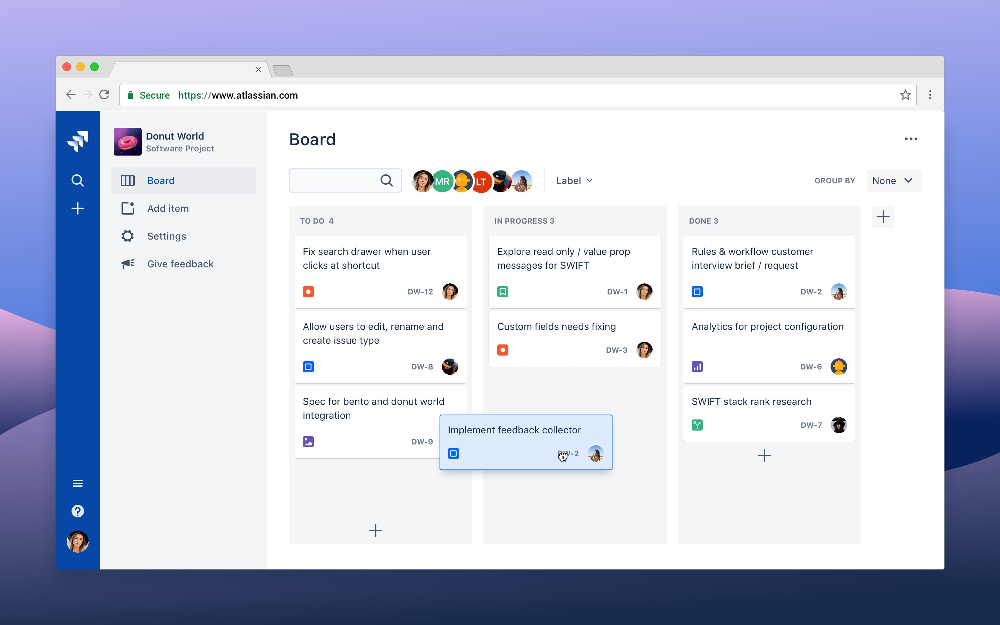
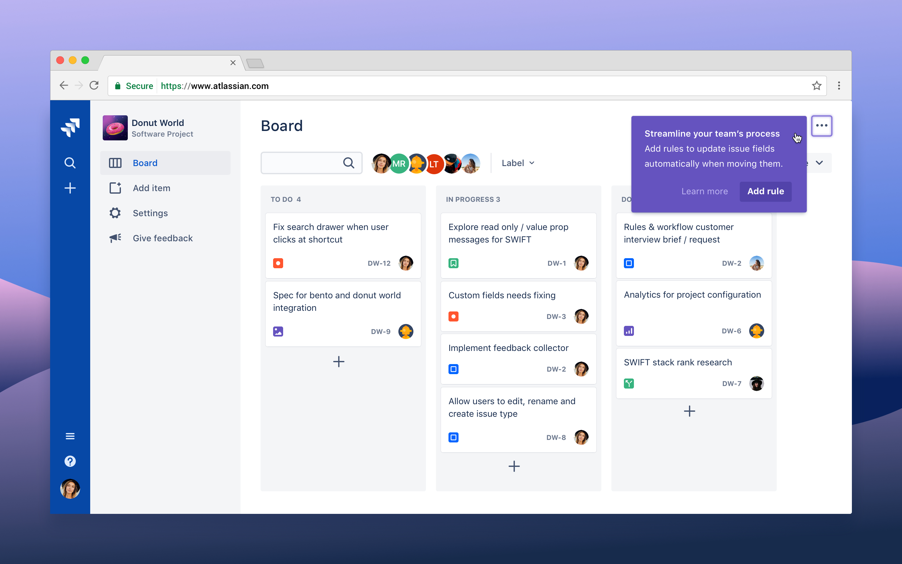

# Onboarding (spotlight)
An onboarding spotlight introduces new features to users through focused messages or multi-step tours.
Source page: https://atlassian.design/components/onboarding
Source package: `@atlaskit/onboarding@15.1.5`

## Examples

## Default

To implement a spotlight, you should first wrap your screen or app in a `SpotlightManager`. Where
you want to place a spotlight, import `Spotlight`, `SpotlightTarget` and `SpotlightTransition`.

`SpotlightTransition` will handle the animation of spotlights as they render in. It should wrap any
`Spotlight` components. `SpotlightTarget` should wrap your spotlight target.

**Example source:** [spotlight-single.tsx](./_source/examples/constellation/spotlight-single.tsx)

```tsx
import React, { useState } from 'react';

import Button, { IconButton } from '@atlaskit/button/new';
import CommentAddIcon from '@atlaskit/icon/core/comment-add';
// eslint-disable-next-line @atlaskit/design-system/use-spotlight-package
import {
	Spotlight,
	SpotlightManager,
	SpotlightTarget,
	SpotlightTransition,
} from '@atlaskit/onboarding';
import { token } from '@atlaskit/tokens';

const SpotlightTourExample = (): React.JSX.Element => {
	const [isSpotlightActive, setIsSpotlightActive] = useState(false);
	const start = () => setIsSpotlightActive(true);
	const end = () => setIsSpotlightActive(false);
	return (
		<SpotlightManager>
			<SpotlightTarget name="comment">
				<IconButton icon={CommentAddIcon} label="comment" />
			</SpotlightTarget>
			{/* eslint-disable-next-line @atlaskit/ui-styling-standard/enforce-style-prop -- Ignored via go/DSP-18766 */}
			<div style={{ marginTop: token('space.200') }}>
				<Button appearance="primary" onClick={() => start()}>
					Show example spotlight
				</Button>
			</div>
			<SpotlightTransition>
				{isSpotlightActive && (
					<Spotlight
						actions={[
							{
								onClick: () => end(),
								text: 'OK',
							},
						]}
						heading="Add a comment"
						target="comment"
						key="comment"
						targetRadius={3}
						targetBgColor={'#FFFFFF'}
					>
						Quickly add a comment to the work item.
					</Spotlight>
				)}
			</SpotlightTransition>
		</SpotlightManager>
	);
};

export default SpotlightTourExample;
```

## Tours

You can connect spotlights in multi-step onboarding tours. Only one spotlight should be shown at a
time.

**Example source:** [spotlight-tour.tsx](./_source/examples/constellation/spotlight-tour.tsx)

```tsx
import React, { useState } from 'react';

import ButtonGroup from '@atlaskit/button/button-group';
import Button, { IconButton } from '@atlaskit/button/new';
import CommentAddIcon from '@atlaskit/icon/core/comment-add';
import CopyIcon from '@atlaskit/icon/core/copy';
// eslint-disable-next-line @atlaskit/design-system/use-spotlight-package
import {
	Spotlight,
	SpotlightManager,
	SpotlightTarget,
	SpotlightTransition,
} from '@atlaskit/onboarding';
import { token } from '@atlaskit/tokens';

const SpotlightTourExample = (): React.JSX.Element => {
	const [activeSpotlight, setActiveSpotlight] = useState<null | number>(null);
	const start = () => setActiveSpotlight(0);
	const next = () => setActiveSpotlight((activeSpotlight || 0) + 1);
	const back = () => setActiveSpotlight((activeSpotlight || 1) - 1);
	const end = () => setActiveSpotlight(null);

	const renderActiveSpotlight = () => {
		const spotlights = [
			<Spotlight
				actions={[
					{
						onClick: () => next(),
						text: 'Next',
					},
					{ onClick: () => end(), text: 'Dismiss', appearance: 'subtle' },
				]}
				heading="Add a comment"
				target="comment"
				key="comment"
				targetRadius={3}
				targetBgColor={'#FFFFFF'}
			>
				Quickly add a comment to the work item.
			</Spotlight>,
			<Spotlight
				actions={[
					{ onClick: () => end(), text: 'OK' },
					{ onClick: () => back(), text: 'Go back', appearance: 'subtle' },
				]}
				heading="Copy code"
				target="copy"
				key="copy"
				targetRadius={3}
				targetBgColor={'#FFFFFF'}
			>
				Trying to bring one of our components into your project? Click to copy the example code,
				then go ahead paste it in your editor.
			</Spotlight>,
		];

		if (activeSpotlight === null) {
			return null;
		}

		return spotlights[activeSpotlight];
	};

	return (
		<SpotlightManager>
			<ButtonGroup label="Choose spotlight options">
				<SpotlightTarget name="comment">
					<IconButton icon={CommentAddIcon} label="comment" />
				</SpotlightTarget>
				<SpotlightTarget name="copy">
					<IconButton icon={CopyIcon} label="Copy" />
				</SpotlightTarget>
			</ButtonGroup>
			{/* eslint-disable-next-line @atlaskit/ui-styling-standard/enforce-style-prop -- Ignored via go/DSP-18766 */}
			<div style={{ marginTop: token('space.200') }}>
				<Button appearance="primary" onClick={() => start()}>
					Start example tour
				</Button>
			</div>
			<SpotlightTransition>{renderActiveSpotlight()}</SpotlightTransition>
		</SpotlightManager>
	);
};

export default SpotlightTourExample;
```

## Blanket tint

If you prefer the spotlight to appear without the tinted blanket background, set the
`blanketIsTinted` prop to `false` on the `SpotlightManager` component.

**Example source:** [spotlight-blanket-is-tinted.tsx](./_source/examples/constellation/spotlight-blanket-is-tinted.tsx)

```tsx
import React, { useState } from 'react';

import Button, { IconButton } from '@atlaskit/button/new';
import CommentAddIcon from '@atlaskit/icon/core/comment-add';
// eslint-disable-next-line @atlaskit/design-system/use-spotlight-package
import {
	Spotlight,
	SpotlightManager,
	SpotlightTarget,
	SpotlightTransition,
} from '@atlaskit/onboarding';
import { token } from '@atlaskit/tokens';

const SpotlightBlanketIsTintedExample = (): React.JSX.Element => {
	const [isSpotlightActive, setIsSpotlightActive] = useState(false);
	const start = () => setIsSpotlightActive(true);
	const end = () => setIsSpotlightActive(false);
	return (
		<SpotlightManager blanketIsTinted={false}>
			<SpotlightTarget name="comment">
				<IconButton icon={CommentAddIcon} label="comment" />
			</SpotlightTarget>
			{/* eslint-disable-next-line @atlaskit/ui-styling-standard/enforce-style-prop -- Ignored via go/DSP-18766 */}
			<div style={{ marginTop: token('space.200') }}>
				<Button appearance="primary" onClick={() => start()}>
					Show example spotlight
				</Button>
			</div>
			<SpotlightTransition>
				{isSpotlightActive && (
					<Spotlight
						actions={[
							{
								onClick: () => end(),
								text: 'OK',
							},
						]}
						heading="Add a comment"
						target="comment"
						key="comment"
						targetRadius={3}
						targetBgColor={'#FFFFFF'}
					>
						Quickly add a comment to the work item.
					</Spotlight>
				)}
			</SpotlightTransition>
		</SpotlightManager>
	);
};

export default SpotlightBlanketIsTintedExample;
```

## Actions

### Appearance

You can change the default action button appearance to `subtle` or `subtle-link` with the
`appearance` property on the action object. Spotlights should have only one default action that
leads people through the onboarding process or prompts an action, with other actions such as "Skip"
using the subtle appearance.

**Example source:** [spotlight-actions-appearance.tsx](./_source/examples/constellation/spotlight-actions-appearance.tsx)

```tsx
import React, { useState } from 'react';

import Button, { IconButton } from '@atlaskit/button/new';
import SearchIcon from '@atlaskit/icon/core/search';
// eslint-disable-next-line @atlaskit/design-system/use-spotlight-package
import {
	Spotlight,
	SpotlightManager,
	SpotlightTarget,
	SpotlightTransition,
} from '@atlaskit/onboarding';
import { token } from '@atlaskit/tokens';

const SpotlightActionsAppearance = (): React.JSX.Element => {
	const [isSpotlightActive, setIsSpotlightActive] = useState(false);
	const start = () => setIsSpotlightActive(true);
	const end = () => setIsSpotlightActive(false);
	return (
		<SpotlightManager>
			<SpotlightTarget name="action-button-appearances">
				<IconButton icon={SearchIcon} label="Example" />
			</SpotlightTarget>
			{/* eslint-disable-next-line @atlaskit/ui-styling-standard/enforce-style-prop -- Ignored via go/DSP-18766 */}
			<div style={{ marginTop: token('space.200') }}>
				<Button appearance="primary" onClick={() => start()}>
					Show example spotlight
				</Button>
			</div>
			<SpotlightTransition>
				{isSpotlightActive && (
					<Spotlight
						actions={[
							{ onClick: () => end(), text: 'Default' },
							{
								appearance: 'subtle',
								onClick: () => end(),
								text: 'Subtle',
							},
							{
								appearance: 'subtle-link',
								onClick: () => end(),
								text: 'Subtle link',
							},
						]}
						heading="Action button appearances"
						key="action-button-appearances"
						target="action-button-appearances"
						targetRadius={3}
						targetBgColor={'#FFFFFF'}
					>
						You can change the default action button appearance to `subtle` or `subtle-link`.
					</Spotlight>
				)}
			</SpotlightTransition>
		</SpotlightManager>
	);
};

export default SpotlightActionsAppearance;
```

### Actions before element

To add a left-aligned element before the action buttons, use the `actionsBeforeElement` prop. One
use case for this is adding a step number to an onboarding tour with 3 or more steps.

**Example source:** [spotlight-actions-before.tsx](./_source/examples/constellation/spotlight-actions-before.tsx)

```tsx
import React, { useState } from 'react';

import ButtonGroup from '@atlaskit/button/button-group';
import Button, { IconButton } from '@atlaskit/button/new';
import CommentAddIcon from '@atlaskit/icon/core/comment-add';
import CopyIcon from '@atlaskit/icon/core/copy';
import FullscreenEnterIcon from '@atlaskit/icon/core/fullscreen-enter';
// eslint-disable-next-line @atlaskit/design-system/use-spotlight-package
import {
	Spotlight,
	SpotlightManager,
	SpotlightTarget,
	SpotlightTransition,
} from '@atlaskit/onboarding';
import { token } from '@atlaskit/tokens';

const SpotlightActionsBefore = (): React.JSX.Element => {
	const [activeSpotlight, setActiveSpotlight] = useState<null | number>(null);
	const start = () => setActiveSpotlight(0);
	const next = () => setActiveSpotlight((activeSpotlight || 0) + 1);
	const back = () => setActiveSpotlight((activeSpotlight || 1) - 1);
	const end = () => setActiveSpotlight(null);

	const renderActiveSpotlight = () => {
		const spotlights = [
			<Spotlight
				actionsBeforeElement="1/3"
				actions={[
					{
						onClick: () => next(),
						text: 'Next',
					},
					{ onClick: () => end(), text: 'Dismiss', appearance: 'subtle' },
				]}
				heading="Add a comment"
				target="comment"
				key="comment"
				targetRadius={3}
				targetBgColor={'#FFFFFF'}
			>
				Quickly add a comment to the work item.
			</Spotlight>,
			<Spotlight
				actionsBeforeElement="2/3"
				actions={[
					{ onClick: () => next(), text: 'Next' },
					{ onClick: () => back(), text: 'Go back', appearance: 'subtle' },
					{ onClick: () => end(), text: 'Dismiss', appearance: 'subtle' },
				]}
				heading="Copy code"
				target="copy"
				key="copy"
				targetRadius={3}
				targetBgColor={'#FFFFFF'}
			>
				Trying to bring one of our components into your project? Click to copy the example code,
				then go ahead paste it in your editor.
			</Spotlight>,
			<Spotlight
				actionsBeforeElement="3/3"
				actions={[
					{ onClick: () => end(), text: 'OK' },
					{ onClick: () => back(), text: 'Go back', appearance: 'subtle' },
				]}
				heading="Expand to full screen"
				target="expand"
				key="expand"
				targetRadius={3}
				targetBgColor={'#FFFFFF'}
			>
				For a focused view of the example, you can expand to full screen.
			</Spotlight>,
		];

		if (activeSpotlight === null) {
			return null;
		}

		return spotlights[activeSpotlight];
	};

	return (
		<SpotlightManager>
			<ButtonGroup label="Choose spotlight options">
				<SpotlightTarget name="comment">
					<IconButton icon={CommentAddIcon} label="comment" />
				</SpotlightTarget>
				<SpotlightTarget name="copy">
					<IconButton icon={CopyIcon} label="Copy" />
				</SpotlightTarget>
				<SpotlightTarget name="expand">
					<IconButton icon={FullscreenEnterIcon} label="Full screen" />
				</SpotlightTarget>
			</ButtonGroup>
			{/* eslint-disable-next-line @atlaskit/ui-styling-standard/enforce-style-prop -- Ignored via go/DSP-18766 */}
			<div style={{ marginTop: token('space.200') }}>
				<Button appearance="primary" onClick={() => start()}>
					Start example tour
				</Button>
			</div>
			<SpotlightTransition>{renderActiveSpotlight()}</SpotlightTransition>
		</SpotlightManager>
	);
};

export default SpotlightActionsBefore;
```

## Heading

To add a heading to a spotlight, use the `heading` prop. For content guidance, see the
[usage tab](https://atlassian.design/components/onboarding/usage).

### Heading after element

The `headingAfterElement` prop allows you to place an element to the right of the heading. This is
sometimes used to implement a close icon button in a spotlight.

**Example source:** [spotlight-heading-after-element.tsx](./_source/examples/constellation/spotlight-heading-after-element.tsx)

```tsx
import React, { useState } from 'react';

import Button, { IconButton } from '@atlaskit/button/new';
import CommentAddIcon from '@atlaskit/icon/core/comment-add';
import CrossIcon from '@atlaskit/icon/core/cross';
// eslint-disable-next-line @atlaskit/design-system/use-spotlight-package
import {
	Spotlight,
	SpotlightManager,
	SpotlightTarget,
	SpotlightTransition,
} from '@atlaskit/onboarding';
import { token } from '@atlaskit/tokens';

const SpotlightHeadingAfterElement = (): React.JSX.Element => {
	const [isSpotlightActive, setIsSpotlightActive] = useState(false);
	const start = () => setIsSpotlightActive(true);
	const end = () => setIsSpotlightActive(false);
	return (
		<SpotlightManager>
			<SpotlightTarget name="comment">
				<IconButton icon={CommentAddIcon} label="comment" />
			</SpotlightTarget>
			{/* eslint-disable-next-line @atlaskit/ui-styling-standard/enforce-style-prop -- Ignored via go/DSP-18766 */}
			<div style={{ marginTop: token('space.200') }}>
				<Button appearance="primary" onClick={() => start()}>
					Show example spotlight
				</Button>
			</div>
			<SpotlightTransition>
				{isSpotlightActive && (
					<Spotlight
						headingAfterElement={
							<IconButton
								icon={CrossIcon}
								appearance="subtle"
								onClick={() => end()}
								label="Close"
							/>
						}
						actions={[
							{
								onClick: () => end(),
								text: 'OK',
							},
						]}
						heading="Add a comment"
						target="comment"
						key="comment"
						targetRadius={3}
						targetBgColor={'#FFFFFF'}
					>
						Quickly add a comment to the work item.
					</Spotlight>
				)}
			</SpotlightTransition>
		</SpotlightManager>
	);
};

export default SpotlightHeadingAfterElement;
```

## Image

You can add an image to a spotlight with the `image` prop. Most Atlassian illustrations are designed
to work with neutral backgrounds, so you may need brand design support to implement an ideal
spotlight image.

**Example source:** [spotlight-image.tsx](./_source/examples/constellation/spotlight-image.tsx)

```tsx
import React, { useState } from 'react';

import Button from '@atlaskit/button/new';
// eslint-disable-next-line @atlaskit/design-system/use-spotlight-package
import {
	Spotlight,
	SpotlightManager,
	SpotlightTarget,
	SpotlightTransition,
} from '@atlaskit/onboarding';
import { token } from '@atlaskit/tokens';

import spotlightImage from '../assets/this-is-new-jira.png';

const SpotlightImageExample = (): React.JSX.Element => {
	const [isSpotlightActive, setIsSpotlightActive] = useState(false);
	const start = () => setIsSpotlightActive(true);
	const end = () => setIsSpotlightActive(false);
	return (
		<SpotlightManager>
			<SpotlightTarget name="switch">
				<Button>Switch projects</Button>
			</SpotlightTarget>
			{/* eslint-disable-next-line @atlaskit/ui-styling-standard/enforce-style-prop -- Ignored via go/DSP-18766 */}
			<div style={{ marginTop: token('space.200') }}>
				<Button appearance="primary" onClick={() => start()}>
					Show example spotlight
				</Button>
			</div>
			<SpotlightTransition>
				{isSpotlightActive && (
					<Spotlight
						image={spotlightImage}
						actions={[
							{
								onClick: () => end(),
								text: 'OK',
							},
						]}
						target="switch"
						label="Switch projects"
						key="switch"
						targetRadius={3}
						targetBgColor={'#FFFFFF'}
					>
						Select the project name and icon to quickly switch between your most recent projects.
					</Spotlight>
				)}
			</SpotlightTransition>
		</SpotlightManager>
	);
};

export default SpotlightImageExample;
```

## Pulse

When spotlights are active, a pulsing outline helps draw attention to the target. It's possible for
you to use this spotlight pulse in custom ways. For example, you can apply the pulse on the target
element _before_ the spotlight is active, and trigger the spotlight the first time a person
interacts with it.

**Example source:** [spotlight-pulse.tsx](./_source/examples/constellation/spotlight-pulse.tsx)

```tsx
import React, { useState } from 'react';

import ButtonGroup from '@atlaskit/button/button-group';
import Button from '@atlaskit/button/new';
// eslint-disable-next-line @atlaskit/design-system/use-spotlight-package
import {
	Spotlight,
	SpotlightManager,
	SpotlightPulse,
	SpotlightTarget,
	SpotlightTransition,
} from '@atlaskit/onboarding';

const SpotlightPulseExample = (): React.JSX.Element => {
	const [isSpotlightActive, setIsSpotlightActive] = useState(false);
	const start = () => setIsSpotlightActive(true);
	const end = () => setIsSpotlightActive(false);
	return (
		<SpotlightManager>
			<ButtonGroup label="Choose spotlight options">
				<SpotlightTarget name="new">
					<SpotlightPulse radius={3} pulse={isSpotlightActive ? false : true}>
						<Button onClick={() => start()}>New feature</Button>
					</SpotlightPulse>
				</SpotlightTarget>
				<SpotlightTarget name="copy">
					<Button>Existing feature</Button>
				</SpotlightTarget>
			</ButtonGroup>
			<SpotlightTransition>
				{isSpotlightActive && (
					<Spotlight
						actions={[
							{
								onClick: () => end(),
								text: 'OK',
							},
						]}
						heading="Spotlight pulse"
						target="new"
						key="new"
						targetRadius={3}
						targetBgColor={'#FFFFFF'}
					>
						Announcing new features with a spotlight pulse is an onboarding pattern that you can
						explore.
					</Spotlight>
				)}
			</SpotlightTransition>
		</SpotlightManager>
	);
};

export default SpotlightPulseExample;
```

### Turning off the pulse

You can turn off the pulsing animation by setting the `pulse` prop to `false`.

**Example source:** [spotlight-pulse-false.tsx](./_source/examples/constellation/spotlight-pulse-false.tsx)

```tsx
import React, { useState } from 'react';

import ButtonGroup from '@atlaskit/button/button-group';
import Button from '@atlaskit/button/new';
// eslint-disable-next-line @atlaskit/design-system/use-spotlight-package
import {
	Spotlight,
	SpotlightManager,
	SpotlightPulse,
	SpotlightTarget,
	SpotlightTransition,
} from '@atlaskit/onboarding';

const SpotlightPulseExample = (): React.JSX.Element => {
	const [isSpotlightActive, setIsSpotlightActive] = useState(false);
	const start = () => setIsSpotlightActive(true);
	const end = () => setIsSpotlightActive(false);
	return (
		<SpotlightManager>
			<ButtonGroup label="Choose spotlight options">
				<SpotlightTarget name="new">
					<SpotlightPulse radius={3} pulse={false}>
						<Button onClick={() => start()}>New feature</Button>
					</SpotlightPulse>
				</SpotlightTarget>
				<SpotlightTarget name="copy">
					<Button>Existing feature</Button>
				</SpotlightTarget>
			</ButtonGroup>
			<SpotlightTransition>
				{isSpotlightActive && (
					<Spotlight
						actions={[
							{
								onClick: () => end(),
								text: 'OK',
							},
						]}
						heading="Spotlight pulse"
						target="new"
						key="new"
						targetRadius={3}
						targetBgColor={'#FFFFFF'}
						pulse={false}
					>
						Announcing new features with a spotlight pulse is an onboarding pattern that you can
						explore.
					</Spotlight>
				)}
			</SpotlightTransition>
		</SpotlightManager>
	);
};

export default SpotlightPulseExample;
```

## Dialog placement

By default, a spotlight dialog will be positioned to the "bottom left" relative to the target. You
can change this by setting your desired position in the `dialogPlacement` prop.

**Example source:** [spotlight-dialog-placement.tsx](./_source/examples/constellation/spotlight-dialog-placement.tsx)

```tsx
import React, { useState } from 'react';

import Button from '@atlaskit/button/standard-button';
import CrossIcon from '@atlaskit/icon/core/cross';
// eslint-disable-next-line @atlaskit/design-system/use-spotlight-package
import {
	Spotlight,
	SpotlightManager,
	SpotlightTarget,
	SpotlightTransition,
} from '@atlaskit/onboarding';
import { token } from '@atlaskit/tokens';

type Placement = (typeof options)[number];

const options = [
	'top right',
	'top center',
	'top left',
	'right bottom',
	'right middle',
	'right top',
	'bottom left',
	'bottom center',
	'bottom right',
	'left top',
	'left middle',
	'left bottom',
] as const;

const SpotlightDialogPlacement = (): React.JSX.Element => {
	const [isSpotlightActive, setIsSpotlightActive] = useState(false);
	const [dialogPlacement, setDialogPlacement] = useState(0);
	const start = () => setIsSpotlightActive(true);
	const end = () => setIsSpotlightActive(false);
	const shiftPlacementOption = () => {
		if (dialogPlacement !== options.length - 1) {
			return setDialogPlacement(dialogPlacement + 1);
		}
		return setDialogPlacement(0);
	};
	const placement = options[dialogPlacement];

	return (
		<SpotlightManager>
			<SpotlightTarget name="placement">
				<Button>Example target</Button>
			</SpotlightTarget>
			{/* eslint-disable-next-line @atlaskit/ui-styling-standard/enforce-style-prop -- Ignored via go/DSP-18766 */}
			<div style={{ marginTop: token('space.200') }}>
				<Button appearance="primary" onClick={() => start()}>
					Show example spotlight
				</Button>
			</div>
			<SpotlightTransition>
				{isSpotlightActive ? (
					<Spotlight
						heading={`Dialog placement: ${placement}`}
						headingAfterElement={
							<Button
								iconBefore={<CrossIcon label="Close" color={token('color.icon.inverse')} />}
								onClick={() => end()}
							/>
						}
						actions={[
							{
								onClick: () => shiftPlacementOption(),
								text: 'Shift dialog placement',
							},
						]}
						dialogPlacement={placement as Placement}
						target="placement"
						key="placement"
						targetRadius={3}
						targetBgColor={'#FFFFFF'}
					>
						You can set where the dialog should appear relative to the contents of the children. Try
						out the options by clicking the action below.
					</Spotlight>
				) : null}
			</SpotlightTransition>
		</SpotlightManager>
	);
};

export default SpotlightDialogPlacement;
```

## Dialog width

You can set a dialog width for a spotlight dialog with the `dialogWidth` prop. The minimum supported
width is `160px`, and the maximum is `600px`.

**Example source:** [spotlight-dialog-width.tsx](./_source/examples/constellation/spotlight-dialog-width.tsx)

```tsx
import React, { useState } from 'react';

import ButtonGroup from '@atlaskit/button/button-group';
import Button, { IconButton } from '@atlaskit/button/new';
import CommentAddIcon from '@atlaskit/icon/core/comment-add';
import CopyIcon from '@atlaskit/icon/core/copy';
import FullscreenEnterIcon from '@atlaskit/icon/core/fullscreen-enter';
// eslint-disable-next-line @atlaskit/design-system/use-spotlight-package
import {
	Spotlight,
	SpotlightManager,
	SpotlightTarget,
	SpotlightTransition,
} from '@atlaskit/onboarding';
import { token } from '@atlaskit/tokens';

const SpotlightDialogWidth = (): React.JSX.Element => {
	const [activeSpotlight, setActiveSpotlight] = useState<null | number>(null);
	const start = () => setActiveSpotlight(0);
	const next = () => setActiveSpotlight((activeSpotlight || 0) + 1);
	const back = () => setActiveSpotlight((activeSpotlight || 1) - 1);
	const end = () => setActiveSpotlight(null);

	const renderActiveSpotlight = () => {
		const spotlights = [
			<Spotlight
				dialogWidth={600}
				actionsBeforeElement="1/3"
				actions={[
					{
						onClick: () => next(),
						text: 'Next',
					},
					{ onClick: () => end(), text: 'Dismiss', appearance: 'subtle' },
				]}
				heading="Add a comment"
				target="comment"
				key="comment"
				targetRadius={3}
				targetBgColor={'#FFFFFF'}
			>
				Quickly add a comment to the work item.
			</Spotlight>,
			<Spotlight
				dialogWidth={400}
				actionsBeforeElement="2/3"
				actions={[
					{ onClick: () => next(), text: 'Next' },
					{ onClick: () => back(), text: 'Go back', appearance: 'subtle' },
					{ onClick: () => end(), text: 'Dismiss', appearance: 'subtle' },
				]}
				heading="Copy code"
				target="copy"
				key="copy"
				targetRadius={3}
				targetBgColor={'#FFFFFF'}
			>
				Trying to bring one of our components into your project? Click to copy the example code,
				then go ahead paste it in your editor.
			</Spotlight>,
			<Spotlight
				dialogWidth={250}
				actionsBeforeElement="3/3"
				actions={[
					{ onClick: () => end(), text: 'OK' },
					{ onClick: () => back(), text: 'Go back', appearance: 'subtle' },
				]}
				heading="Expand to full screen"
				target="expand"
				key="expand"
				targetRadius={3}
				targetBgColor={'#FFFFFF'}
			>
				For a focused view of the example, you can expand to full screen.
			</Spotlight>,
		];

		if (activeSpotlight === null) {
			return null;
		}

		return spotlights[activeSpotlight];
	};

	return (
		<SpotlightManager>
			<ButtonGroup label="Choose spotlight options">
				<SpotlightTarget name="comment">
					<IconButton icon={CommentAddIcon} label="comment" />
				</SpotlightTarget>
				<SpotlightTarget name="copy">
					<IconButton icon={CopyIcon} label="Copy" />
				</SpotlightTarget>
				<SpotlightTarget name="expand">
					<IconButton icon={FullscreenEnterIcon} label="Full screen" />
				</SpotlightTarget>
			</ButtonGroup>
			{/* eslint-disable-next-line @atlaskit/ui-styling-standard/enforce-style-prop -- Ignored via go/DSP-18766 */}
			<div style={{ marginTop: token('space.200') }}>
				<Button appearance="primary" onClick={() => start()}>
					Start example tour
				</Button>
			</div>
			<SpotlightTransition>{renderActiveSpotlight()}</SpotlightTransition>
		</SpotlightManager>
	);
};

export default SpotlightDialogWidth;
```

## Target border radius

The border radius of the spotlight target needs to be explicitly set. In the next example, the first
spotlight applies the default behavior, the second spotlight sets `targetRadius` to `3` to match a
target button, and the final spotlight has `targetRadius` to `24` to match a round target.

**Example source:** [spotlight-target-radius.tsx](./_source/examples/constellation/spotlight-target-radius.tsx)

```tsx
import React, { useState } from 'react';

import Avatar from '@atlaskit/avatar';
import ButtonGroup from '@atlaskit/button/button-group';
import Button, { IconButton } from '@atlaskit/button/new';
import CommentAddIcon from '@atlaskit/icon/core/comment-add';
import CopyIcon from '@atlaskit/icon/core/copy';
// eslint-disable-next-line @atlaskit/design-system/use-spotlight-package
import {
	Spotlight,
	SpotlightManager,
	SpotlightTarget,
	SpotlightTransition,
} from '@atlaskit/onboarding';
import { token } from '@atlaskit/tokens';

const SpotlightTargetRadius = (): React.JSX.Element => {
	const [activeSpotlight, setActiveSpotlight] = useState<null | number>(null);
	const start = () => setActiveSpotlight(0);
	const next = () => setActiveSpotlight((activeSpotlight || 0) + 1);
	const back = () => setActiveSpotlight((activeSpotlight || 1) - 1);
	const end = () => setActiveSpotlight(null);

	const renderActiveSpotlight = () => {
		const spotlights = [
			<Spotlight
				actions={[
					{
						onClick: () => next(),
						text: 'Next',
					},
					{ onClick: () => end(), text: 'Dismiss', appearance: 'subtle' },
				]}
				heading="Add a comment"
				target="comment"
				key="comment"
				targetBgColor={'#FFFFFF'}
			>
				Quickly add a comment to the work item.
			</Spotlight>,
			<Spotlight
				targetRadius={3}
				actions={[
					{ onClick: () => next(), text: 'Next' },
					{ onClick: () => back(), text: 'Go back', appearance: 'subtle' },
					{ onClick: () => end(), text: 'Dismiss', appearance: 'subtle' },
				]}
				heading="Copy code"
				target="copy"
				key="copy"
				targetBgColor={'#FFFFFF'}
			>
				Trying to bring one of our components into your project? Click to copy the example code,
				then go ahead paste it in your editor.
			</Spotlight>,
			<Spotlight
				targetRadius={24}
				actions={[
					{ onClick: () => end(), text: 'OK' },
					{ onClick: () => back(), text: 'Go back', appearance: 'subtle' },
				]}
				heading="Upload a profile picture"
				target="avatar"
				key="avatar"
				targetBgColor={'#FFFFFF'}
			>
				Having a profile picture helps you and your team by making your contributions more
				identifiable. If you'd rather remain mysterious, that's okay too! You do you.
			</Spotlight>,
		];

		if (activeSpotlight === null) {
			return null;
		}

		return spotlights[activeSpotlight];
	};

	return (
		<SpotlightManager>
			<ButtonGroup label="Choose spotlight options">
				<SpotlightTarget name="comment">
					<IconButton icon={CommentAddIcon} label="comment" />
				</SpotlightTarget>
				<SpotlightTarget name="copy">
					<IconButton icon={CopyIcon} label="Copy" />
				</SpotlightTarget>
			</ButtonGroup>
			<SpotlightTarget name="avatar">
				<Avatar />
			</SpotlightTarget>
			{/* eslint-disable-next-line @atlaskit/ui-styling-standard/enforce-style-prop -- Ignored via go/DSP-18766 */}
			<div style={{ marginTop: token('space.200') }}>
				<Button appearance="primary" onClick={() => start()}>
					Start example tour
				</Button>
			</div>
			<SpotlightTransition>{renderActiveSpotlight()}</SpotlightTransition>
		</SpotlightManager>
	);
};

export default SpotlightTargetRadius;
```

## Target background color

Sometimes the blanket can affect the background color of the target element. For example, subtle
buttons are semi-transparent, which causes them to look darker when the blanket is applied. In cases
like this, you can pass a color value to `targetBgColor` to make your target stand out properly.

**Example source:** [spotlight-target-background.tsx](./_source/examples/constellation/spotlight-target-background.tsx)

```tsx
import React, { useState } from 'react';

import ButtonGroup from '@atlaskit/button/button-group';
import Button, { IconButton } from '@atlaskit/button/new';
import CommentAddIcon from '@atlaskit/icon/core/comment-add';
import CopyIcon from '@atlaskit/icon/core/copy';
// eslint-disable-next-line @atlaskit/design-system/use-spotlight-package
import {
	Spotlight,
	SpotlightManager,
	SpotlightTarget,
	SpotlightTransition,
} from '@atlaskit/onboarding';
import { token } from '@atlaskit/tokens';

const SpotlightTargetBackground = (): React.JSX.Element => {
	const [activeSpotlight, setActiveSpotlight] = useState<null | number>(null);
	const start = () => setActiveSpotlight(0);
	const next = () => setActiveSpotlight((activeSpotlight || 0) + 1);
	const back = () => setActiveSpotlight((activeSpotlight || 1) - 1);
	const end = () => setActiveSpotlight(null);

	const renderActiveSpotlight = () => {
		const spotlights = [
			<Spotlight
				actions={[
					{
						onClick: () => next(),
						text: 'Next',
					},
					{ onClick: () => end(), text: 'Dismiss', appearance: 'subtle' },
				]}
				heading="No targetBgColor set"
				target="comment"
				key="comment"
				targetRadius={3}
			>
				You can see that even though the spotlight pulse surrounds the button, it no longer stands
				out on the page.
			</Spotlight>,
			<Spotlight
				targetBgColor={'#FFFFFF'}
				actions={[
					{ onClick: () => end(), text: 'OK' },
					{ onClick: () => back(), text: 'Go back', appearance: 'subtle' },
				]}
				heading="With targetBg set"
				target="copy"
				key="copy"
				targetRadius={3}
			>
				Setting the `targetBgColor` ensures that the cloned spotlight target has all the context it
				needs to stand out properly.
			</Spotlight>,
		];

		if (activeSpotlight === null) {
			return null;
		}

		return spotlights[activeSpotlight];
	};

	return (
		<SpotlightManager>
			<ButtonGroup label="Choose spotlight options">
				<SpotlightTarget name="comment">
					<IconButton icon={CommentAddIcon} label="comment" />
				</SpotlightTarget>
				<SpotlightTarget name="copy">
					<IconButton icon={CopyIcon} label="Copy" />
				</SpotlightTarget>
			</ButtonGroup>
			{/* eslint-disable-next-line @atlaskit/ui-styling-standard/enforce-style-prop -- Ignored via go/DSP-18766 */}
			<div style={{ marginTop: token('space.200') }}>
				<Button appearance="primary" onClick={() => start()}>
					Start example tour
				</Button>
			</div>
			<SpotlightTransition>{renderActiveSpotlight()}</SpotlightTransition>
		</SpotlightManager>
	);
};

export default SpotlightTargetBackground;
```

## Target replacement

You can replace the original target with another component using the `targetReplacement` prop.

**Example source:** [spotlight-target-replacement.tsx](./_source/examples/constellation/spotlight-target-replacement.tsx)

```tsx
/**
 * @jsxRuntime classic
 * @jsx jsx
 */
import { type ImgHTMLAttributes, useState } from 'react';

import { css, jsx } from '@compiled/react';

import Button from '@atlaskit/button/new';
// eslint-disable-next-line @atlaskit/design-system/use-spotlight-package
import {
	Spotlight,
	SpotlightManager,
	SpotlightPulse,
	SpotlightTarget,
	SpotlightTransition,
} from '@atlaskit/onboarding';
import { token } from '@atlaskit/tokens';

import logoInverted from '../assets/logo-inverted.png';
import logo from '../assets/logo.png';

const Replacement = (rect: any) => {
	const style = { overflow: 'hidden', ...rect };

	return (
		// eslint-disable-next-line @atlaskit/ui-styling-standard/enforce-style-prop -- Ignored via go/DSP-18766
		<SpotlightPulse style={style}>
			<Image alt="I replace the target element." src={logoInverted} />
		</SpotlightPulse>
	);
};

const imageStyles = css({
	width: '128px',
	height: '128px',
});

const Image = ({ alt, src }: ImgHTMLAttributes<HTMLImageElement>) => (
	
);

const SpotlightTargetReplacementExample = (): JSX.Element => {
	const [isSpotlightActive, setIsSpotlightActive] = useState(false);
	const start = () => setIsSpotlightActive(true);
	const end = () => setIsSpotlightActive(false);
	return (
		<SpotlightManager>
			{/* eslint-disable-next-line @atlaskit/ui-styling-standard/enforce-style-prop -- Ignored via go/DSP-18766 */}
			
			<SpotlightTarget name="target-replacement-example">
				<Image alt="I will be replaced..." src={logo} />
			</SpotlightTarget>
			{/* eslint-disable-next-line @atlaskit/ui-styling-standard/enforce-style-prop -- Ignored via go/DSP-18766 */}
			<div style={{ marginTop: token('space.200') }}>
				<Button appearance="primary" onClick={() => start()}>
					Show example spotlight
				</Button>
			</div>
			<SpotlightTransition>
				{isSpotlightActive && (
					<Spotlight
						targetReplacement={Replacement}
						actions={[{ onClick: () => end(), text: 'OK' }]}
						dialogPlacement="bottom left"
						key="target-replacement-example"
						heading="Target replacement"
						target="target-replacement-example"
						targetRadius={3}
					>
						You can replace the original target with another component using the `targetReplacement`
						prop.
					</Spotlight>
				)}
			</SpotlightTransition>
		</SpotlightManager>
	);
};

export default SpotlightTargetReplacementExample;
```

## Conditional spotlight targets

You can use the `useSpotlight` hook to check if a spotlight target is rendered or not. This allows
you to conditionally add steps into a spotlight tour.

**Example source:** [spotlight-conditional-targets.tsx](./_source/examples/constellation/spotlight-conditional-targets.tsx)

```tsx
import React, { useState } from 'react';

import ButtonGroup from '@atlaskit/button/button-group';
import Button, { IconButton } from '@atlaskit/button/new';
import CommentAddIcon from '@atlaskit/icon/core/comment-add';
import CopyIcon from '@atlaskit/icon/core/copy';
import FullscreenEnterIcon from '@atlaskit/icon/core/fullscreen-enter';
// eslint-disable-next-line @atlaskit/design-system/use-spotlight-package
import {
	Spotlight,
	SpotlightManager,
	SpotlightTarget,
	SpotlightTransition,
	useSpotlight,
} from '@atlaskit/onboarding';
import { token } from '@atlaskit/tokens';

const SpotlightWithConditionalTargets = () => {
	const [active, setActive] = useState<number | null>(null);
	const [isSecondTargetVisible, setIsSecondTargetVisible] = useState(true);
	const { isTargetRendered } = useSpotlight();

	const start = () => setActive(0);
	const next = () => setActive((active || 0) + 1);
	const back = () => setActive((active || 0) - 1);
	const end = () => setActive(null);

	const renderActiveSpotlight = () => {
		if (active == null) {
			return null;
		}

		const spotlights = [
			{
				target: 'comment',
				element: (
					<Spotlight
						actions={[
							{
								onClick: () => next(),
								text: 'Next',
							},
							{ onClick: () => end(), text: 'Dismiss', appearance: 'subtle' },
						]}
						heading="Add a comment"
						target="comment"
						key="comment"
						targetRadius={3}
						targetBgColor={'#FFFFFF'}
					>
						Quickly add a comment to the work item.
					</Spotlight>
				),
			},
			{
				target: 'copy',
				element: (
					<Spotlight
						actions={[
							{ onClick: () => next(), text: 'Next' },
							{ onClick: () => back(), text: 'Go back', appearance: 'subtle' },
							{ onClick: () => end(), text: 'Dismiss', appearance: 'subtle' },
						]}
						heading="Copy code"
						target="copy"
						key="copy"
						targetRadius={3}
						targetBgColor={'#FFFFFF'}
					>
						Trying to bring one of our components into your project? Click to copy the example code,
						then go ahead paste it in your editor.
					</Spotlight>
				),
			},
			{
				target: 'expand',
				element: (
					<Spotlight
						actions={[
							{ onClick: () => end(), text: 'OK' },
							{ onClick: () => back(), text: 'Go back', appearance: 'subtle' },
						]}
						heading="Expand to full screen"
						target="expand"
						key="expand"
						targetRadius={3}
						targetBgColor={'#FFFFFF'}
					>
						For a focused view of the example, you can expand to full screen.
					</Spotlight>
				),
			},
		]
			.filter(({ target }) => isTargetRendered(target))
			.map(({ element }) => element);

		return spotlights[active];
	};

	return (
		<>
			<ButtonGroup label="Choose spotlight options">
				<SpotlightTarget name="comment">
					<IconButton icon={CommentAddIcon} label="comment" />
				</SpotlightTarget>
				{isSecondTargetVisible && (
					<SpotlightTarget name="copy">
						<IconButton icon={CopyIcon} label="Copy" />
					</SpotlightTarget>
				)}
				<SpotlightTarget name="expand">
					<IconButton icon={FullscreenEnterIcon} label="Full screen" />
				</SpotlightTarget>
			</ButtonGroup>
			{/* eslint-disable-next-line @atlaskit/ui-styling-standard/enforce-style-prop -- Ignored via go/DSP-18766 */}
			<div style={{ marginTop: token('space.200') }}>
				<ButtonGroup label="Choose spotlight options">
					<Button appearance="primary" onClick={() => start()}>
						Start example tour
					</Button>
					<Button onClick={() => setIsSecondTargetVisible(!isSecondTargetVisible)}>
						Show/hide second spotlight target
					</Button>
				</ButtonGroup>
			</div>
			<SpotlightTransition>{renderActiveSpotlight()}</SpotlightTransition>
		</>
	);
};

export default function SpotlightWithConditionalTargetsExample(): React.JSX.Element {
	return (
		<SpotlightManager>
			<SpotlightWithConditionalTargets />
		</SpotlightManager>
	);
}
```

## Props

### `@atlaskit/onboarding` — `Spotlight`

| Prop | Required | Type | Description | Deprecated |
| --- | --- | --- | --- | --- |
| `actions` | No | `Action[]` | Buttons to render in the footer. | No |
| `actionsBeforeElement` | No | `string \| number \| boolean \| React.ReactElement<any, string \| React.JSXElementConstructor<any>> \| Iterable<React.ReactNode> \| React.ReactPortal` | An optional node to be rendered beside the footer actions. | No |
| `children` | No | `string \| number \| boolean \| React.ReactElement<any, string \| React.JSXElementConstructor<any>> \| Iterable<React.ReactNode> \| React.ReactPortal` | The elements rendered in the modal. | No |
| `dialogPlacement` | No | `"top left" \| "top center" \| "top right" \| "right top" \| "right middle" \| "right bottom" \| "bottom left" \| "bottom center" \| "bottom right" \| "left top" \| "left middle" \| "left bottom"` | Where the dialog should appear, relative to the contents of the children. | No |
| `dialogWidth` | No | `number` | The width of the dialog in pixels. The minimum possible width is 160px and the maximum width is 600px. | No |
| `footer` | No | `React.ComponentClass<any, any> \| React.FunctionComponent<any>` | Optional element rendered below the body. | No |
| `header` | No | `React.ComponentClass<any, any> \| React.FunctionComponent<any>` | Optional element rendered above the body. | No |
| `heading` | No | `string` | Heading text rendered above the body. | No |
| `headingAfterElement` | No | `string \| number \| boolean \| React.ReactElement<any, string \| React.JSXElementConstructor<any>> \| Iterable<React.ReactNode> \| React.ReactPortal` | An optional element rendered to the right of the heading. | No |
| `image` | No | `string` | Path to the image. | No |
| `label` | No | `string` | Refers to an `aria-label` attribute. Sets an accessible name for the spotlight dialog wrapper to announce it to users of assistive technology.<br>Usage of either this, or the `titleId` prop is strongly recommended to improve accessibility. | No |
| `pulse` | No | `boolean` | Whether or not to display a pulse animation around the spotlighted element. | No |
| `scrollPositionBlock` | No | `"start" \| "center" \| "end" \| "nearest"` | Used set the 'block' attribute on scrollIntoView, which determines the vertical alignment of the target node to the nearest scrollable ancestor. | No |
| `shouldWatchTarget` | No | `boolean` | Whether the spotlight should check for changes to the spotlighted element or its position.<br>This prop may negatively affect performance and should be used only if layout shifts are causing the spotlight to be positioned incorrectly. | No |
| `target` | No | `string` | The name of the SpotlightTarget. | No |
| `targetBgColor` | No | `string` | The background color of the element being highlighted. | No |
| `targetNode` | No | `HTMLElement` | The spotlight target node. | No |
| `targetOnClick` | No | `(eventData: { event: React.MouseEvent<HTMLElement, MouseEvent>; target?: string; }) => void` | Function to fire when a person clicks on the cloned target. | No |
| `targetRadius` | No | `string \| number` | The border radius of the element being highlighted. | No |
| `targetReplacement` | No | `React.ComponentClass<any, any> \| React.FunctionComponent<any>` | Alternative element to render than the wrapped target. | No |
| `testId` | No | `string` | This prop is a unique string that appears as an attribute `data-testid` in the rendered HTML output serving as a hook for automated tests.<br>Defaults to `"spotlight"`.<br>As this component is composed of multiple components we use this `testId` as a prefix:<br>- `"${testId}--dialog"` to identify the spotlight dialog<br>- `"${testId}--target"` to identify the spotlight target clone | No |
| `titleId` | No | `string` | Refers to a value of an `aria-labelledby` attribute. References an element to define accessible name for the spotlight dialog.<br>Usage of either this, or the `label` prop is strongly recommended to improve accessibility. | No |

### `@atlaskit/onboarding` — `SpotlightManager`

| Prop | Required | Type | Description | Deprecated |
| --- | --- | --- | --- | --- |
| `blanketIsTinted` | No | `boolean` | Boolean prop for toggling blanket transparency. | No |
| `children` | Yes | `string \| number \| boolean \| ReactElement<any, string \| JSXElementConstructor<any>> \| Iterable<ReactNode> \| ReactPortal` | Typically the app, or a section of the app. | No |
| `component` | No | `"symbol" \| "object" \| "footer" \| ComponentType<any> \| "header" \| "image" \| "label" \| "center" \| "a" \| "abbr" \| "address" \| "area" \| "article" \| "aside" \| "audio" \| ... 163 more ... \| "view"` | @deprecated<br>Component is deprecated and will be removed in the future. | Yes |
| `onBlanketClicked` | No | `() => void` | Handler function to be called when the blanket is clicked. | No |

## Spotlight manager props

### `@atlaskit/onboarding` — `Spotlight`

| Prop | Required | Type | Description | Deprecated |
| --- | --- | --- | --- | --- |
| `actions` | No | `Action[]` | Buttons to render in the footer. | No |
| `actionsBeforeElement` | No | `string \| number \| boolean \| React.ReactElement<any, string \| React.JSXElementConstructor<any>> \| Iterable<React.ReactNode> \| React.ReactPortal` | An optional node to be rendered beside the footer actions. | No |
| `children` | No | `string \| number \| boolean \| React.ReactElement<any, string \| React.JSXElementConstructor<any>> \| Iterable<React.ReactNode> \| React.ReactPortal` | The elements rendered in the modal. | No |
| `dialogPlacement` | No | `"top left" \| "top center" \| "top right" \| "right top" \| "right middle" \| "right bottom" \| "bottom left" \| "bottom center" \| "bottom right" \| "left top" \| "left middle" \| "left bottom"` | Where the dialog should appear, relative to the contents of the children. | No |
| `dialogWidth` | No | `number` | The width of the dialog in pixels. The minimum possible width is 160px and the maximum width is 600px. | No |
| `footer` | No | `React.ComponentClass<any, any> \| React.FunctionComponent<any>` | Optional element rendered below the body. | No |
| `header` | No | `React.ComponentClass<any, any> \| React.FunctionComponent<any>` | Optional element rendered above the body. | No |
| `heading` | No | `string` | Heading text rendered above the body. | No |
| `headingAfterElement` | No | `string \| number \| boolean \| React.ReactElement<any, string \| React.JSXElementConstructor<any>> \| Iterable<React.ReactNode> \| React.ReactPortal` | An optional element rendered to the right of the heading. | No |
| `image` | No | `string` | Path to the image. | No |
| `label` | No | `string` | Refers to an `aria-label` attribute. Sets an accessible name for the spotlight dialog wrapper to announce it to users of assistive technology.<br>Usage of either this, or the `titleId` prop is strongly recommended to improve accessibility. | No |
| `pulse` | No | `boolean` | Whether or not to display a pulse animation around the spotlighted element. | No |
| `scrollPositionBlock` | No | `"start" \| "center" \| "end" \| "nearest"` | Used set the 'block' attribute on scrollIntoView, which determines the vertical alignment of the target node to the nearest scrollable ancestor. | No |
| `shouldWatchTarget` | No | `boolean` | Whether the spotlight should check for changes to the spotlighted element or its position.<br>This prop may negatively affect performance and should be used only if layout shifts are causing the spotlight to be positioned incorrectly. | No |
| `target` | No | `string` | The name of the SpotlightTarget. | No |
| `targetBgColor` | No | `string` | The background color of the element being highlighted. | No |
| `targetNode` | No | `HTMLElement` | The spotlight target node. | No |
| `targetOnClick` | No | `(eventData: { event: React.MouseEvent<HTMLElement, MouseEvent>; target?: string; }) => void` | Function to fire when a person clicks on the cloned target. | No |
| `targetRadius` | No | `string \| number` | The border radius of the element being highlighted. | No |
| `targetReplacement` | No | `React.ComponentClass<any, any> \| React.FunctionComponent<any>` | Alternative element to render than the wrapped target. | No |
| `testId` | No | `string` | This prop is a unique string that appears as an attribute `data-testid` in the rendered HTML output serving as a hook for automated tests.<br>Defaults to `"spotlight"`.<br>As this component is composed of multiple components we use this `testId` as a prefix:<br>- `"${testId}--dialog"` to identify the spotlight dialog<br>- `"${testId}--target"` to identify the spotlight target clone | No |
| `titleId` | No | `string` | Refers to a value of an `aria-labelledby` attribute. References an element to define accessible name for the spotlight dialog.<br>Usage of either this, or the `label` prop is strongly recommended to improve accessibility. | No |

### `@atlaskit/onboarding` — `SpotlightManager`

| Prop | Required | Type | Description | Deprecated |
| --- | --- | --- | --- | --- |
| `blanketIsTinted` | No | `boolean` | Boolean prop for toggling blanket transparency. | No |
| `children` | Yes | `string \| number \| boolean \| ReactElement<any, string \| JSXElementConstructor<any>> \| Iterable<ReactNode> \| ReactPortal` | Typically the app, or a section of the app. | No |
| `component` | No | `"symbol" \| "object" \| "footer" \| ComponentType<any> \| "header" \| "image" \| "label" \| "center" \| "a" \| "abbr" \| "address" \| "area" \| "article" \| "aside" \| "audio" \| ... 163 more ... \| "view"` | @deprecated<br>Component is deprecated and will be removed in the future. | Yes |
| `onBlanketClicked` | No | `() => void` | Handler function to be called when the blanket is clicked. | No |

## Usage

An onboarding spotlight focuses attention on a specific part of the UI, like a button or an icon.
Spotlights can also guide people through tasks that require multiple steps to complete.

## Parts


1. **Spotlight target:** The section of the UI that you want to call attention to. It can be
   rectangular or circular. Typically this surrounds an isolated element like an icon, button, or
   text field.
1. **Message:** Try to restrict messages to two lines in length. Showcase a single change and how it
   benefits the person reading your message. Try to avoid just naming the function.
1. **Action:** In a multi-step tour, these will be the skip and next buttons. In spotlights where
   you want people to try an action, the button should lead to that new action.
1. **Pulse:** A pulse animation to draw attention to the spotlight target.
1. **Blanket:** A translucent overlay that covers the rest of the screen that is not being spotlit.
<!-- This is only necessary for multi-step spotlight tours. -->

## Accessibility

- When there's a heading, its value is referenced as the accessible name of the spotlight dialog. If
  you need to add/reference another accessible name, consider either
  [label](https://atlassian.design/components/onboarding/code#Spotlight-label) or
  [titleId](https://atlassian.design/components/onboarding/code#Spotlight-titleId) prop. Avoid using both of these props at
  the same time.
- The pulse animation can be very disruptive for some users. Like with the spotlight itself, limit
  the pulse animation to one spotlight at a time and limit the number of pulses.
- If the spotlight opens upon page entry, avoid a pulse animation as the attention is already on the
  spotlight.

## Best practices

- Only show one spotlight at a time.
- For spotlight tours, keep the entire flow in mind. Sequence tasks and messages in a logical way to
  increase success.
- Offer a dismiss option at every step. Don't force people to participate.
- Ideally, spotlights should only have a single step. Don't overwhelm people with too much
  information. Try and combine or eliminate tasks where possible. Aim for 3-4 steps maximum. People
  only need enough information to get them started.
- Make sure your spotlight isn’t competing with other onboarding messages from other teams. Not
  every change requires changeboarding, so ask yourself if this message is really necessary or
  helpful.

## Content guidelines

### Headings

- Use the heading to communicate the main benefit to the user. For example, "Manage your work"
  instead of "Work items".
- Write headings in sentence case.
- Limit headings to just a few words. Personalize where you can, for example, “Your room”.

### Message copy

- Include the benefits of the feature and why it's important to the person seeing it.
- Keep the text length to two lines at the app's minimum supported size.
- Be considerate of people's time and patience. Short amounts of information are better. Don't
  repeat content from the title, and put the most important keywords at the start of the sentence.
- If you talk about an element or a location within the body of the spotlight message, that element
  should be visible on the screen at the same time. Don't talk about things that the viewer can't
  see.
- Avoid having people look in another location for more information, but if it can't be avoided, use
  a link to support documentation.

### Call to action (CTA)

- For buttons leading people through the steppers of a spotlight, use "Next".
- Add an option to dismiss or cancel reassures people that they can opt out.
- For the last in a series of steps, or for any action which confirms or closes a spotlight message,
  use "OK".
- Spotlight components clone HTML elements they encompass. However, if there are internal components
  such as HTMLCanvasElement, these will not be cloned automatically. You'll need to find the canvas
  element in the DOM and clone it manually.

## Behavior

### Pulse

The spotlight target can have a pulse animation to draw attention to the focused area. As they can
be very distracting and increase cognitive load, limit the number of pulses per spotlight.

## First impressions

First impressions are the experiences that people using our apps encounter when they do or see
something for the first time.

All teams can use the first impression guidelines to drive people towards their "aha!" moment — when
they know how something delivers value to them.

### Principles for good first impressions

Great first impressions can influence a person's decision to engage with, keep using, and recommend
our apps. They should make people feel supported, motivated, confident, and empowered.

| **Principle**               | **How to achieve it**                                                                                                                                                                                                                                                                                                                                                                                                 |
| --------------------------- | --------------------------------------------------------------------------------------------------------------------------------------------------------------------------------------------------------------------------------------------------------------------------------------------------------------------------------------------------------------------------------------------------------------------- |
| **Driven by user benefits** | Know your target audience and demonstrate the value proposition to them when they need it. Understand the user's goals, what they want to accomplish, and how the feature or change will benefit them.                                                                                                                                                                                                                |
| **Thoughtful**              | Think about what people were doing before encountering your first impression pattern and what they'll be doing next. First impression patterns should be dismissible, so we get out of people's way.                                                                                                                                                                                                                  |
| **Continuously considered** | Onboarding and change management should be built into the design and development cycles. It should not be an afterthought.                                                                                                                                                                                                                                                                                            |
| **Holistic**                | Consider the whole user journey when creating a first impression. Define the priority and quantity of all push notifications the user will encounter based on their needs. All first impressions should complement rather than compete with each other. Know what other first impressions or notifications your user might encounter, so you can prioritize the right one at the right time and minimize distraction. |

## First impression patterns for existing users

There are two first impression patterns for current users:

- [New experience](#new-experience-pattern) — to introduce existing users to an entire set of
  feature changes, which can include new functionality, look, or interaction points.
- [New or updated feature](#new-or-updated-feature-pattern) — to introduce existing users to a new
  or updated feature.

> **Don**
>
> We don't want to overwhelm people with content about experiences they haven't seen before, such
> 		as change management messaging.

Choose the pattern based on the size of impact the change may have on the person’s experience or the
usability of the app.

| **Size of change** | **Description**                                                                                                                                                                                                                                                                             | **Pattern for change**                       |
| ------------------ | ------------------------------------------------------------------------------------------------------------------------------------------------------------------------------------------------------------------------------------------------------------------------------------------- | -------------------------------------------- |
| **Small**          | A change that impacts a small part of our apps or only a subset of users.                                                                                                                                                                                                                   | New or updated feature                       |
| **Medium**         | A change that significantly impacts how all or a majority of users interact with a part of our apps. If the user needs to navigate to other parts of the app, consider the new experience pattern.                                                                                          | New or updated feature **or** new experience |
| **Large**          | A change that dramatically impacts how all users interact with and use our apps. Large changes should be rolled out on a well-planned schedule, ideally with an opt-in and opt-out strategy. Ensure the customer impact is clearly understood and communicated before any change rolls out. | New experience                               |

These patterns should be contextual and focused on the benefit to the person, ideally validated
through testing with people.

Make sure people are prepared for the change with an opt-in to opt-out strategy before forcing
everyone into the new experience.

Existing admins, power users, end users, and novice users may have different reasons to be excited
about your new feature:

- Admins — focus on configuration and control.
- Power users — focus on shortcuts and improving the way they work.
- End users and novice users — focus on the benefits for their teams and how it empowers them.

### New experience pattern

This pattern introduces existing users to an entire set of feature changes, for example, new
functionality, appearance, or interaction points.

Use this pattern to help people understand the value of the new feature set, and how it benefits
them and their team. Focus on the top two to three benefits for the user and show these in context.

#### Entry points

Choose an appropriate place to notify people of the new experience, but don't take over their work:
entry points for new experiences should be dismissible.

Only highlight the feature and its top benefit in one place.

If the onboarding (spotlight) component isn’t suitable, you could also use
[benefits modal](https://atlassian.design/components/onboarding/benefits-modal/examples).

If you can't decide on the best entry point for your new experience, run an early signal test with
existing users.

In this example, an admin gets a notification about a new feature set. They can either try out the
experience or dismiss the notification.



#### Educational content

Use the spotlight component to highlight the top two to three benefits of the new experience in
context.

If your app supports in-app help, point out where people can find more information when they dismiss
the educational content.

In the example, the admin chooses to try out the new feature set and is shown in context where it
lives in the app. They are shown two to three dismissible spotlights that showcase the top benefits.



### New or updated feature pattern

This pattern introduces existing users to a new or updated feature.

Use this pattern to help people understand the value of the feature, preferably in the context of a
task. Focus on the top benefit and show them how to achieve it.

#### Entry point

Choose an appropriate place to notify people of the new feature, but don't take over their work.
Entry points for new feature announcements should be passive and temporary (they shouldn't live
forever).

Allow power users to uncover advanced features progressively rather than announcing changes they may
not be interested in.

Use the spotlight pulse to subtly highlight where your new feature is accessed.

In the example below, the user navigates to their project and a spotlight highlights where the
feature lives.



#### Educational content

Use the spotlight component to highlight the top benefit of the new feature in context.

When people click the spotlight pulse, they see a short message summarizing the new feature. They
are encouraged to try the new feature or learn more about it.



#### Inflection point example

For features that provide shortcuts for power users or otherwise improve the way they work, consider
introducing a spotlight after recognizing a pattern of repeated behavior. We call these "inflection
points".

In this example, an admin moves a card from **to do** to **in progress**. The admin then opens the
card and assigns it to someone else.



The admin repeats this action two more times. At this point, we can recognize that the admin is
repeating the action multiple times and suggest, using a spotlight, a way to automate this task.



## Related

- For a more flexible, standalone spotlight message, see
  [spotlight card](https://atlassian.design/components/onboarding/spotlight-card/usage).
- For an onboarding modal, see [custom modal dialog](https://atlassian.design/components/modal-dialog/examples).

## Changelog

The complete package changelog is preserved at [CHANGELOG.md](_package/CHANGELOG.md).
