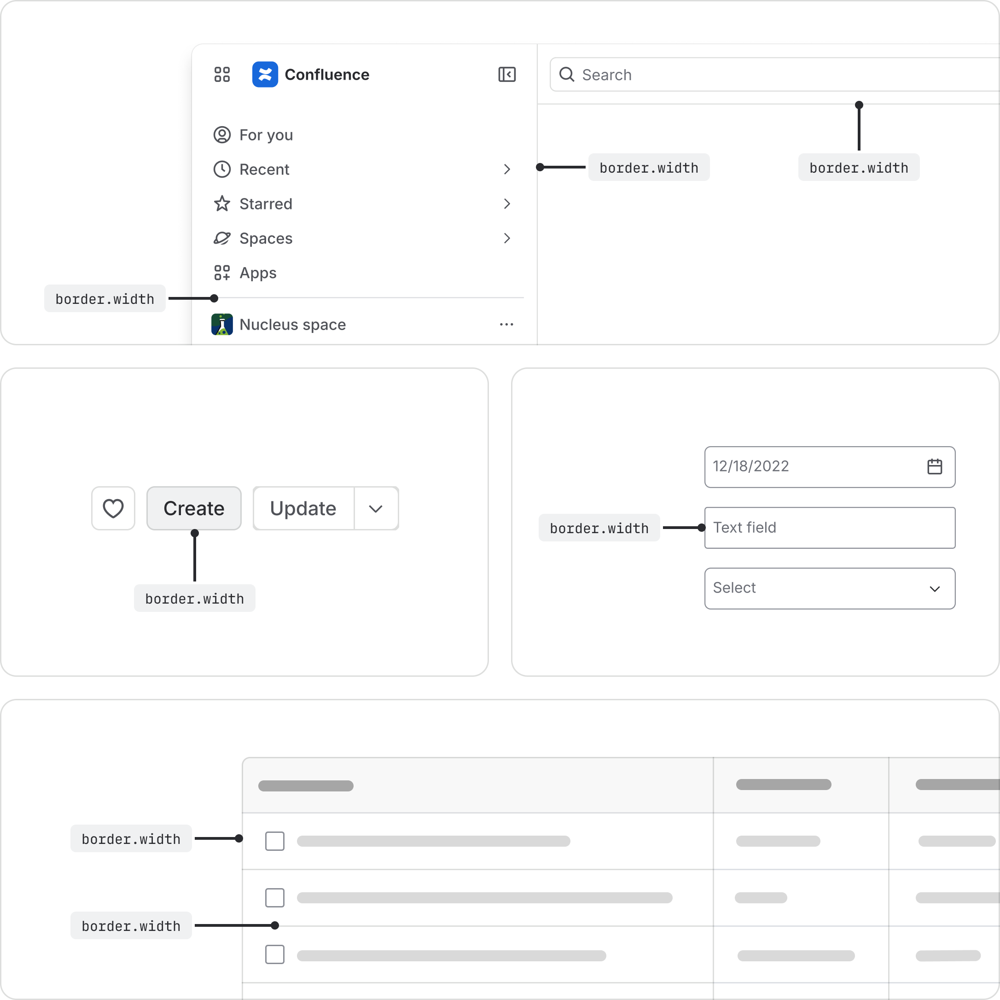
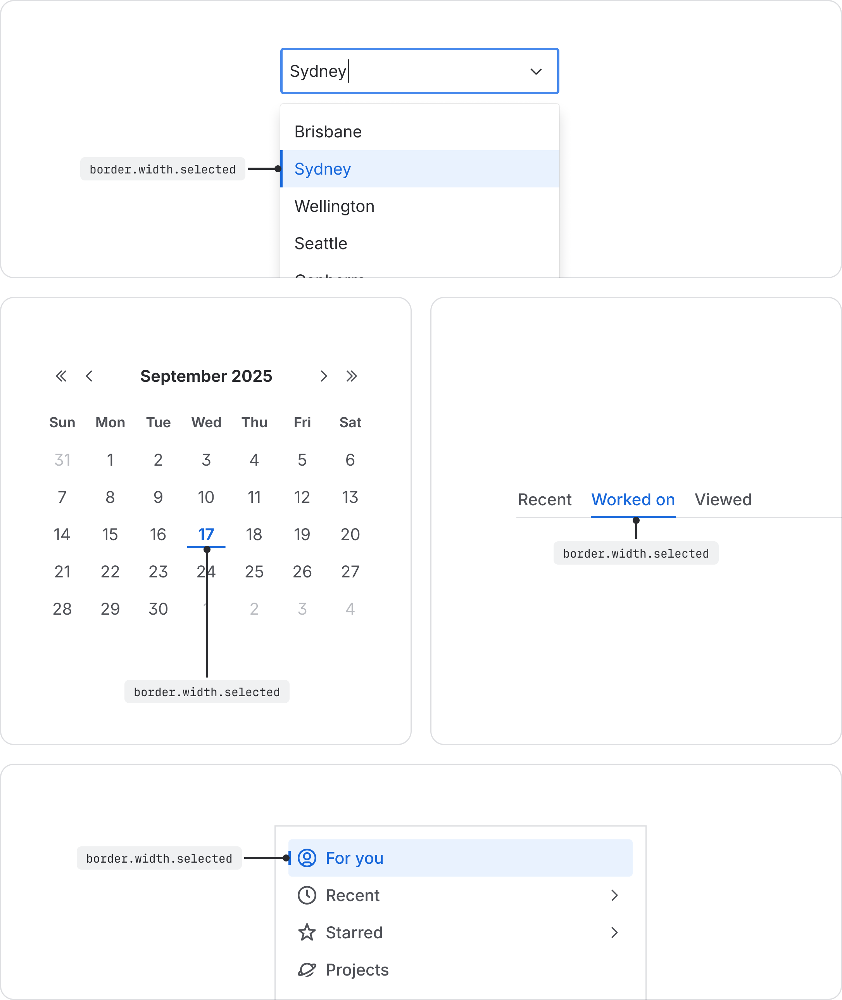
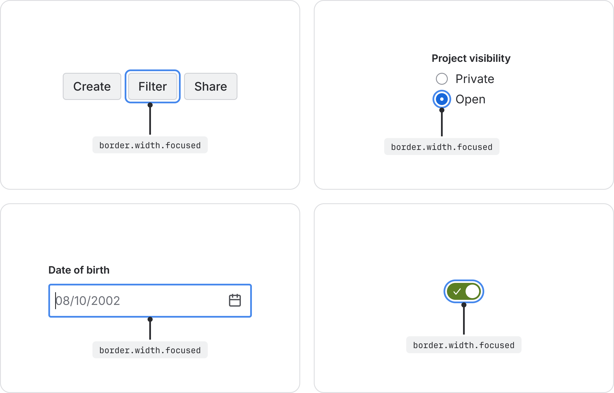
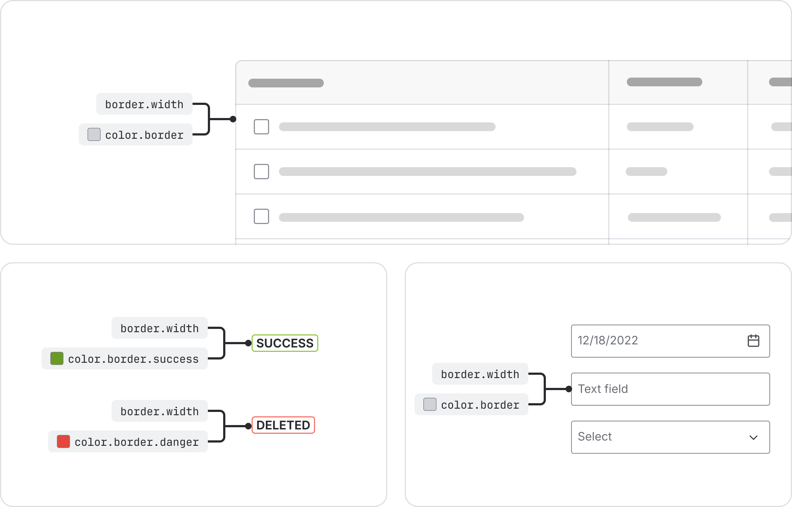
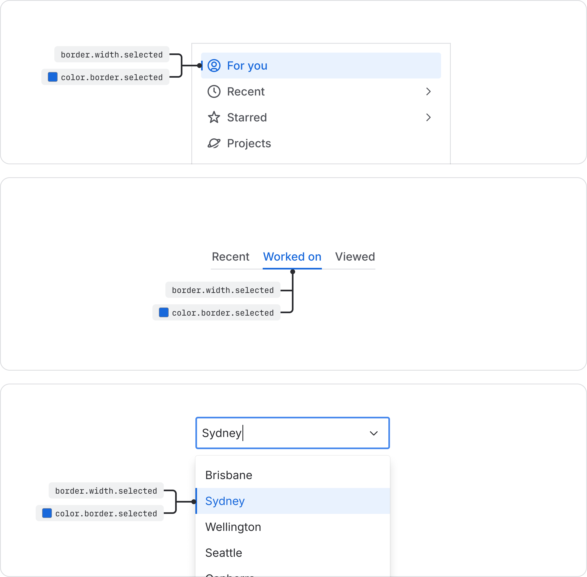
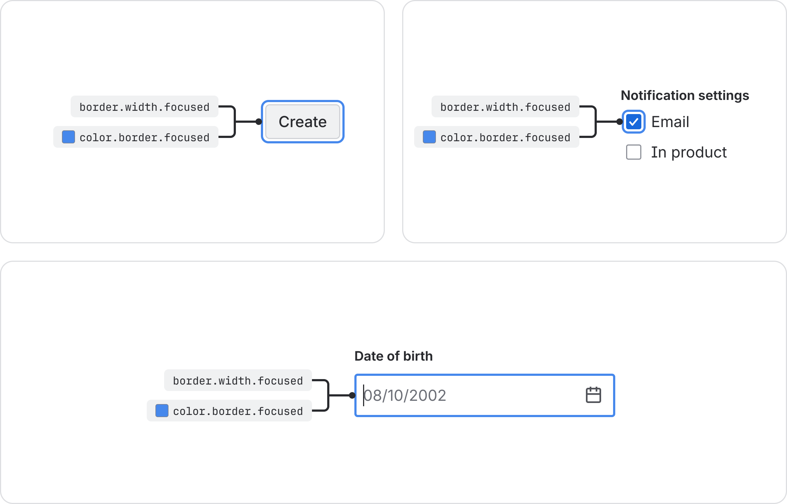
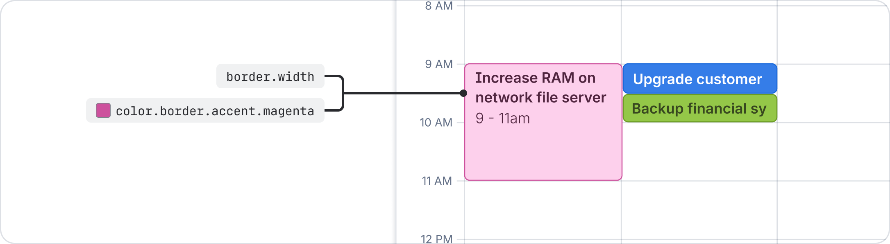

# Border
Define boundaries, separate components, and add visual emphasis with border tokens.

## About border tokens
Borders define boundaries and add emphasis using a combination of width and color tokens. Width tokens control a border's prominence, while color tokens provide its meaning. Pair these tokens to communicate an element’s purpose, such as a simple divider, or a visible interactive state.

## Border width tokens and usage guidelines
Use border width tokens to provide a clear and intentional way to apply width across different states and use cases.

| Token name | Suitable for | Value* |
| --- | --- | --- |
| `border.width` | The default width for all standard component borders and dividers. | 1px |
| `border.width.selected` | The width used to indicate a selected element, such as an active tab or a chosen item. | 2px |
| `border.width.focused` | The width used for the focus ring on interactive elements. | 2px |

* Token values are subject to change and should be used as an indication only.

### Default border width
The border.width token is the default value for all standard borders and dividers. It establishes the baseline thickness for components that require a subtle, defining outline, ensuring they are visually distinct.

### Selected states
Use the `border.width.selected` token to show users which option they’ve selected from a group. Apply this token to highlight a user's choice, such as an active tab or a chosen item in a list.

### Focus ring
Use the `border.width.focused` token to define the thickness of the focus ring. Apply this token to show keyboard users where they are on the page. When users press Tab to move through an interface, the token highlights the active element they can interact with. This helps make your interface accessible to everyone.

## Border color and width pairing
Create borders by pairing width and color tokens. Choose:

- width tokens to control how thick and visible your border appears
- color tokens to show what the border means, like its state or importance

Always pair the right width token with the right color token to keep your interface consistent and clear for users.

### Visual indicator for selected state
Always pair the `border.width.selected` token with the `color.border.selected` token, to show users which items they’ve selected. Use this combination to consistently highlight selected elements, like an active tab or a chosen list item, throughout the interface.

### Required pairing for focus state
Always pair the `border.width.focused` token with the `color.border.focused` token to define the thickness of the focus ring.

Use this combination to consistently highlight elements that receive keyboard focus, so users always know which element is active and ready for interaction.

To ensure consistency and accessibility when adding a focused state to your components, follow these standards:

- **Code:** Use the Focusable component to wrap all interactive elements requiring focus.
- **Design:** Use the Focus Ring component (Atlassians only) from the Atlassian Design System Figma library.

It’s important to consider contrast when using different accent colors in your UI. For subtle backgrounds, pair them with an accent border to meet the 3:1 contrast requirement for accessibility.

More about accent colors

