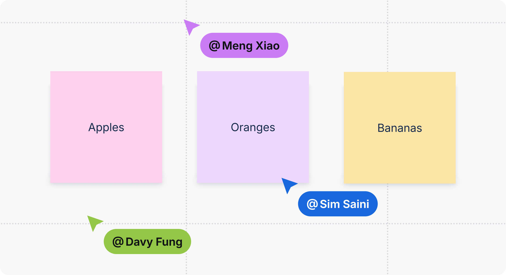
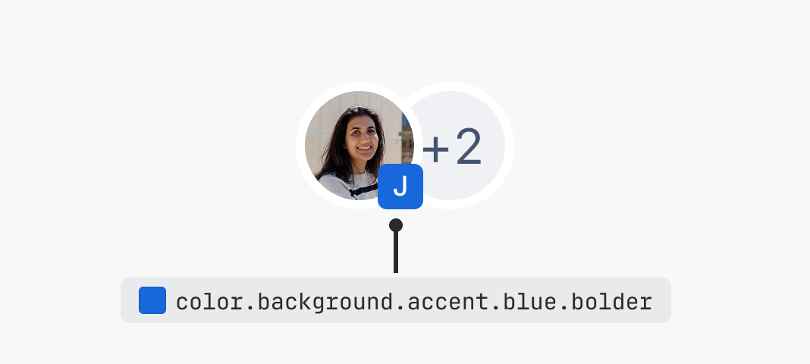
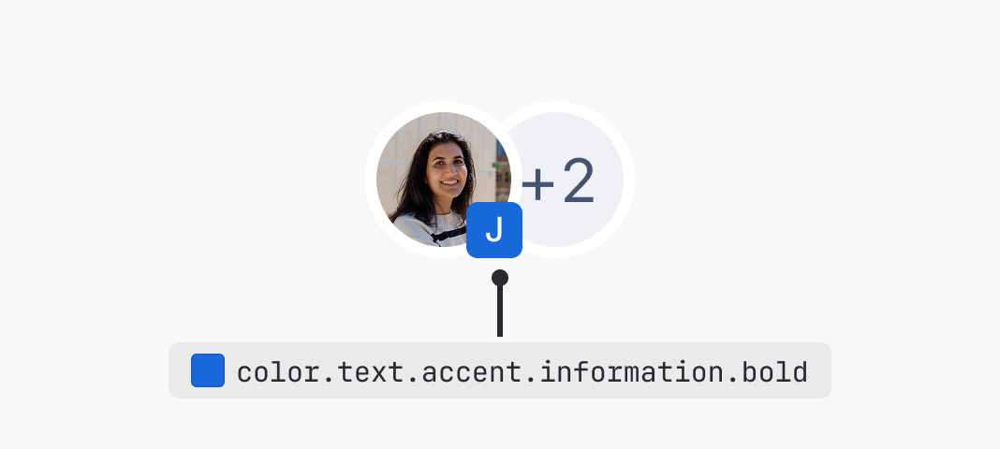
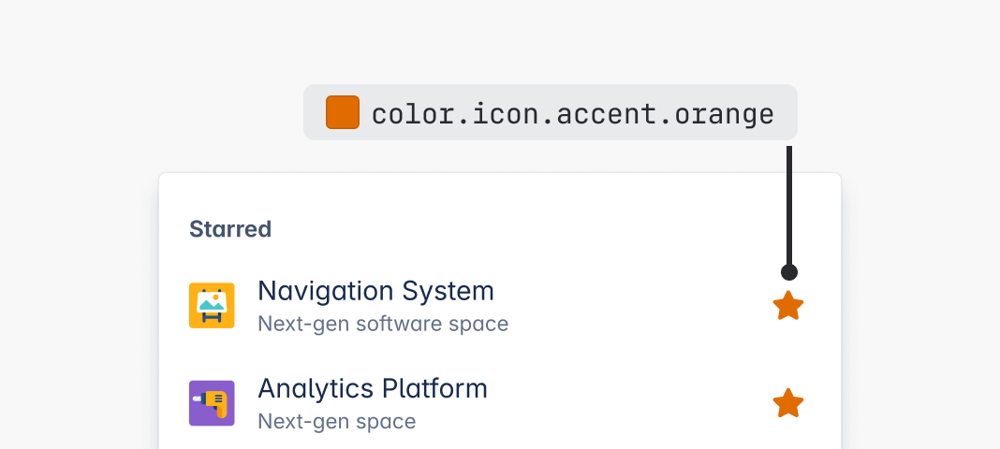
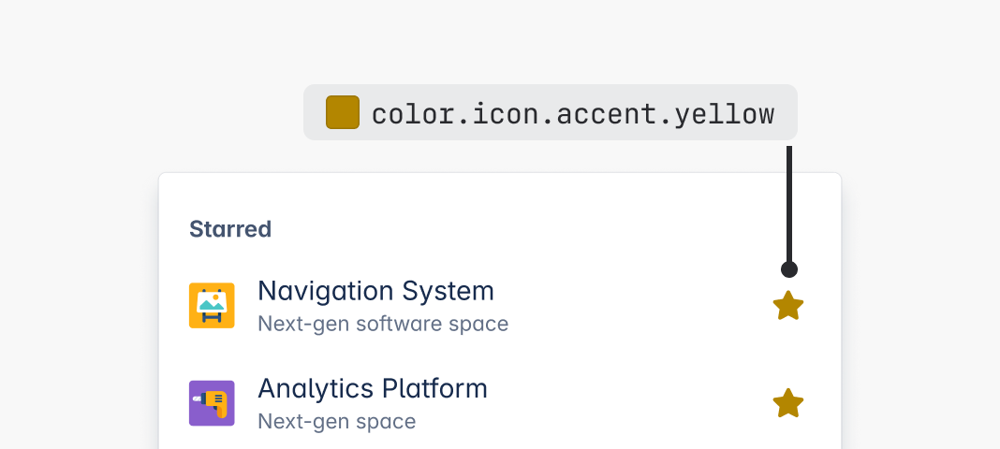
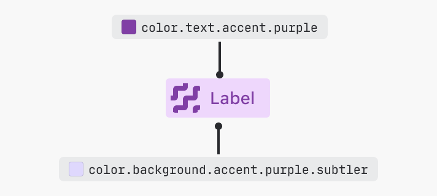
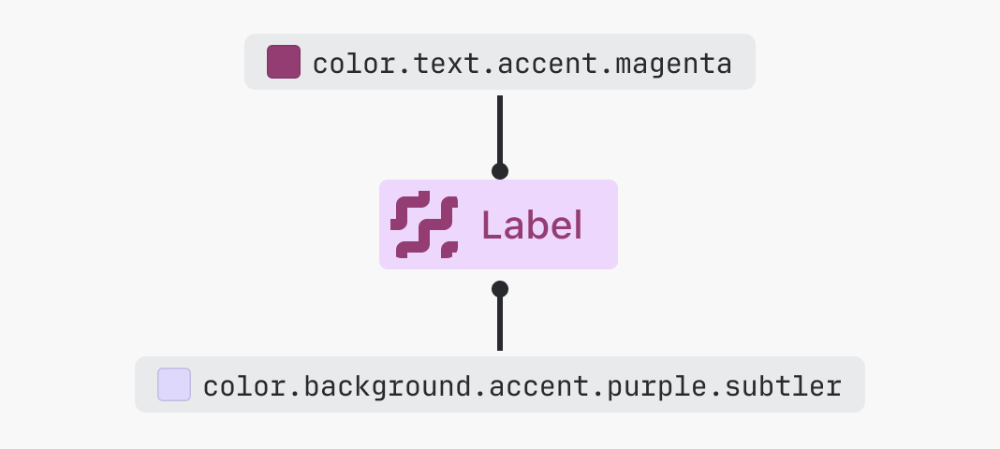

# Accents
Accent colors help differentiate interface elements such as sticky notes, color pickers, and project icons.

Accents don't communicate any specific meaning to users, unlike success, warning, or other color roles.

Use accent colors where users choose a color for their content (in color pickers), or in experiences where color helps categorize content.

## Color options
There are 10 accent colors available: blue, teal, green, lime, yellow, purple, magenta, red, orange, and gray.

## Applying accent colors
Each accent color has dedicated design tokens that can be applied to backgrounds, text, borders and icons. The full list of tokens is available in design token reference list.

If you aren't sure whether to use an accent token, consider whether the color could be swapped for another without changing the experience or meaning behind it.

> 
> **Do**
>
> Use accent tokens for any experience where the color is just one of many colors, and changing it would have no impact on the experience.

> 
> **Don’t**
>
> Don't use accent tokens when the color has a specific meaning in our system, such as information, warning, or success.

## Emphasis levels
Accent tokens come in multiple shades, which can either provide different emphasis levels for visual hierarchy or be used to provide more color options for user-generated content.

### Background accent tokens
Background accent tokens have four emphasis levels ranging from subtlest to bolder.

### Text accent tokens
Text accent tokens have two emphasis levels – default and bolder.

### Icon accent tokens
Icon accent tokens have two emphasis levels – default and bolder.

## Accent color accessibility
When pairing accent text or icon colors against backgrounds, make sure they meet minimum contrast requirements.

- Pair default or bolder accent text or icons with subtlest and subtler accent backgrounds
- Pair bolder accent text or icons with subtle accent backgrounds
- Pair inverse text or icons with bolder accent backgrounds

If you're pairing text or icon tokens outside of these recommendations, ensure they meet the minimum contrast requirements against the background.

![Visualization of how various teal text and background pairings can look. Default and bolder text appears on a subtlest background, default and bolder text appears on a subtler background, bolder text appears on a subtle background, and inverse text appears on a bolder background.Visualization of how various teal icon and background pairings can look. Default accent icons or icons using accent text appear on a subtlest background, an icon using accent text appears on a subtler or subtle background, and an inverse icon appears on a bolder background.](accent-text-contrast-pairings.png)
![Visualization of how various teal text and background pairings can look. Default and bolder text appears on a subtlest background, default and bolder text appears on a subtler background, bolder text appears on a subtle background, and inverse text appears on a bolder background.Visualization of how various teal icon and background pairings can look. Default accent icons or icons using accent text appear on a subtlest background, an icon using accent text appears on a subtler or subtle background, and an inverse icon appears on a bolder background.](accent-icon-contrast-pairings.png)

## Best practices

### Avoid yellow
Yellow presents a unique challenge for accessibility and can appear more like brown. Consider using a different accent color in its place, such as orange.

> 
> **Do**
>
> Consider using accent tokens other than yellow, such as orange.

> 
> **Don’t**
>
> Avoid using yellow accent tokens, as these become brown to meet contrast requirements.

### Use borders for more contrast around subtle backgrounds
Pair subtler accent backgrounds with accent borders if your experience needs to pass 3:1 contrast.

Bolder accent backgrounds meet these requirements on their own. For data visualization, use our chart tokens instead.

### Avoid mixing different accent colors
Maintain visual harmony by combining foreground and background elements with colors from the same family.

> 
> **Do**
>
> Pair accent background and foreground elements (text, icons, or borders) from the same color to create harmonious experiences.

> 
> **Don’t**
>
> Don't mix accent backgrounds with different colored foreground elements (text, icons, or borders).
