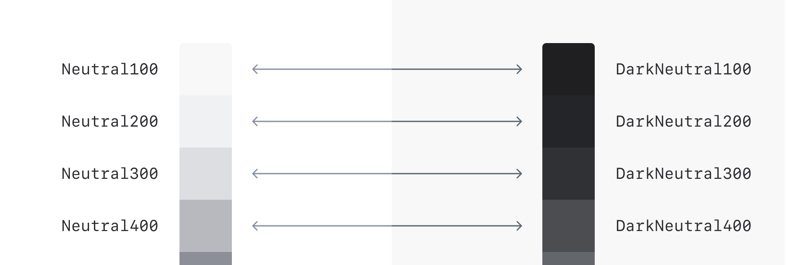
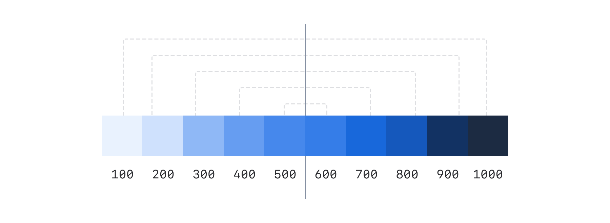
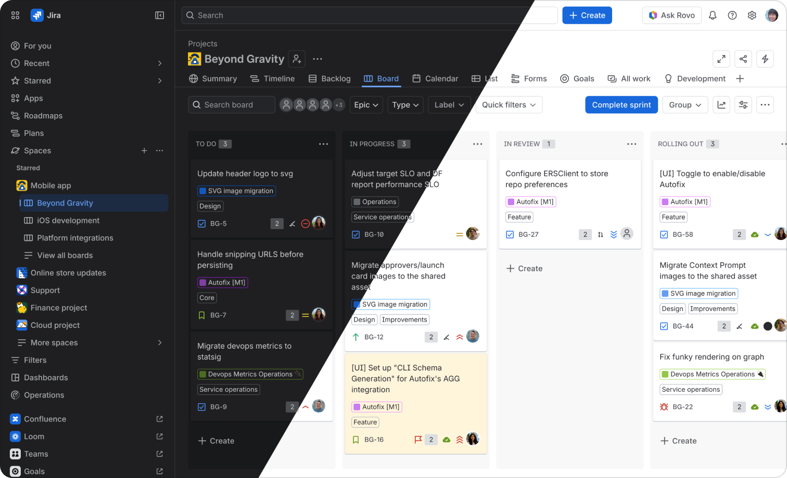

# Color Palette
Our color palette is a selection of colors that work together to create consistency in apps.

## The palette

### Lime

| Token | Hex | RGB / RGBA |
| --- | --- | --- |
| Lime100 | `#EFFFD6` | `rgb(239, 255, 214)` |
| Lime200 | `#D3F1A7` | `rgb(211, 241, 167)` |
| Lime250 | `#BDE97C` | `rgb(189, 233, 124)` |
| Lime300 | `#B3DF72` | `rgb(179, 223, 114)` |
| Lime400 | `#94C748` | `rgb(148, 199, 72)` |
| Lime500 | `#82B536` | `rgb(130, 181, 54)` |
| Lime600 | `#6A9A23` | `rgb(106, 154, 35)` |
| Lime700 | `#5B7F24` | `rgb(91, 127, 36)` |
| Lime800 | `#4C6B1F` | `rgb(76, 107, 31)` |
| Lime850 | `#3F5224` | `rgb(63, 82, 36)` |
| Lime900 | `#37471F` | `rgb(55, 71, 31)` |
| Lime1000 | `#28311B` | `rgb(40, 49, 27)` |

### Red

| Token | Hex | RGB / RGBA |
| --- | --- | --- |
| Red100 | `#FFECEB` | `rgb(255, 236, 235)` |
| Red200 | `#FFD5D2` | `rgb(255, 213, 210)` |
| Red250 | `#FFB8B2` | `rgb(255, 184, 178)` |
| Red300 | `#FD9891` | `rgb(253, 152, 145)` |
| Red400 | `#F87168` | `rgb(248, 113, 104)` |
| Red500 | `#F15B50` | `rgb(241, 91, 80)` |
| Red600 | `#E2483D` | `rgb(226, 72, 61)` |
| Red700 | `#C9372C` | `rgb(201, 55, 44)` |
| Red800 | `#AE2E24` | `rgb(174, 46, 36)` |
| Red850 | `#872821` | `rgb(135, 40, 33)` |
| Red900 | `#5D1F1A` | `rgb(93, 31, 26)` |
| Red1000 | `#42221F` | `rgb(66, 34, 31)` |

### Orange

| Token | Hex | RGB / RGBA |
| --- | --- | --- |
| Orange100 | `#FFF5DB` | `rgb(255, 245, 219)` |
| Orange200 | `#FCE4A6` | `rgb(252, 228, 166)` |
| Orange250 | `#FBD779` | `rgb(251, 215, 121)` |
| Orange300 | `#FBC828` | `rgb(251, 200, 40)` |
| Orange400 | `#FCA700` | `rgb(252, 167, 0)` |
| Orange500 | `#F68909` | `rgb(246, 137, 9)` |
| Orange600 | `#E06C00` | `rgb(224, 108, 0)` |
| Orange700 | `#BD5B00` | `rgb(189, 91, 0)` |
| Orange800 | `#9E4C00` | `rgb(158, 76, 0)` |
| Orange850 | `#7A3B00` | `rgb(122, 59, 0)` |
| Orange900 | `#693200` | `rgb(105, 50, 0)` |
| Orange1000 | `#3A2C1F` | `rgb(58, 44, 31)` |

### Yellow

| Token | Hex | RGB / RGBA |
| --- | --- | --- |
| Yellow100 | `#FEF7C8` | `rgb(254, 247, 200)` |
| Yellow200 | `#F5E989` | `rgb(245, 233, 137)` |
| Yellow250 | `#EFDD4E` | `rgb(239, 221, 78)` |
| Yellow300 | `#EED12B` | `rgb(238, 209, 43)` |
| Yellow400 | `#DDB30E` | `rgb(221, 179, 14)` |
| Yellow500 | `#CF9F02` | `rgb(207, 159, 2)` |
| Yellow600 | `#B38600` | `rgb(179, 134, 0)` |
| Yellow700 | `#946F00` | `rgb(148, 111, 0)` |
| Yellow800 | `#7F5F01` | `rgb(127, 95, 1)` |
| Yellow850 | `#614A05` | `rgb(97, 74, 5)` |
| Yellow900 | `#533F04` | `rgb(83, 63, 4)` |
| Yellow1000 | `#332E1B` | `rgb(51, 46, 27)` |

### Green

| Token | Hex | RGB / RGBA |
| --- | --- | --- |
| Green100 | `#DCFFF1` | `rgb(220, 255, 241)` |
| Green200 | `#BAF3DB` | `rgb(186, 243, 219)` |
| Green250 | `#97EDC9` | `rgb(151, 237, 201)` |
| Green300 | `#7EE2B8` | `rgb(126, 226, 184)` |
| Green400 | `#4BCE97` | `rgb(75, 206, 151)` |
| Green500 | `#2ABB7F` | `rgb(42, 187, 127)` |
| Green600 | `#22A06B` | `rgb(34, 160, 107)` |
| Green700 | `#1F845A` | `rgb(31, 132, 90)` |
| Green800 | `#216E4E` | `rgb(33, 110, 78)` |
| Green850 | `#19573D` | `rgb(25, 87, 61)` |
| Green900 | `#164B35` | `rgb(22, 75, 53)` |
| Green1000 | `#1C3329` | `rgb(28, 51, 41)` |

### Teal

| Token | Hex | RGB / RGBA |
| --- | --- | --- |
| Teal100 | `#E7F9FF` | `rgb(231, 249, 255)` |
| Teal200 | `#C6EDFB` | `rgb(198, 237, 251)` |
| Teal250 | `#B1E4F7` | `rgb(177, 228, 247)` |
| Teal300 | `#9DD9EE` | `rgb(157, 217, 238)` |
| Teal400 | `#6CC3E0` | `rgb(108, 195, 224)` |
| Teal500 | `#42B2D7` | `rgb(66, 178, 215)` |
| Teal600 | `#2898BD` | `rgb(40, 152, 189)` |
| Teal700 | `#227D9B` | `rgb(34, 125, 155)` |
| Teal800 | `#206A83` | `rgb(32, 106, 131)` |
| Teal850 | `#1A5265` | `rgb(26, 82, 101)` |
| Teal900 | `#164555` | `rgb(22, 69, 85)` |
| Teal1000 | `#1E3137` | `rgb(30, 49, 55)` |

### Blue

| Token | Hex | RGB / RGBA |
| --- | --- | --- |
| Blue100 | `#E9F2FE` | `rgb(233, 242, 254)` |
| Blue200 | `#CFE1FD` | `rgb(207, 225, 253)` |
| Blue250 | `#ADCBFB` | `rgb(173, 203, 251)` |
| Blue300 | `#8FB8F6` | `rgb(143, 184, 246)` |
| Blue400 | `#669DF1` | `rgb(102, 157, 241)` |
| Blue500 | `#4688EC` | `rgb(70, 136, 236)` |
| Blue600 | `#357DE8` | `rgb(53, 125, 232)` |
| Blue700 | `#1868DB` | `rgb(24, 104, 219)` |
| Blue800 | `#1558BC` | `rgb(21, 88, 188)` |
| Blue850 | `#144794` | `rgb(20, 71, 148)` |
| Blue900 | `#123263` | `rgb(18, 50, 99)` |
| Blue1000 | `#1C2B42` | `rgb(28, 43, 66)` |

### Purple

| Token | Hex | RGB / RGBA |
| --- | --- | --- |
| Purple100 | `#F8EEFE` | `rgb(248, 238, 254)` |
| Purple200 | `#EED7FC` | `rgb(238, 215, 252)` |
| Purple250 | `#E3BDFA` | `rgb(227, 189, 250)` |
| Purple300 | `#D8A0F7` | `rgb(216, 160, 247)` |
| Purple400 | `#C97CF4` | `rgb(201, 124, 244)` |
| Purple500 | `#BF63F3` | `rgb(191, 99, 243)` |
| Purple600 | `#AF59E1` | `rgb(175, 89, 225)` |
| Purple700 | `#964AC0` | `rgb(150, 74, 192)` |
| Purple800 | `#803FA5` | `rgb(128, 63, 165)` |
| Purple850 | `#673286` | `rgb(103, 50, 134)` |
| Purple900 | `#48245D` | `rgb(72, 36, 93)` |
| Purple1000 | `#35243F` | `rgb(53, 36, 63)` |

### Magenta

| Token | Hex | RGB / RGBA |
| --- | --- | --- |
| Magenta100 | `#FFECF8` | `rgb(255, 236, 248)` |
| Magenta200 | `#FDD0EC` | `rgb(253, 208, 236)` |
| Magenta250 | `#FCB6E1` | `rgb(252, 182, 225)` |
| Magenta300 | `#F797D2` | `rgb(247, 151, 210)` |
| Magenta400 | `#E774BB` | `rgb(231, 116, 187)` |
| Magenta500 | `#DA62AC` | `rgb(218, 98, 172)` |
| Magenta600 | `#CD519D` | `rgb(205, 81, 157)` |
| Magenta700 | `#AE4787` | `rgb(174, 71, 135)` |
| Magenta800 | `#943D73` | `rgb(148, 61, 115)` |
| Magenta850 | `#77325B` | `rgb(119, 50, 91)` |
| Magenta900 | `#50253F` | `rgb(80, 37, 63)` |
| Magenta1000 | `#3D2232` | `rgb(61, 34, 50)` |

### Light mode neutrals

#### Solid

| Token | Hex | RGB / RGBA |
| --- | --- | --- |
| Neutral0 | `#FFFFFF` | `rgb(255, 255, 255)` |
| Neutral100 | `#F8F8F8` | `rgb(248, 248, 248)` |
| Neutral200 | `#F0F1F2` | `rgb(240, 241, 242)` |
| Neutral300 | `#DDDEE1` | `rgb(221, 222, 225)` |
| Neutral400 | `#B7B9BE` | `rgb(183, 185, 190)` |
| Neutral500 | `#8C8F97` | `rgb(140, 143, 151)` |
| Neutral600 | `#7D818A` | `rgb(125, 129, 138)` |
| Neutral700 | `#6B6E76` | `rgb(107, 110, 118)` |
| Neutral800 | `#505258` | `rgb(80, 82, 88)` |
| Neutral900 | `#3B3D42` | `rgb(59, 61, 66)` |
| Neutral1000 | `#292A2E` | `rgb(41, 42, 46)` |
| Neutral1100 | `#1E1F21` | `rgb(30, 31, 33)` |
| Neutral1200 | `#000000` | `rgb(0, 0, 0)` |

#### Alpha

| Token | Hex | RGB / RGBA |
| --- | --- | --- |
| Neutral100A | `#17171708` | `rgba(23, 23, 23, 0.03)` |
| Neutral200A | `#0515240F` | `rgba(5, 21, 36, 0.06)` |
| Neutral300A | `#0B120E24` | `rgba(11, 18, 14, 0.14)` |
| Neutral400A | `#080F214A` | `rgba(8, 15, 33, 0.29)` |
| Neutral500A | `#050C1F75` | `rgba(5, 12, 31, 0.46)` |

### Dark mode neutrals

#### Solid

| Token | Hex | RGB / RGBA |
| --- | --- | --- |
| DarkNeutral-100 | `#111213` | `rgb(17, 18, 19)` |
| DarkNeutral0 | `#18191A` | `rgb(24, 25, 26)` |
| DarkNeutral100 | `#1F1F21` | `rgb(31, 31, 33)` |
| DarkNeutral200 | `#242528` | `rgb(36, 37, 40)` |
| DarkNeutral250 | `#2B2C2F` | `rgb(43, 44, 47)` |
| DarkNeutral300 | `#303134` | `rgb(48, 49, 52)` |
| DarkNeutral350 | `#3D3F43` | `rgb(61, 63, 67)` |
| DarkNeutral400 | `#4B4D51` | `rgb(75, 77, 81)` |
| DarkNeutral500 | `#63666B` | `rgb(99, 102, 107)` |
| DarkNeutral600 | `#7E8188` | `rgb(126, 129, 136)` |
| DarkNeutral700 | `#96999E` | `rgb(150, 153, 158)` |
| DarkNeutral800 | `#A9ABAF` | `rgb(169, 171, 175)` |
| DarkNeutral900 | `#BFC1C4` | `rgb(191, 193, 196)` |
| DarkNeutral1000 | `#CECFD2` | `rgb(206, 207, 210)` |
| DarkNeutral1100 | `#E2E3E4` | `rgb(226, 227, 228)` |
| DarkNeutral1200 | `#FFFFFF` | `rgb(255, 255, 255)` |

#### Alpha

| Token | Hex | RGB / RGBA |
| --- | --- | --- |
| DarkNeutral-100A | `#01040475` | `rgba(1, 4, 4, 0.46)` |
| DarkNeutral100A | `#BDBDBD0A` | `rgba(189, 189, 189, 0.04)` |
| DarkNeutral200A | `#CECED912` | `rgba(206, 206, 217, 0.07)` |
| DarkNeutral250A | `#D9DAE71A` | `rgba(217, 218, 231, 0.1)` |
| DarkNeutral300A | `#E3E4F21F` | `rgba(227, 228, 242, 0.12)` |
| DarkNeutral350A | `#E8EDFD2E` | `rgba(232, 237, 253, 0.18)` |
| DarkNeutral400A | `#E5E9F640` | `rgba(229, 233, 246, 0.25)` |
| DarkNeutral500A | `#E9F0FB5C` | `rgba(233, 240, 251, 0.36)` |

## Picking colors for dark mode
Neutral colors are set up in a way that makes it easy to convert a light theme to a dark theme. If you use our design tokens to apply colors, this mapping is done for you.

There is a light neutral ramp and an equivalent dark neutral ramp. Neutral100 in the light neutral ramp should equate to DarkNeutral100 in the dark neutral ramp.

Saturated colors are also easy to convert from a light theme to a dark theme using symmetry. We currently have 10 swatches set up in each palette. If the swatches are divided in half, each half becomes a mirror.

For instance, if a button color is 700 in light theme, it will be 400 in dark theme. If a section message background is 100 in light theme, it will be 1000 in dark theme. Design tokens will handle these conversions for you.

Using symmetry is a great place to start and will cover most use cases. However, it may not work for all use cases and color mapping can be adjusted accordingly.

### Dedicated to
These colors have been dedicated to honor the memory of Rosie and Alexandria, and will be woven into Atlassian apps and design for years to come.

Red300 - Alexandria
Alexandria reflects genuine love and dedication.

Magenta300 - Rosie
Like its namesake, Rosie makes the world a brighter place.
