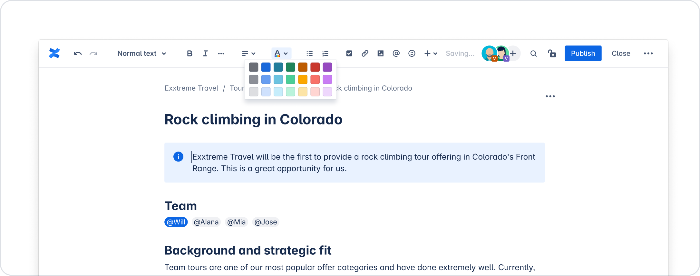
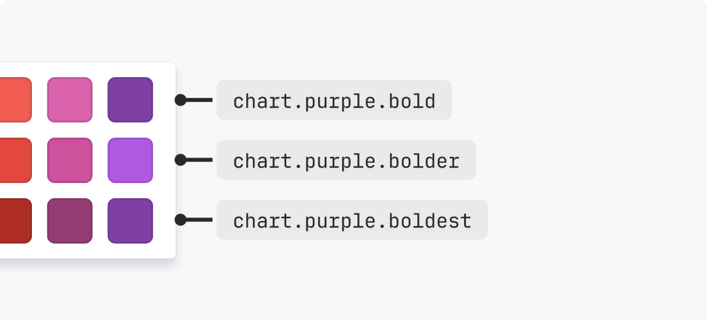
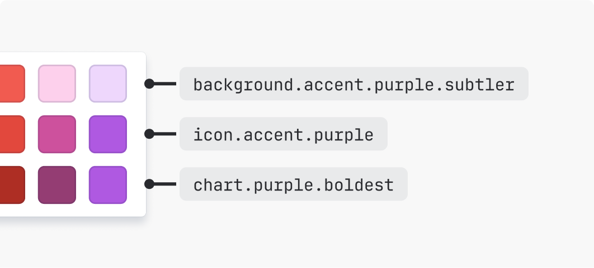
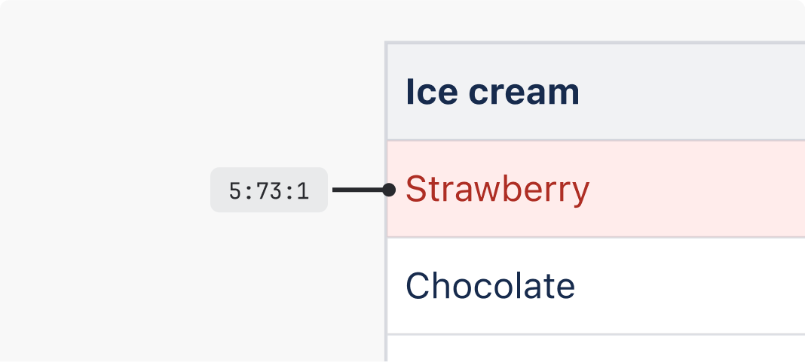
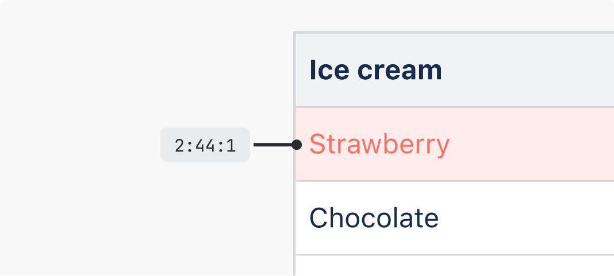
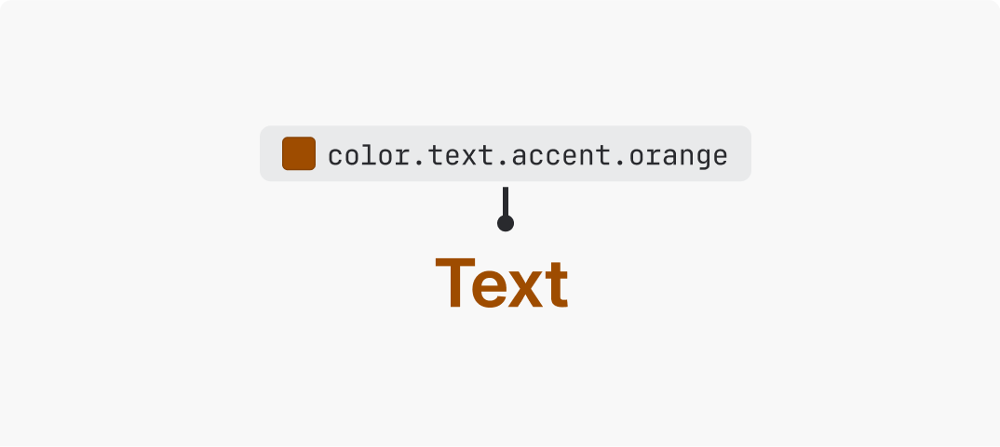
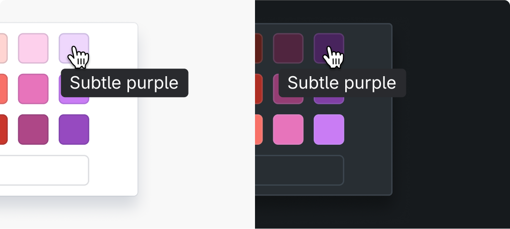
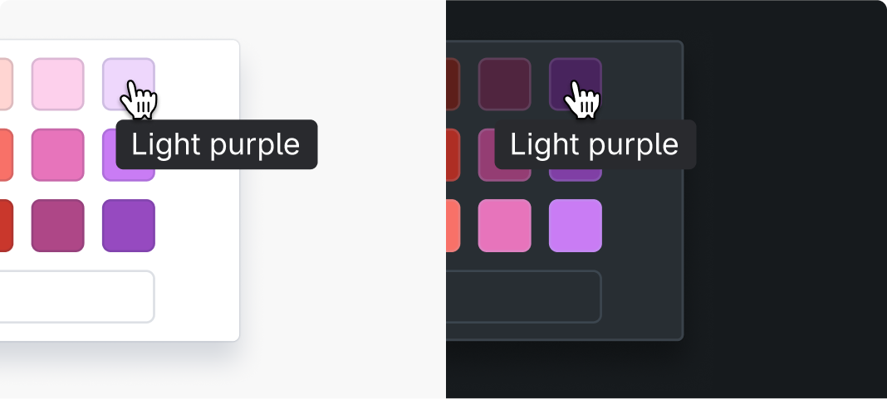
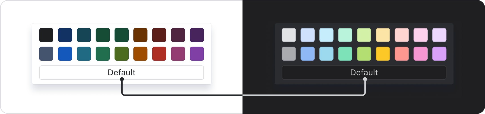

# Color picker swatches
Color pickers provide a way for customers to choose their own color applications.
Color pickers let users choose colors for elements in their content.

Use design tokens for color pickers to ensure the colors work across different themes and experiences.

## Choosing tokens for color pickers
- Text color pickers
- Background color pickers
- Chart color pickers
A range of colors and shades are available. Determine which ones to include based on the needs of your experience.

### Text color pickers
There are two accent shades of each text color for a total of 18 text token color options. See the available text accent tokens in the design tokens list.

If you need additional text colors, you can add a third row of colors using our accent icon colors. These meet the right contrasts for large-scale text (at least 18px bold or 24px).

### Background color pickers
There are four accent shades of each background color for a total of 36 background color options. See the available background accent tokens in the design tokens list.

### Chart color pickers
There are three accent shades of each chart color for a total of 27 chart color options. See the available chart accent tokens in the design tokens list.

## Best practices

### Use tokens appropriate to the type of picker
Text tokens should be used for text color pickers, and background tokens should be used for background color pickers.

> 
> **Do**
>
> Use design tokens appropriate to the type of picker.

> 
> **Don’t**
>
> Don't use design tokens solely based on how the color looks.

### Ensure there are accessible color pairing options
Consider how colors will be applied by customers to ensure appropriate options are available to support the creation of accessible content.

For example, check how text and background colors will be used together to ensure the emphasis levels required for accessible pairings are available.

> 
> **Do**
>
> Provide color options that can be paired in a way that meets accessible contrasts.

> 
> **Don’t**
>
> Don't offer colors in color pickers that do not support the creation of accessible content.

### Avoid yellow
While yellow accent and chart tokens are available, we recommend not including them in your color picker.

> 
> **Do**
>
> Consider using accent tokens other than yellow, such as orange.

> 
> **Don’t**
>
> Avoid using yellow accent tokens, as these become brown to meet contrast requirements.

### Use theme agnostic color descriptions
Always provide text descriptions for color options in a picker. Text descriptions should be included in a tooltip.

Use emphasis levels to describe different shades of the same color, from subtlest to boldest. When applied to a background color picker, this might appear like:

- Subtlest {color}
- Subtler {color}
- Subtle {color}
- Bold {color}

> 
> **Do**
>
> Use color descriptions that work across light and dark themes, such as 'subtle' and 'bold'.

> 
> **Don’t**
>
> Don't use terms such as 'light' and 'dark' to describe colors, as these descriptions become inaccurate between light and dark themes.

When defining text descriptions for inverse or default surface color options, use "default" as the color description where possible. In cases where this doesn't make sense, such as for inverse text, the description can be changed dynamically between light and dark mode.

