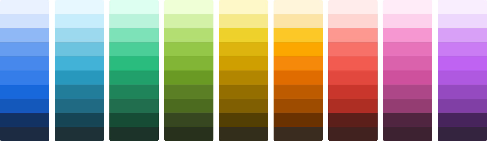
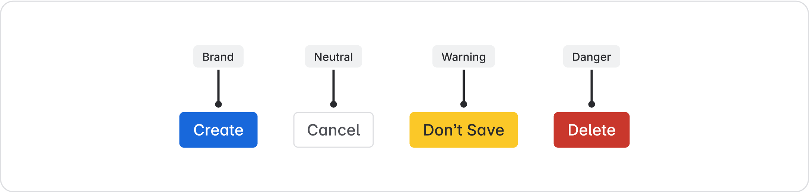
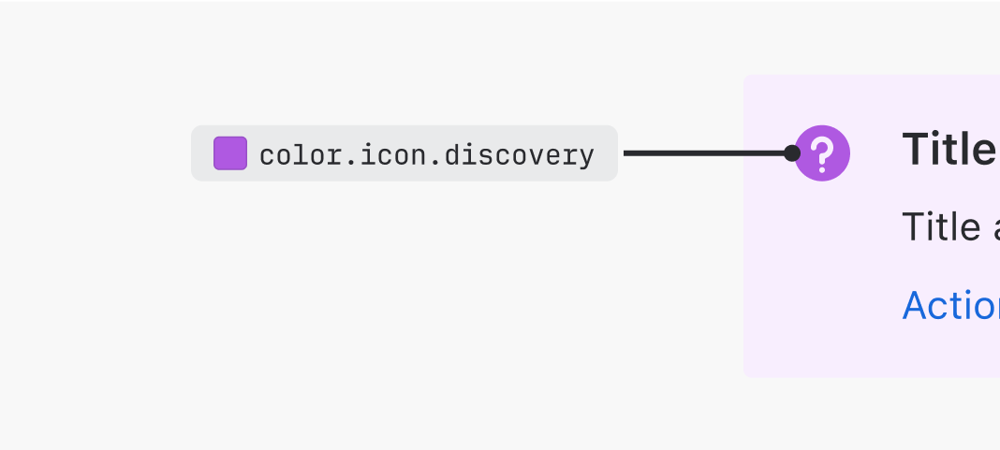
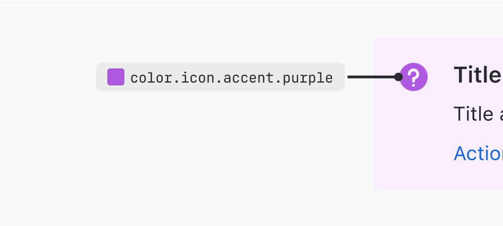

# Color
Color distinguishes our brand and reinforces consistent experiences across apps.

## Color anatomy

### Saturated colors
Saturated colors can infuse meaning to an experience, highlight UI, or create associations with similar colored UI.

### Neutral colors
Neutral colors apply to most backgrounds, text, and shapes in our experiences. They don’t typically have a meaning associated with them, though they can imply things like disabled states.

Color ramp for light neutrals, and a separate color ramp for dark neutrals.

### Alpha colors
Alpha colors have varying levels of transparency or opacity. Transparency helps UI adapt to different background colors and elevations.

If you aren't using design tokens, see our color palette page for hex codes and RGBa values.

## Applying color with design tokens
For most Atlassian app experiences, colors are applied using design tokens. This means rather than choosing a certain shade or value, you’ll choose a design token to apply colors.

For the full list of color design tokens and their values, see our design token reference list. Every token comes with a description to help you ensure you’re using the correct one.

All color design tokens start with the word “color”, followed by the property that it's applied to, such as a background, border, or icon.

After the property name, the token may have one or more modifiers that represent the different parts of our color system: color role, emphasis level, and interaction state.

## Color roles
Color roles describe the intention behind the color. For example, color roles are applied to buttons to differentiate between primary, secondary, warning, or dangerous actions.

| Role | Description |
|------|-------------|
| neutral | Use for default text and secondary UI elements, such as secondary buttons or navigation elements. |
| brand | Use for primary actions or elements that communicate the Atlassian brand. |
| information | Use for informative UI, such as an information icon, or UI that communicates something is in progress. |
| success | Use to communicate a favorable outcome, such as a success message. |
| warning | Use for UI that communicates caution to prevent a mistake or error from occurring. |
| danger | Use for UI that communicates danger or serious error states. |
| discovery | Use for UI that communicates something new, such as onboarding or new feature information. |
| accent | Use for colors that don't have any specific meaning tied to them. You should be able to exchange one accent color for another, and the experience would remain unchanged. Accent colors: gray, red, green, blue, yellow, orange, teal, purple, magenta, and lime. |
| inverse | Use for UI elements that sit on bold emphasis backgrounds. |
| input | Use for form fields. (Note that design system form fields will already have tokens applied.) |

> 
> **Do**
>
> Use the right color role for your situation.

> 
> **Don’t**
>
> Don’t use an accent when the color has semantic meaning.

## Emphasis levels
Emphasis determines the amount of contrast a color has against the default surface. Emphasis can range from subtlest to boldest. Bolder colors have more contrast against the default surface, which adds more attention than subtle colors.

### Use inverse tokens on bold backgrounds
Inverse tokens are designed to show on bold backgrounds. There are inverse tokens for text, borders, and icons on bold backgrounds.

For bold warning backgrounds, which are yellow, there are special warning.inverse tokens designed to pass WCAG AA contrast requirements.

## Interaction states
States communicate the status of an interactive element.

Use hovered, pressed, selected, focused, or disabled tokens to create visual changes related to interaction states.

### Hovered and pressed for icons
There are no dedicated hovered and pressed tokens for icons. Instead, we recommend using a subtle neutral background to indicate state changes.

## Accessibility in color
We comply with WCAG AA standard contrast ratios:

- **Must pass 3:1 contrast**: Any UI essential to understanding the experience and text 24px or larger (WCAG 1.4.11)
- **Must pass 4.5:1**: Text smaller than 24px (WCAG 1.4.3)
See our color accessibility guidance for more information.

## Designing in dark mode
Design tokens currently support two color themes: light and dark. Each color design token maps to a different value for each theme so their appearance differs depending on which theme is being used.

- To learn the basics of tokens and themes, go to design tokens.
- For detailed mappings from light to dark colors, see picking colors for dark mode. Note that if you are using design tokens, you shouldn’t have to map your own values.

## Related
- Learn about the basics of design tokens.
- If you need hex codes, RGBA values, or dark mode mappings, see our color palettes.
- For guidance on color usage in charts, read our data visualization color guideline.
- See the list of all design tokens for full descriptions and values for all tokens.
