# Data Visualization
Color can support comprehension of charts and other data visualizations.

Data visualization is the representation of information in pictorial or graphical format, such as charts, graphs, maps, and diagrams. These visuals aid in the communication of complex data so that insights can be more easily drawn.

Because color can affect our perception of information, the appropriate use of color is critical in making a data visualization successful.

## Applying color to data visualizations
Color in Atlassian apps experiences are applied using design tokens. For data visualization, chart color tokens are available to ensure appropriate color contrasts can be met. Use chart tokens for lines, bars or other UI representing the data. For elements of the chart interface such as axes and text, use border and text tokens.

- Title: color.text
- Tick label: `color.text.subtle`
- Threshold or reference line: `color.chart.neutral`
- Legend: color.text
- Gridline: color.border
- Mark: `color.chart.brand`

## Types of chart colors
- Single-color charts
- Categorical
- Status and severity
- Custom charts

Sequential and divergent chart colors are not currently supported.

### Single-color charts
For data visualization requiring only one color, use `color.chart.brand` as the default color choice. This ensures all data visualization embodies our brand's visual language.

If the data represents status or severity, use the appropriate status or severity color token instead.

To highlight one piece of data from a data set, use `color.chart.neutral` for the less important information so that the important data can stand out.

| Token | Description |
|-------|-------------|
| `color.chart.brand` | Our primary color for data visualization. Use when only one color is required. |
| `color.chart.neutral` | A secondary color for data visualization. Use for the less important data when you want other data to stand out. |

> 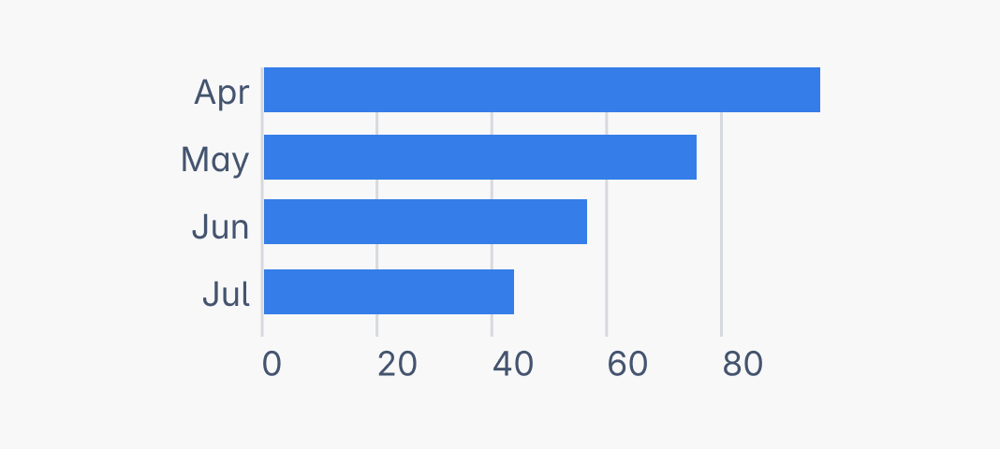
> **Do**
>
> Use a single color as the default for data visualizations. Only add more colors when needing to differentiate between data categories.

> 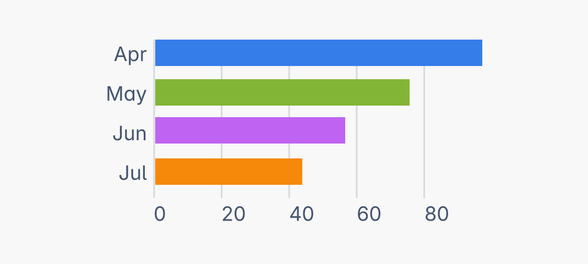
> **Don’t**
>
> Don't use more than one color in your data visualization if the additional colors don't serve any communication purpose.

### Categorical
Use categorical chart colors when you need to differentiate two or more unrelated data categories from each other.

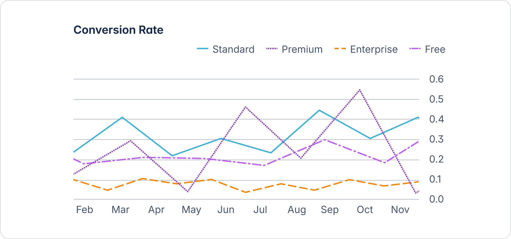

Follow the same sequence as the numbers in the token names. This ensures each color is visually distinct from its neighbors across all color deficiencies. If the display order can't be controlled (in line charts for example), provide additional visual indicators.

| Token | Description |
|-------|-------------|
| `color.chart.categorical.1` | For data visualization only. Follow the numbered sequence. |
| `color.chart.categorical.2` | For data visualization only. Follow the numbered sequence. |
| `color.chart.categorical.3` | For data visualization only. Follow the numbered sequence. |
| `color.chart.categorical.4` | For data visualization only. Follow the numbered sequence. |
| `color.chart.categorical.5` | For data visualization only. Follow the numbered sequence. |
| `color.chart.categorical.6` | For data visualization only. Follow the numbered sequence. |
| `color.chart.categorical.7` | For data visualization only. Follow the numbered sequence. |
| `color.chart.categorical.8` | For data visualization only. Follow the numbered sequence. |

> 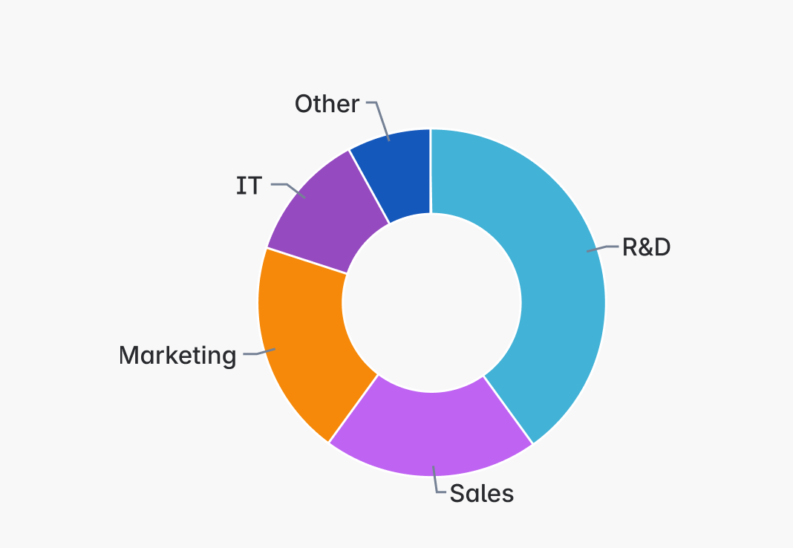
> **Do**
>
> Limit the number of colors presented in your data visualization to 5-6 by grouping additional categories together.

> 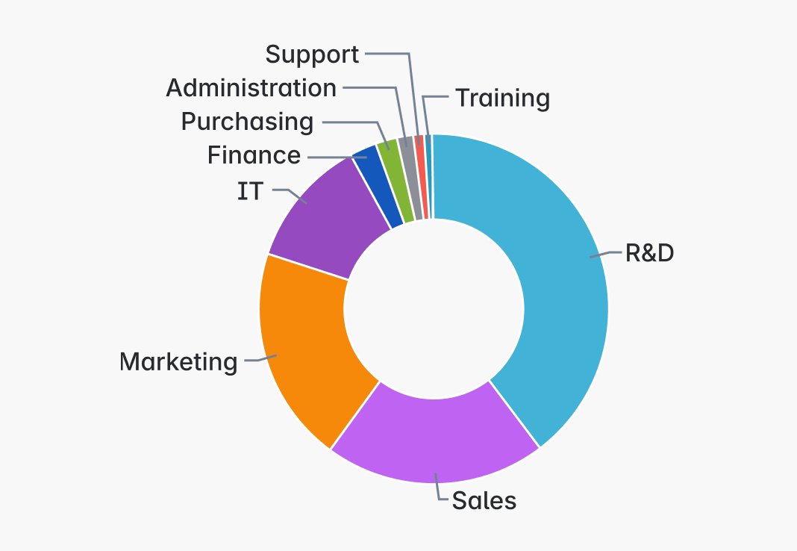
> **Don’t**
>
> Avoid using more than 5-6 colors in a data visualization. Too many colors can hinder comprehension.

### Status and severity
These chart colors use established color associations for status and severity, such as in progress, at risk, or high priority. Use these when you want to reinforce meaning through color in your data visualization.

If more than one set of data exists for a given color association, use bold emphasis to represent the more extreme value. For example, High priority and Highest priority both use danger tokens, but Highest uses `color.chart.danger.bold`.

It's important to note that status and severity colors may be hard for users with color deficiencies to tell apart. For this reason, use other visual indicators or consider categorical colors as a better option.

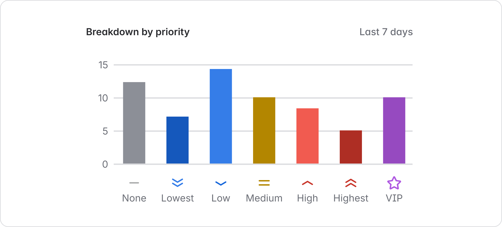

| Token | Description |
|-------|-------------|
| `color.chart.success` | For data visualization communicating positive information, such as 'on track' or done. |
| `color.chart.success.bold` | For data visualization communicating positive information, such as 'on track' or done. |
| `color.chart.warning` | For data visualization communicating caution, such as 'at risk' or 'medium priority'. |
| `color.chart.warning.bold` | For data visualization communicating caution, such as 'at risk' or 'medium priority'. |
| `color.chart.danger` | For data visualization communicating negative or critical information, such as 'off track' or 'high priority'. |
| `color.chart.danger.bold` | For data visualization communicating negative or critical information, such as 'off track' or 'high priority'. |
| `color.chart.information` | For data visualization communicating low priority or in-progress statuses. |
| `color.chart.information.bold` | For data visualization communicating low priority or in-progress statuses. |
| `color.chart.discovery` | For data visualization communicating 'new' statuses. |
| `color.chart.discovery.bold` | For data visualization communicating 'new' statuses. |
| `color.chart.neutral` | For data visualization communicating 'to-do' statuses. |

### Custom charts
A generic set of chart color tokens is available to support data visualization experiences where end users can choose their own colors.

They can also be used to build custom categorical color schemes, although our predefined categorical tokens are recommended for better accessibility and consistency.

These tokens are available in every hue with three emphasis levels. See all custom chart tokens in our design token reference list or get guidance on color picker swatches.

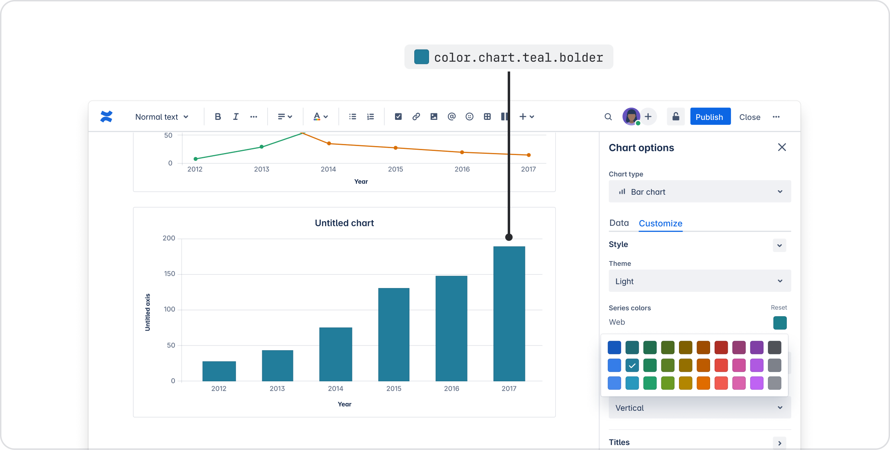

## Interacting with chart data
Data visualization often allows users to drill into data by hovering or selecting a data point. Use chart hovered tokens to provide visual feedback for these interactions.

An alternative approach is to fade out data that isn't being interacted with. Use our opacity.disabled token for this implementation.

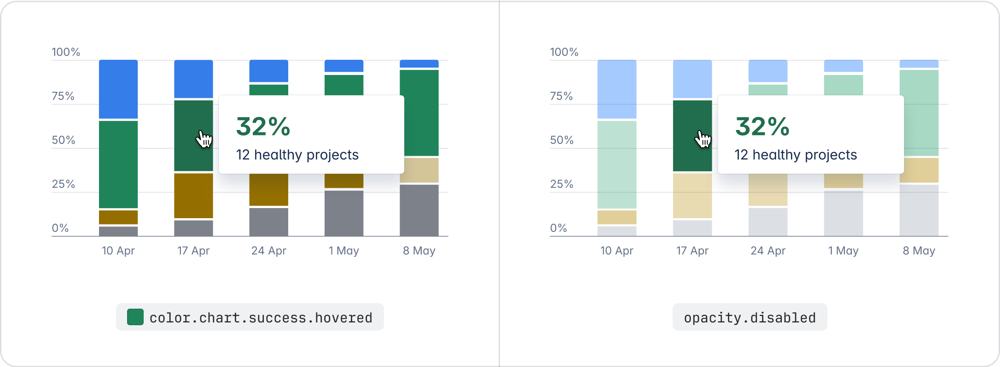

## All chart color tokens
For the full list of chart design tokens and their values, see our design token reference list. Every token comes with a description to help you ensure you're using the correct one.

## Chart color accessibility
Our chart colors meet WCAG AA 3:1 contrast ratios when used on any of our elevation surfaces (WCAG 1.4.11).

The following sections provide more guidance to help you achieve better accessibility.

### Apply a border or space between adjacent colors
While these chart colors pass 3:1 contrast ratios against surfaces, they don't against each other. For this reason, apply a space or border (`color.border.inverse`) as a visual separator between data elements.

> 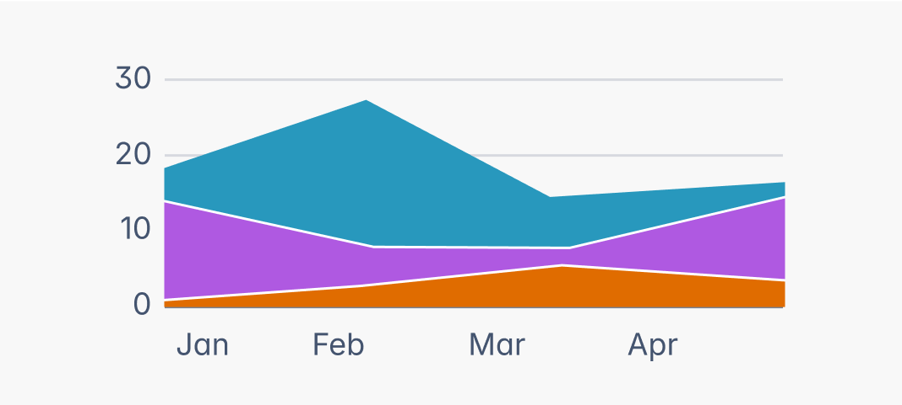
> **Do**
>
> Apply a visual separator between chart colors.

> 
> **Don’t**
>
> Don't place chart colors adjacent to each other.

### Don't place text on chart colors
Our chart colors don't support accessible pairings with text, which need at least a 4.5:1 contrast. Consider placing text next to the chart element instead.

For use cases where text is an essential feature (for example, calendar events), consider using our other color tokens instead.

> 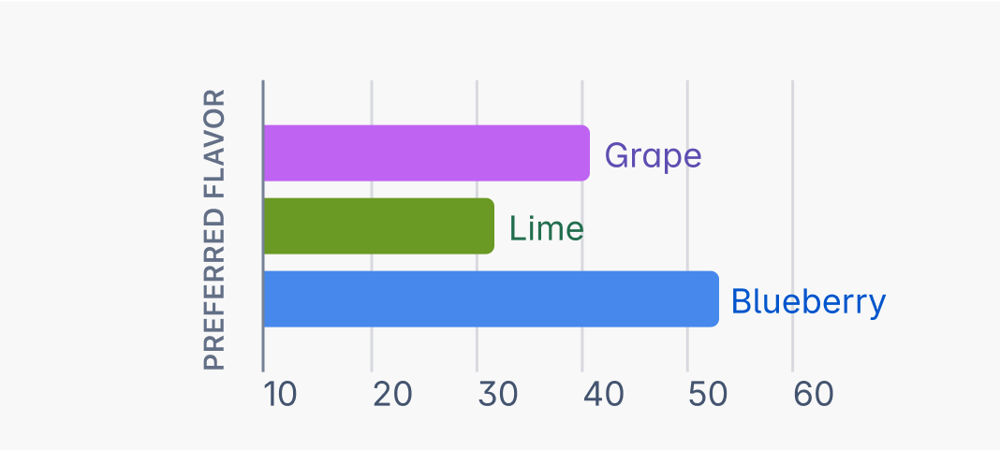
> **Do**
>
> Position text nearby chart data.

> 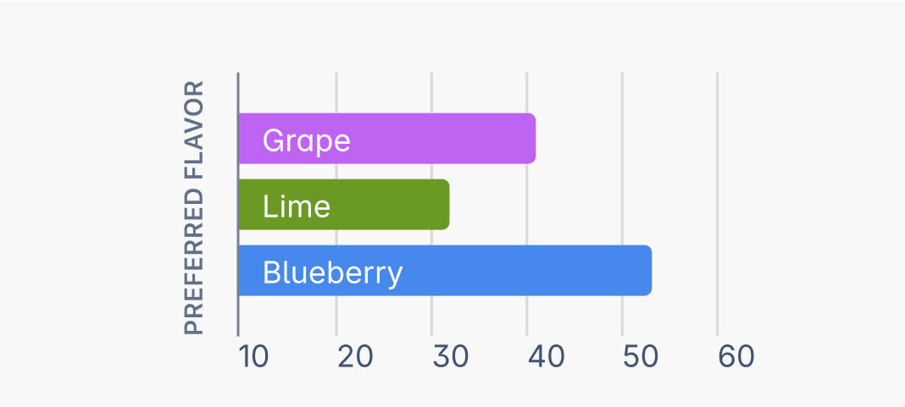
> **Don’t**
>
> Don't apply text over chart colors.

### Don't rely on color alone
Avoid using just color to communicate meaning in your data visualization. Incorporate other visual indicators such as shapes, line texture, patterns, or direct labels to support users in making sense of the data. Highcharts provide some good examples of these accessible chart experiences.

Additionally, providing the data in alternative formats, such as tables and text-based descriptions, will ensure all users can access the data in their preferred format.

> 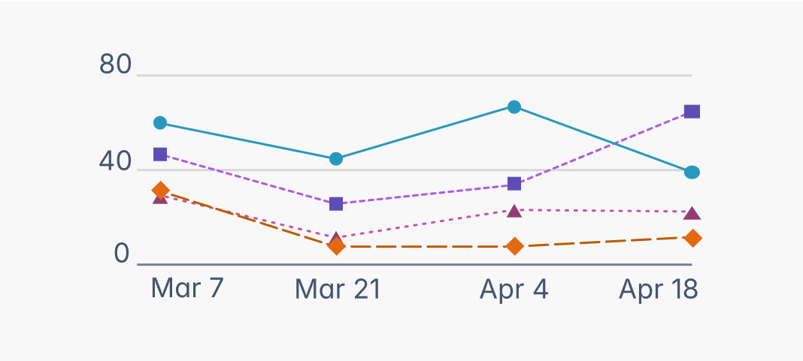
> **Do**
>
> Incorporate visual indicators other than color into your data visualization.

> 
> **Don’t**
>
> Don't rely on color alone to communicate meaning in your data visualization.

## Data visualization in dark mode
Chart color tokens currently support two color themes: light and dark. Each token maps to a different value for each theme so their appearance differs depending on which theme is being used.

- To learn the basics of tokens and themes, go to design tokens.
- For detailed mappings from light to dark colors, see picking colors for dark mode. Note that if you are using design tokens, you shouldn't have to map your own values.
