# Elevation
Elevations are layered surfaces that form the foundation of UI.

Elevations are the layered surfaces that form the foundation of the UI. They create a blank canvas where other UI will be placed, such as text, icons, backgrounds, and borders.

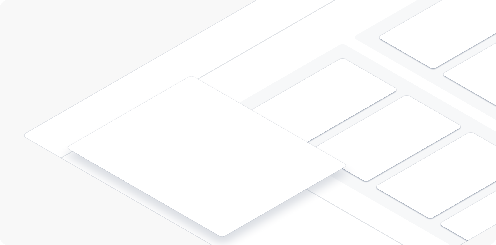

Most elevations consist of surfaces and shadows. Together, surfaces and shadows give the impression of lift or depth. Elevations can guide focus through layering, or indicate that the UI can be scrolled, slid, or dragged.


## Applying Elevations
The elevations use design tokens to apply different surface levels. The highest two elevation surfaces, raised and overlay, are paired with shadows to create more depth.

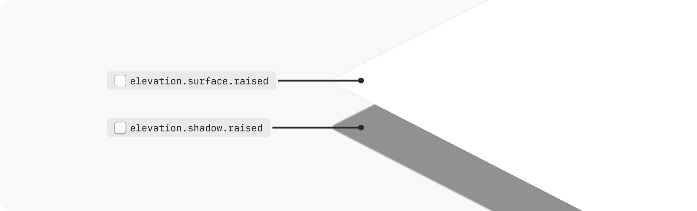

### Elevations in dark theme
Shadows can be harder to see in dark mode, so dark mode elevations also rely on different surface colors. Imagine that the surfaces are distantly lit from the front — the higher the elevation, the lighter the surface looks.

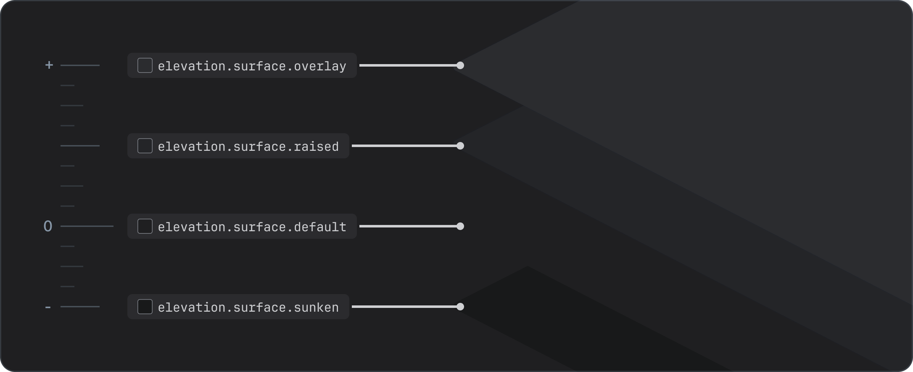

Raised and overlay surfaces are still paired with shadows for added depth and consistency in dark mode.

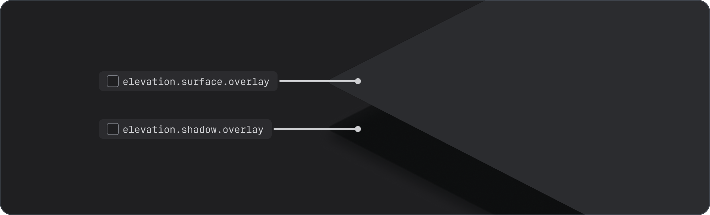

## Types of elevations
There are four basic elevation levels:

1. Sunken
2. Default
3. Raised
4. Overlay

There is also one "overflow" elevation for special cases.


### Sunken
Sunken is the lowest elevation available. The sunken surface creates a backdrop (or well) where other content sits. Columns on a Kanban board are a good example of the sunken elevation.

Only use sunken surfaces on the default surface level. Don’t apply sunken elevations on raised or overlay elevations. To differentiate areas of the UI in other ways, use whitespace or borders instead.

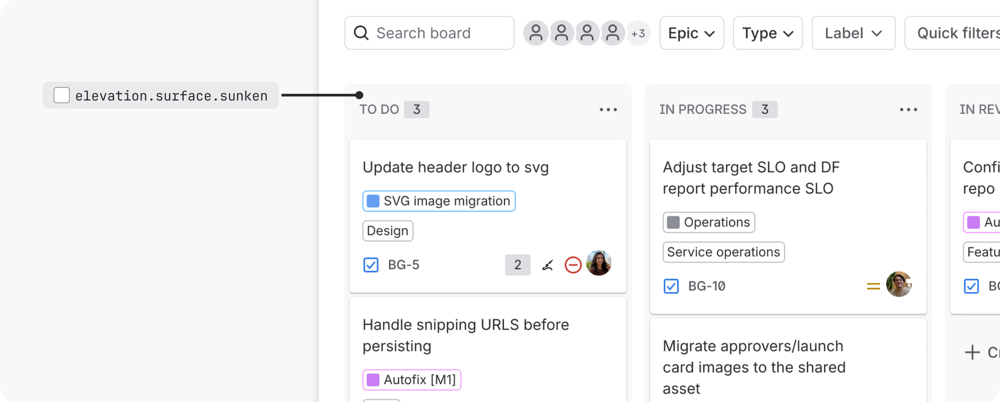

**Using** `elevation.surface.sunken` vs `color.background.neutral`
Although `elevation.surface.sunken` and `color.background.neutral` tokens may appear similar in light mode, they behave differently in dark mode. Here are the main differences between the two:

`elevation.surface.sunken` is an opaque (solid) token that darkens in both light and dark modes. Use this token as a backdrop to group content or elements together (such as a kanban board) on the default surface.

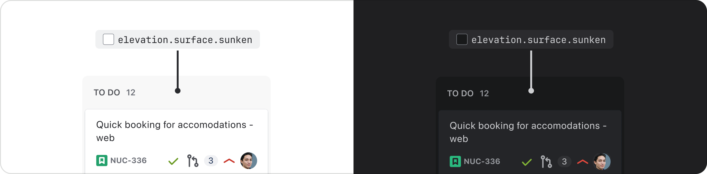

`color.background.neutral` is a token that uses a transparent color. It darkens in light mode and lightens in dark mode. Use this token when you need the background to adapt to different elevations, which is relevant in dark mode since surfaces change depending on what elevation you’re on.

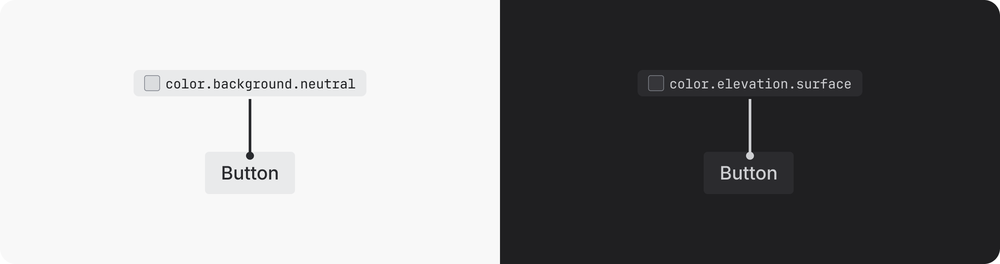

### Default
The default elevation is the baseline with respect to all other layers. It represents a flat UI surface with no visual lift, such as a Confluence page.

Use `elevation.surface` as the starting point for body content when building a UI. To create flat cards, pair with a border.

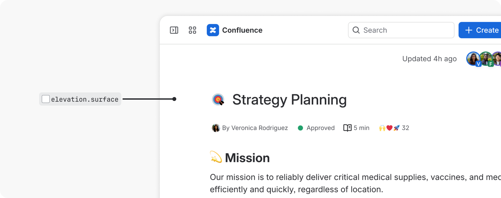

### Raised
Raised elevations sit slightly higher than default elevations. They are reserved for cards that can be moved, such as Jira and Trello cards. In special circumstances, they can be used for cards as a way to provide additional heirarchy or emphasis.

Always pair `elevation.surface.raised` with `elevation.shadow.raised`. This is particularly important in dark mode, where raised surfaces are lighter to help differentiate elevations.

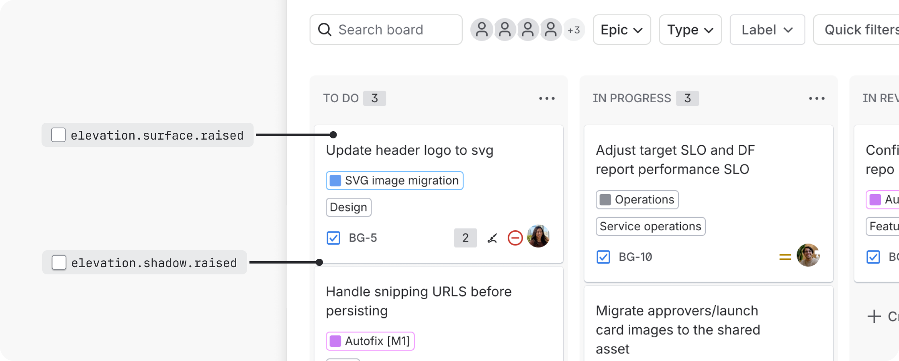

> **Do**
>
> Use raised elevations intentionally. If using for emphasis, limit to one section or focal point of the screen.

> **Don’t**
>
> Raised elevations can create visual noise, so don’t use to group content when a border or white space would suffice.


### Overlay
Overlay is the highest elevation available. It is reserved for a UI that sits over another UI, such as modals, dialogs, dropdown menus, floating toolbars, and floating single-action buttons.

Always pair `elevation.surface.overlay` with `elevation.shadow.overlay`. This is important in dark mode, where overlay surfaces are lighter to help differentiate elevations.

Overlays can stack on top of other overlays.

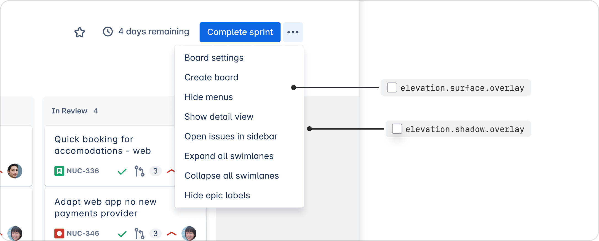

### Overflow
Overflow is a shadow indicating content has scrolled outside a view. It can be used for vertical or horizontal scroll. An example of overflow shadows is the horizontal scroll in tables on a Confluence page.

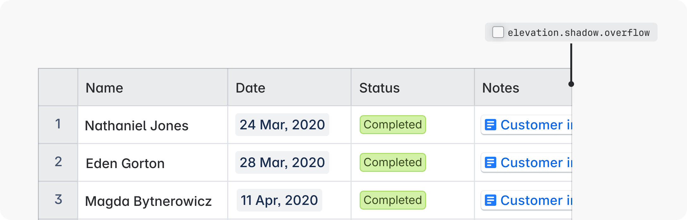

If box shadows are not technically feasible, use the combination of `elevation.shadow.overflow.spread` and `elevation.shadow.overflow.perimeter` to replicate the overflow shadow.


## Interaction states

### Hovered and pressed
Elevations use surface color changes to communicate hovered and pressed states. Use the hovered and pressed elevation tokens to create these visual changes.

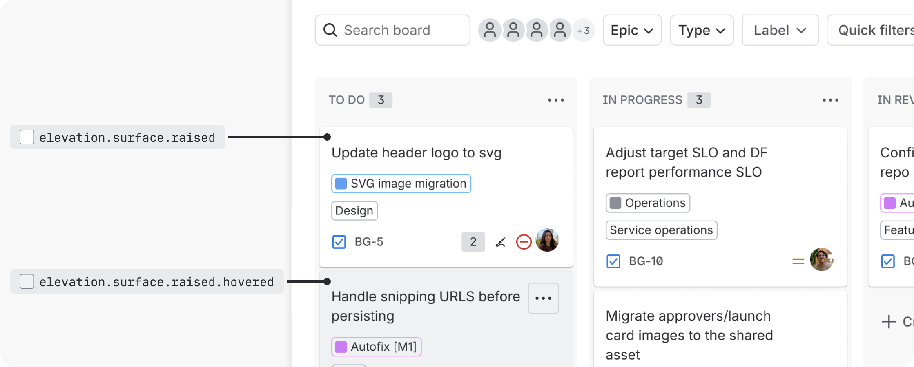

Transitions between elevations can be used as an alternative to hovered and pressed tokens, but only for default and raised elevations (not overlays):

- Transition to overlay elevation on hover
- Transition to raised elevation on press

This approach should be used sparingly to avoid excessive animation. It should not be used for very small UI, as elevation changes are harder to see than surface color changes at this size.

> **Do**
>
> Use the recommended hovered and pressed tokens for interaction states on elevations.

> **Don’t**
>
> Don’t combine elevation transitions and hovered and pressed tokens for interactive states. Use one or the other.


#### Background change example

```
// Default:
Background color: elevation.surface
Hovered background color: elevation.surface.hovered
Pressed background color: elevation.surface.pressed

// Default (bordered):
Background color: elevation.surface
Hovered background color: elevation.surface.hovered
Pressed background color: elevation.surface.pressed
Border: 1px solid color.border

// Raised:
Background color: elevation.surface.raised
Hovered background color: elevation.surface.raised.hovered
Pressed background color: elevation.surface.raised.pressed
Shadow: elevation.shadow.raised

// Overlay
Background color: elevation.surface.overlay
Hovered background color: elevation.surface.overlay.hovered
Pressed background color: elevation.surface.overlay.pressed
Shadow: elevation.shadow.overlay
```

#### Elevation change example

```
// Default:
Background color: elevation.surface
Hovered background color: elevation.surface.overlay
Pressed background color: elevation.surface.raised
Hovered shadow: elevation.shadow.overlay
Pressed shadow: elevation.shadow.raised

// Default (with border)
Background color: elevation.surface
Hovered background color: elevation.surface.overlay
Pressed background color: elevation.surface.raised
Border: 1px solid color.border
Hovered shadow: elevation.shadow.overlay
Pressed shadow: elevation.shadow.raised

// Raised
Background color: elevation.surface.raised
Hovered background color: elevation.surface.overlay
Pressed background color: elevation.surface.raised
Shadow: elevation.shadow.raised
Hovered shadow: elevation.shadow.overlay
Pressed shadow: elevation.shadow.raised
```

### Dragged
Use the overlay elevation for any UI that is being dragged. Once moved, it returns to its original elevation.

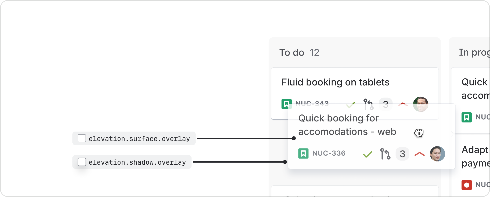


### scrolled
When scrollable content exceeds the available area, a border or overflow shadow can be applied at the point the content is cut off to indicate there is hidden content that can be scrolled back into view.

A border is the default approach for scrolled content and can be seen in modal sticky headers and footers, and top and side navigation.

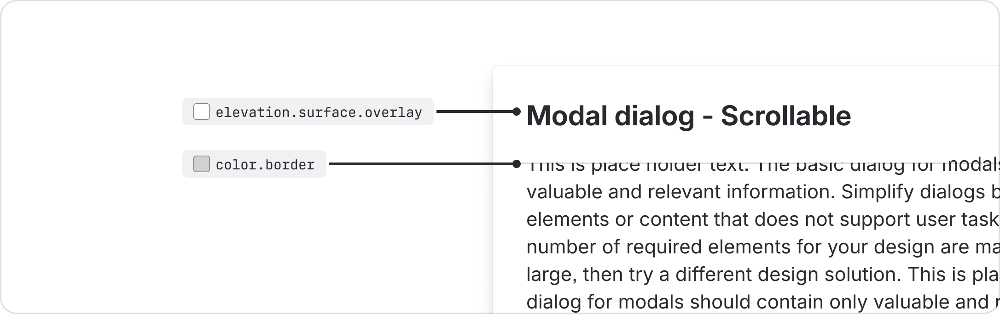

Overflow shadows are reserved for experiences where a border might be easily missed, such as in very small UI or tables that use borders to separate cells.

Both approaches should apply the appropriate surface token where the content is being hidden.


## All elevation tokens and values
For the full list of elevation design tokens and their values, see our design token reference list. Every token comes with a description to help you ensure you’re using the correct one.


## Best practices

### Follow the recommended surface and shadow pairings
Raised and overlay elevations have dedicated surface and shadow pairings.

> 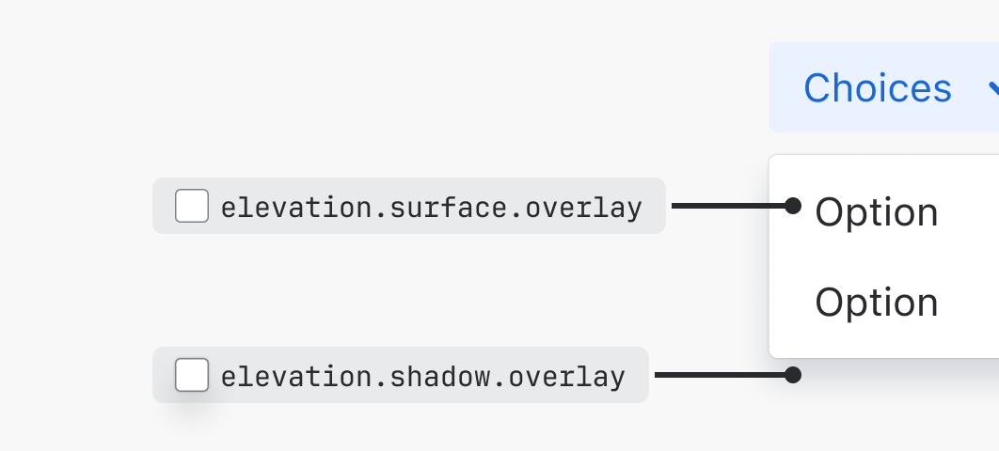
> **Do**
>
> When creating elevations, always pair matching surface and shadow tokens.

> 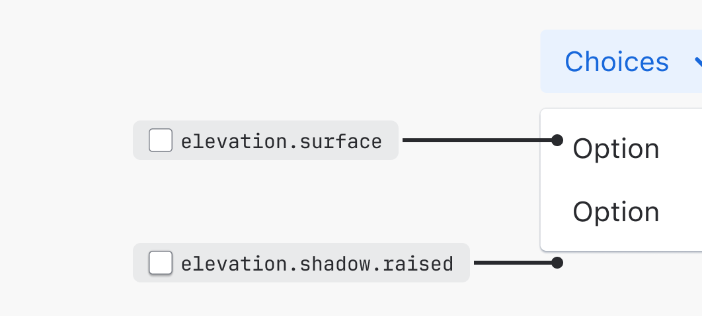
> **Don’t**
>
> Don't mix different shadow and surface elevation tokens.


### Replace elevation surfaces with background colors only when required
Elevation surfaces use our neutral palettes. If a different color is needed, surface tokens can be swapped for any solid background token. When using background tokens, align to the behavior of interaction states for color tokens.

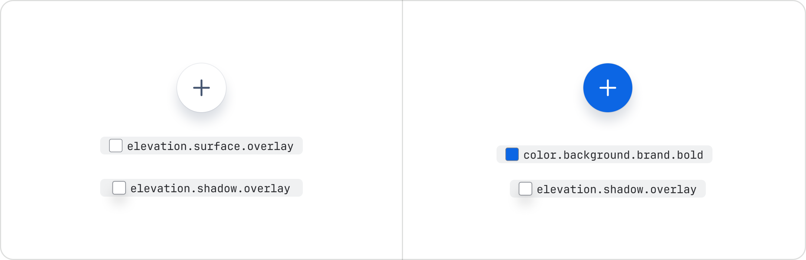


### Avoid excessive use of raised and overlay elevations
The shadows and surfaces of raised and overlay elevations can create busy UI if not applied intentionally. Follow the recommended guidance when considering these elevations.

> 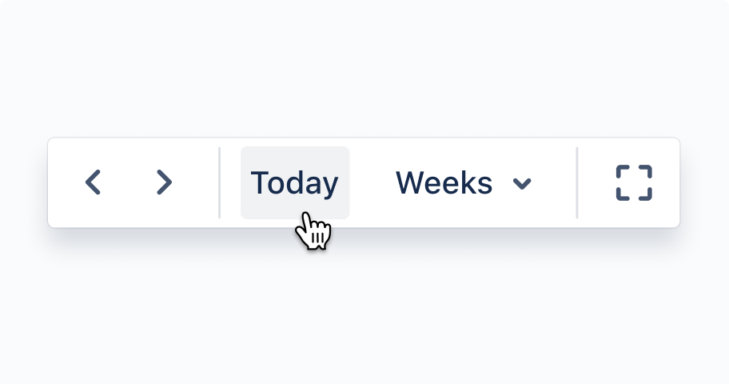
> **Do**
>
> Limit the use of overlay elevations by grouping related buttons together in a floating toolbar if they are required to sit over another UI.

> 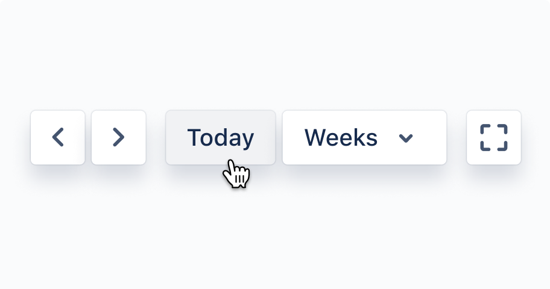
> **Don’t**
>
> Don’t have more than one floating button next to each other.


### Check contrast ratios
Always make sure your elevation and background choices are accessible.

> **Do**
>
> Check the contrast ratio for UI on overlay surfaces in dark mode to ensure it meets accessibility requirements.

> **Don’t**
>
> Don't assume that because UI is accessible in light mode, it will be in dark mode. Some UI may need tweaking.


## Z-index
The z-index determines the stacking order of elements. Elements with a higher z-index always sit in front of elements with a lower z-index.

Different UI can have the same elevation style, but each UI should apply a different z-index to indicate the layer(s) order in a stack (or where the elements touch).

Z-index | Example usage | Elevation level
--- | --- | ---
100 | None | None
200 | Atlassian navigation | Default
300 | Inline dialog | Overlay
400 | Popup | Overlay
500 | Blanket | None
510 | Modal | Overlay
600 | Flag | Overlay
700 | Spotlight | Overlay
800 | Tooltip | None

## Related
- Learn about the basics of design tokens.
- See the list of all design tokens for full descriptions and values for all tokens.
