# Grid
A layout guide for aligning content within the app's main content area.

## Overview
Grid is a system for arranging content consistently within the main content area of an Atlassian app.

In Figma, grids are typically set up using layout guides. In the Atlassian Design System, we offer a purpose-built Figma grid for structuring content within the app's main content area. Engineers implement equivalent layouts using a combination of primitives such as box, stack, and inline.

The layout component (in code and Figma) defines everything around the main content area, including navigation and panels.

Layout component anatomy showing the top nav, side nav, main, and panel. Grid sits within main.

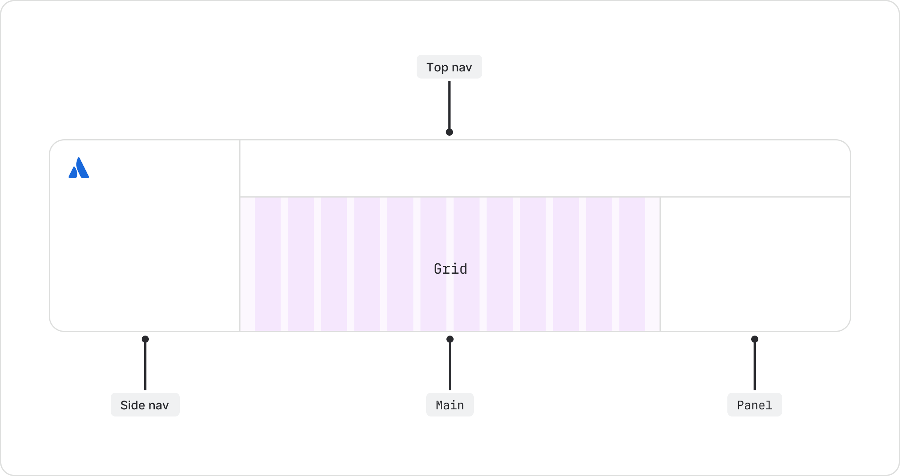

## Grid basics
Our Figma grid has three basic elements:

- **Columns** divide the main content area into 12 equal parts for horizontal structure.
- **Gutters** are the gaps between columns, providing consistent separation between content.
- **Margins** are the empty space between the outer columns and the edge of the main content area. They give content breathing room.

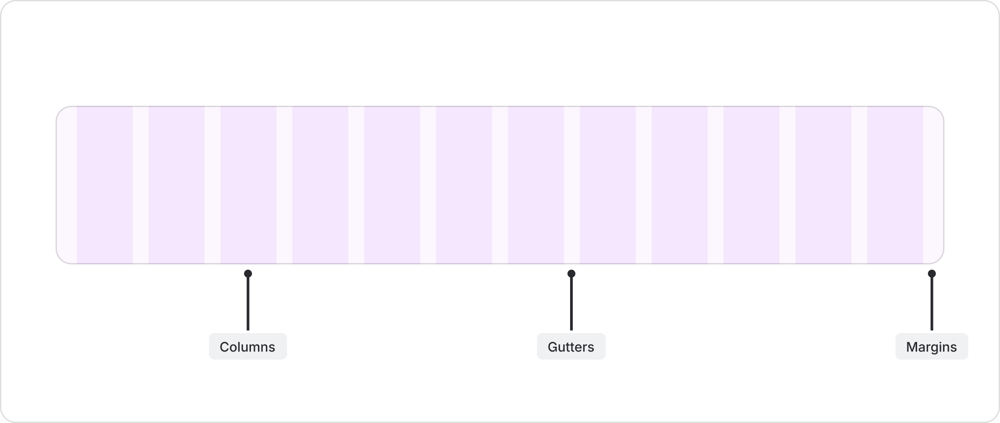

By aligning content to the columns, our grid accommodates a variety of layouts within the main content area.

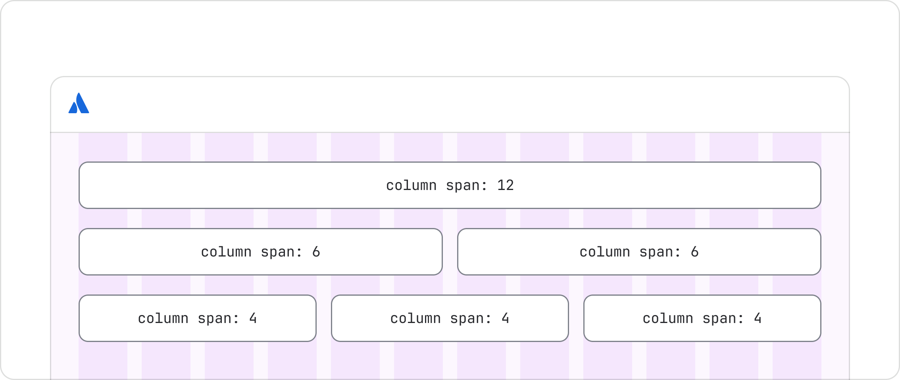

Content in the main content area can also span fewer columns, centered within the grid.

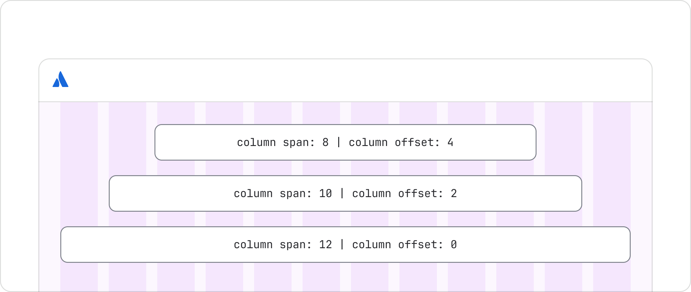

> 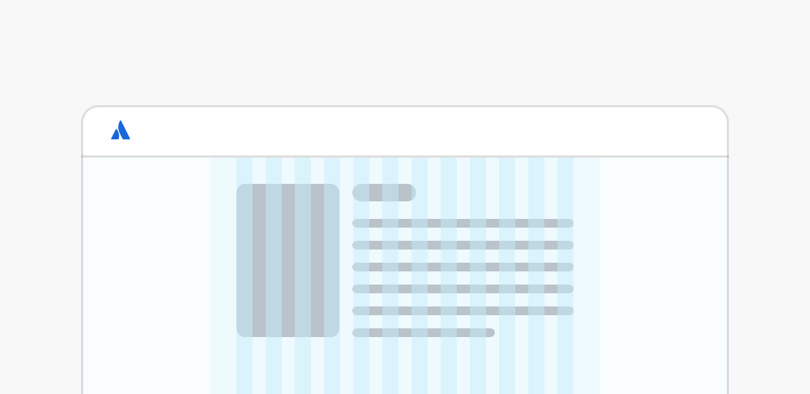
> **Do**
>
> Align content within the app's main content area across any number of columns required.

> 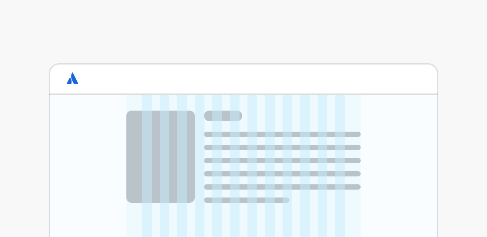
> **Don’t**
>
> Don't allow content to overflow into gutters or margins. This breaks visual alignment and makes layouts unpredictable.

## Aligning to the grid
Within the main content area, align content containers to the grid columns. Examples include cards, images, text blocks, tables, and forms.

Small elements, like buttons and icons, do not need to align to this grid. Use space tokens to manage the space between and within them instead.

The same applies within content containers. Only top-level containers need to align to the grid. Use space tokens for the elements inside them, such as cards and table columns.

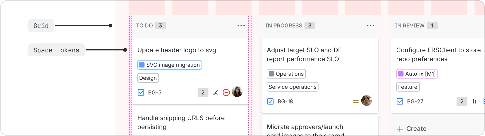

Overlays like modals, tooltips, and dropdown menus also sit outside the grid, as they float above the page content.

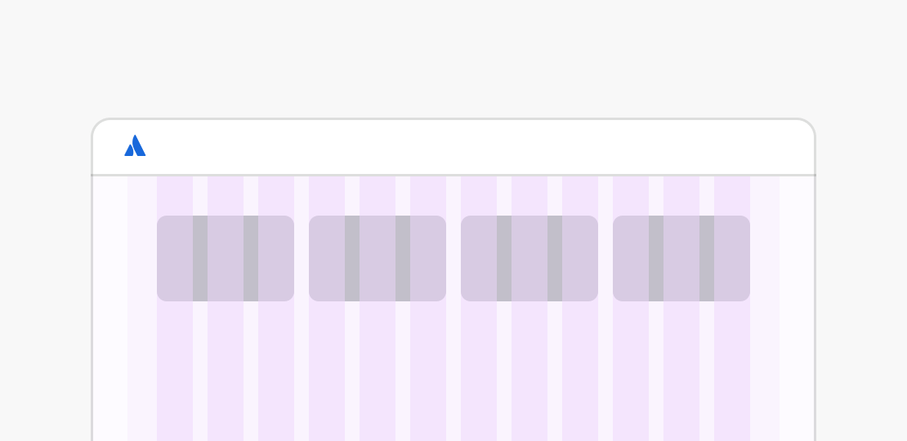

> **Do**
>
> Align content containers to our grid columns, such as cards, images, text blocks, tables, and forms.

> 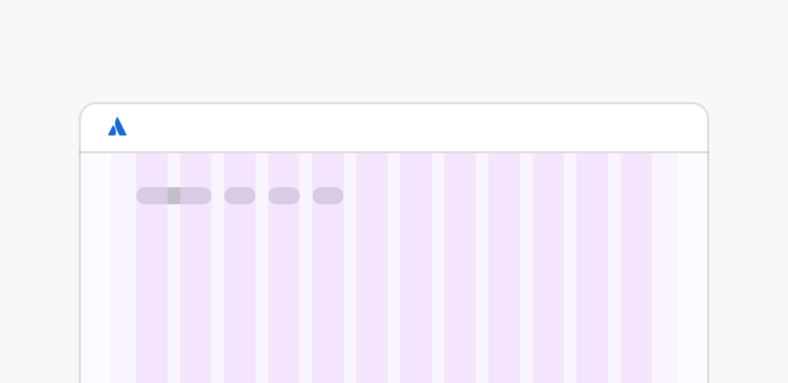
> **Don’t**
>
> Don't align small elements, such as buttons or icons, to the grid. Instead, use space tokens to manage their spacing.

## Nested grids
Space tokens are the recommended approach for aligning content within containers, but you can also apply an internal grid.

The underlying concepts are the same: columns, gutters, and margins. Our Figma grid is only intended for the main content area. To set up a grid inside a container, create your own using values from our spacing scale.

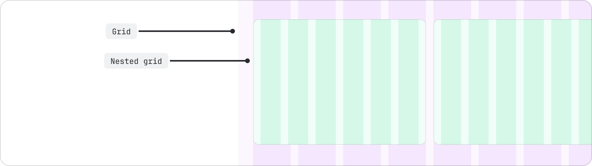

## Grid breakpoints
At each breakpoint, the gutter width, margin width, and number of columns adjust within the main content area.

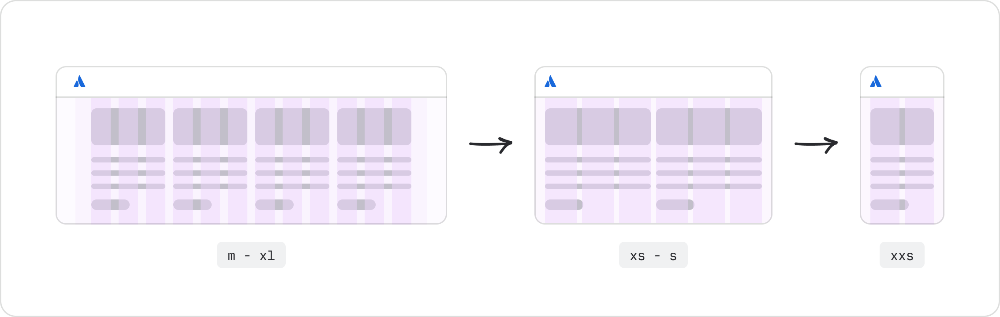

These are our default values for the grid in the main content area. Check your app or local system for the specific grid values in use, as they may differ.

| Breakpoint | Viewport | Columns | Gutters | Margins |
| --- | --- | --- | --- | --- |
| `xxs` | 320 - 479px | 2 | 12px | 16px |
| `xs` | 480 - 767px | 6 | 12px | 16px |
| `s` | 768 - 1023px | 6 | 12px | 16px |
| `m` | 1024 - 1439px | 12 | 16px | 32px |
| `l` | 1440 - 1767px | 12 | 16px | 32px |
| `xl` | 1768+px | 12 | 16px | 32px |

### Designing for multiple breakpoints
Design for at least 2 screen sizes, preferably more. One of these should be mobile.

| Device | Breakpoint | Width (px) | Height (px) | Good | Better | Best |
| --- | --- | --- | --- | --- | --- | --- |
| Mobile | `xxs` | 320 | 568 | ✓ | ✓ | ✓ |
| Tablet | `s` | 768 | 1024 | - | - | ✓ |
| Desktop | `l` | 1440 | 900 | - | ✓ | ✓ |
| Desktop | `xl` | 1920 | 1080 | ✓ | ✓ | ✓ |

Breakpoints also affect layout areas like navigation and panels. See the layout component for details.

## Grid types
There are two types of grid:

- **Fixed grids** have a maximum width and sit centered in the main content area. This is the default option.
- **Fluid grids** fill the available space in the main content area. Use fluid grids when content expands horizontally and has no natural maximum width. Use them sparingly. At very large viewports, text lines can become too long and visual relationships between elements may break down.

When the main content area is smaller than the maximum width, such as at smaller breakpoints, fixed grids behave the same as fluid grids.

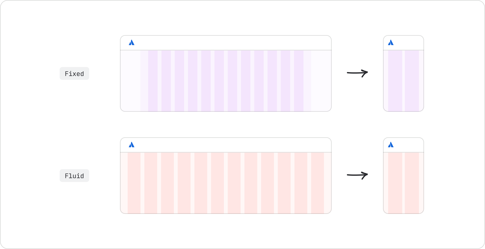

### Fixed grids
There are two fixed grid options:

- **Fixed-wide** has a maximum width of 1296px (including margins). Use this as the default for most experiences.
- **Fixed-narrow** has a maximum width of 864px (including margins). Use this for long-form content to limit line length and increase readability. Some internal elements, such as headers, may break out of the grid to span across the page.

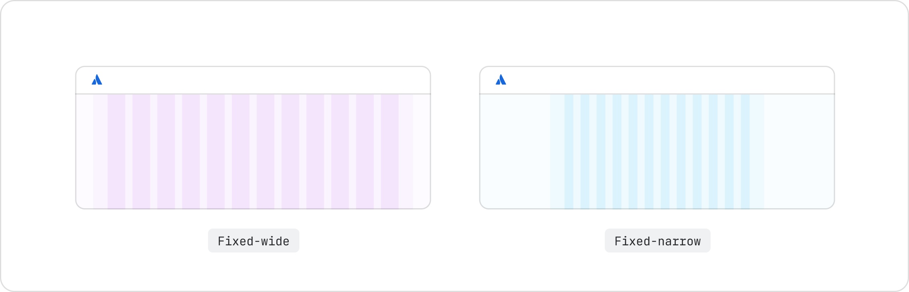

### Choosing a grid type
| Grid type | Maximum width (margins included) | Use when | Examples |
| --- | --- | --- | --- |
| Fixed-wide (default) | 1296px | Content benefits from structure but doesn't need full width | Dashboards, directories, search results |
| Fixed-narrow | 864px | Long-form reading is the primary activity | Blogs, articles, documentation |
| Fluid | No maximum | Content expands horizontally with no natural maximum width | Kanban boards, whiteboards |

> 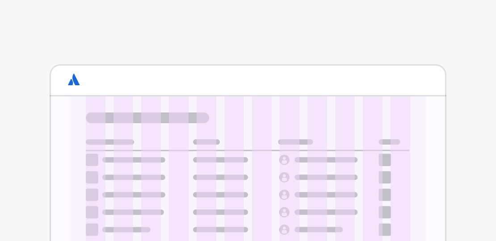
> **Do**
>
> Use fixed-wide grids for structured content, such as dashboards, search results, and directories.

> 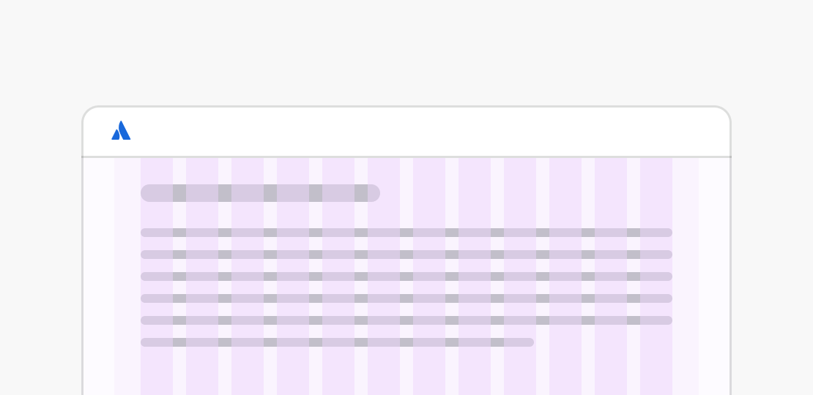
> **Don’t**
>
> Don't use fixed-wide grids for long-form content like blogs and articles. Long line lengths impair readability.

> 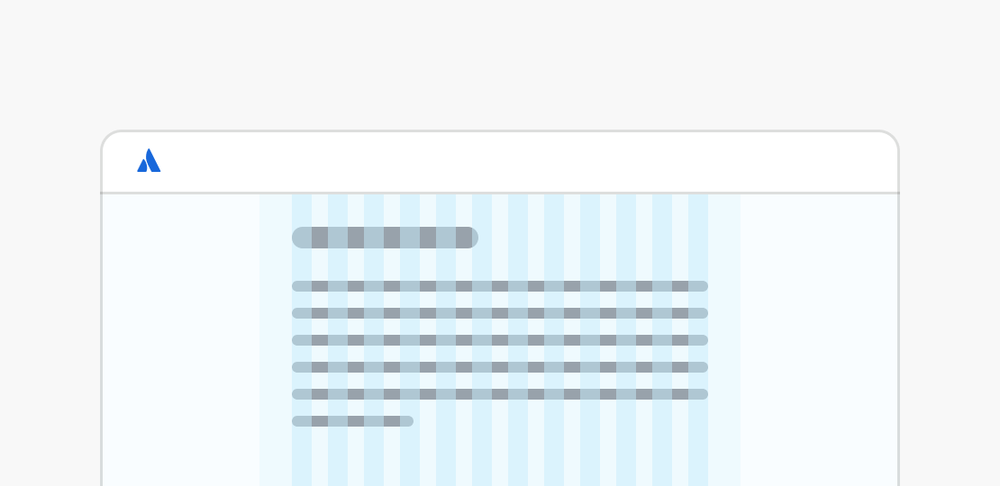
> **Do**
>
> Use fixed-narrow grids for long-form content, such as blogs and articles.

> 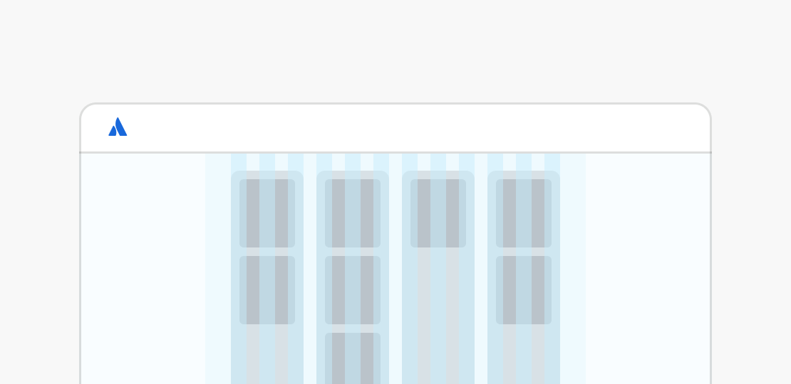
> **Don’t**
>
> Don't use fixed-narrow grids for content that needs more horizontal space. Use fixed-wide or fluid instead.

> 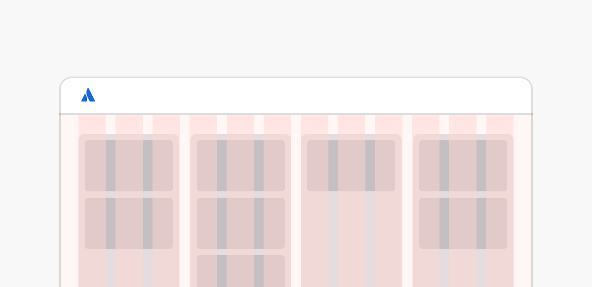
> **Do**
>
> Use fluid grids for content that expands horizontally, such as kanban boards and whiteboards.

> 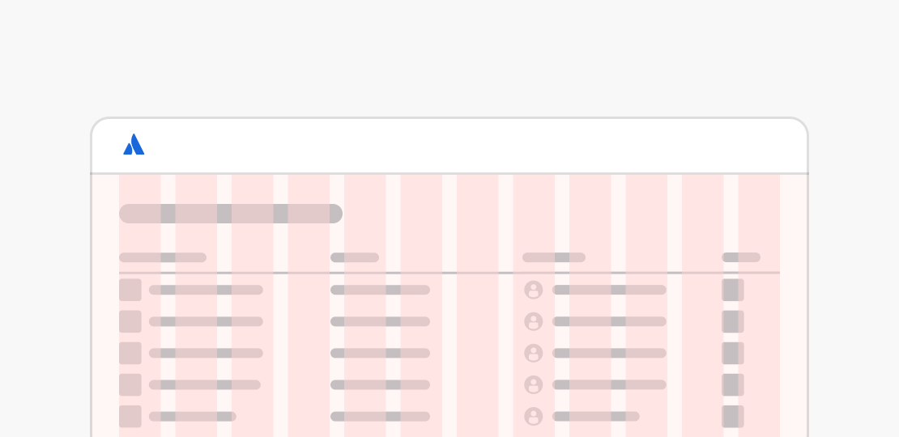
> **Don’t**
>
> Don't use fluid grids for structured content with a natural width, such as dashboards or directories. Elements lose their visual relationship at large viewports.

## Applying grid
The default grid is already built into the Figma layout component.

1. Select your grid type from the component properties panel.
2. Choose your breakpoint from the responsive menu in the appearance panel.

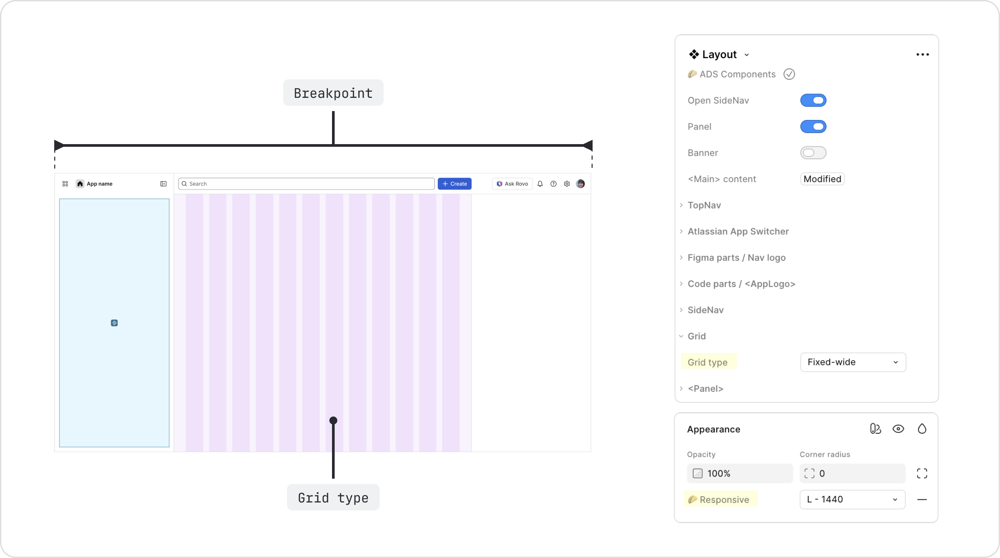

You can also use this grid outside of the layout component. Select it from the assets panel in the ADS Foundations library, or create your own using your app's values.

**Tip**: Use **Shift + G** (Mac) or **Control + G** (Windows) to show or hide the grid in Figma.

> 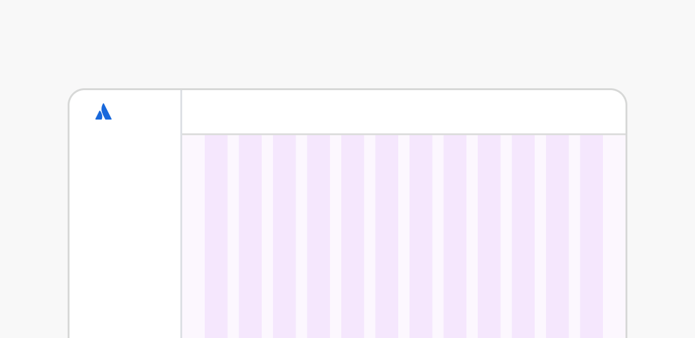
> **Do**
>
> Span only the main content area. Exclude the side nav and panel.

> 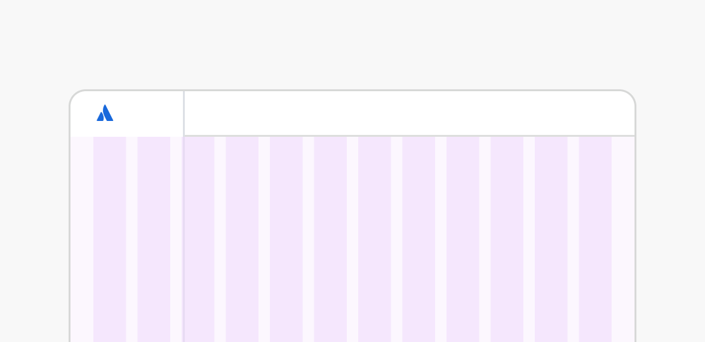
> **Don’t**
>
> Don't span the grid across navigation or panel areas.

> 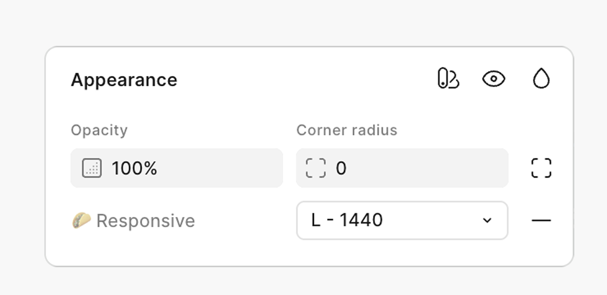
> **Do**
>
> Change the breakpoint from the responsive setting in the appearance panel.

> 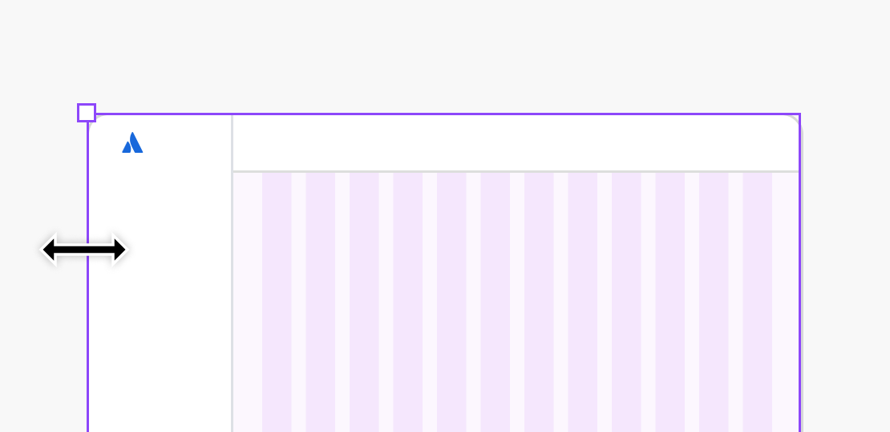
> **Don’t**
>
> Don't change the breakpoint by resizing the grid or layout component. The linked grid styles will map incorrectly.

> 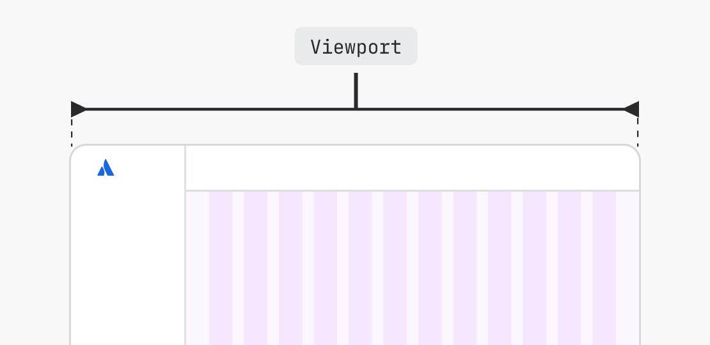
> **Do**
>
> Set the grid breakpoint to the full viewport width.

> 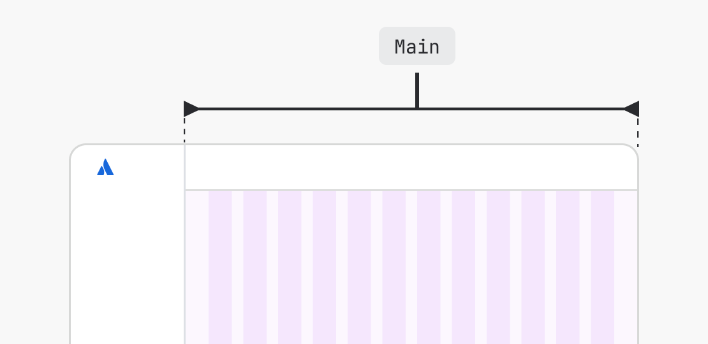
> **Don’t**
>
> Don't set the breakpoint based on the main content area width. Breakpoints are based on the full viewport width.

## Grid and auto layout
Grid is a layout guide, a visual reference for aligning content to columns. To build layouts that adjust as the breakpoint changes, use auto layout to position content along the grid columns.

> 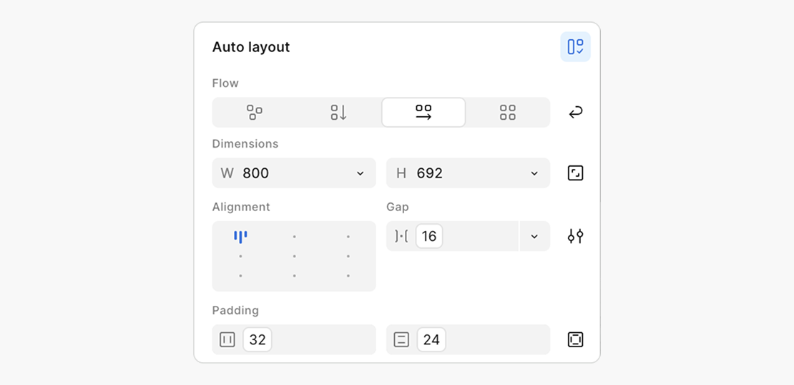
> **Do**
>
> Use auto layout to build responsive layouts that align to the grid.

> 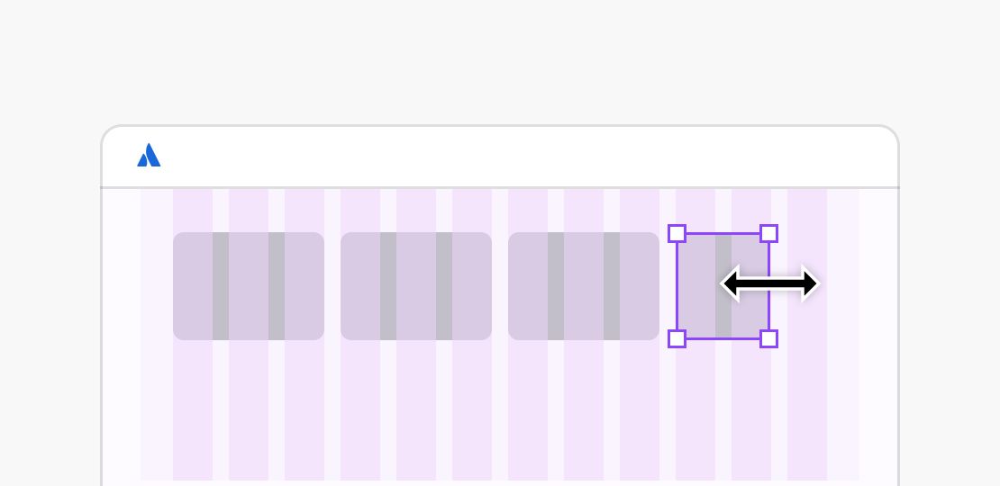
> **Don’t**
>
> Don't use absolute positioning or drag-to-place content without auto layout. Manual placement doesn't adapt to changing breakpoints and breaks responsive layouts.

## Related
- Layout is the component that defines the outer structure of an app, including navigation, panels, and the main content area.
- Primitives are the box, stack, and inline primitives used to build equivalent layouts in code.
- Spacing uses space tokens to ensure consistent alignment and separation between elements.
- ADS Figma libraries contain the pre-built grid with default Atlassian breakpoint values.
- Auto layout in Figma is Figma's guide to building responsive layouts that align to grid columns.
