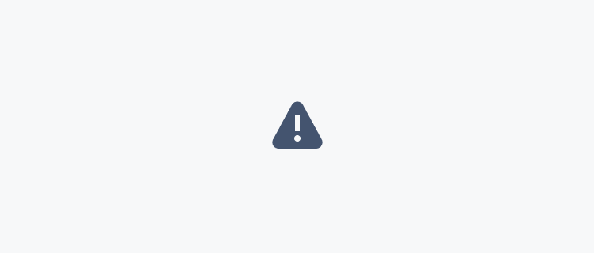
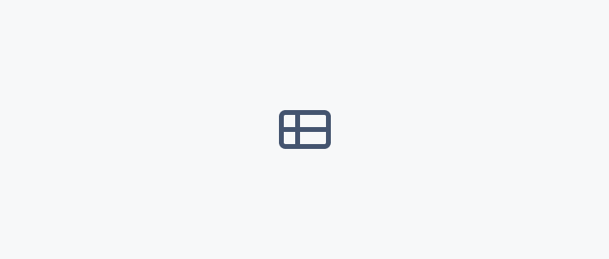
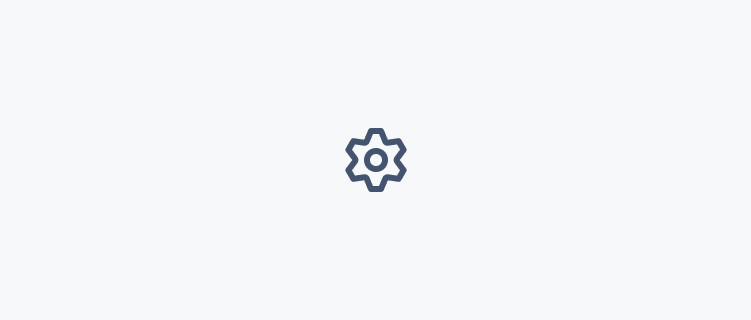
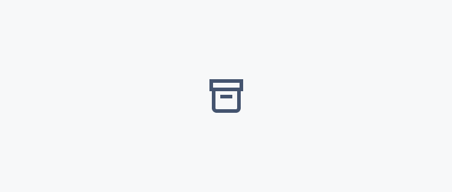
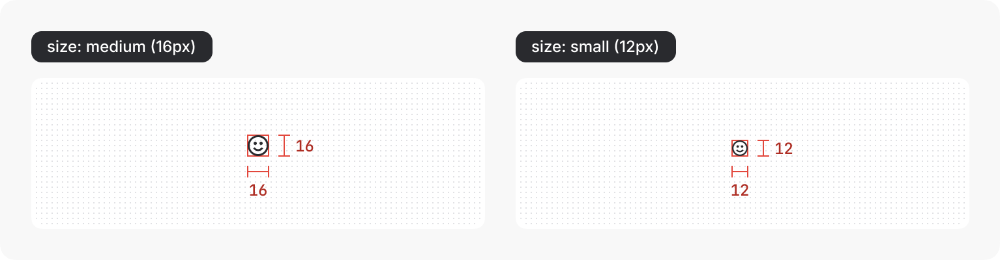
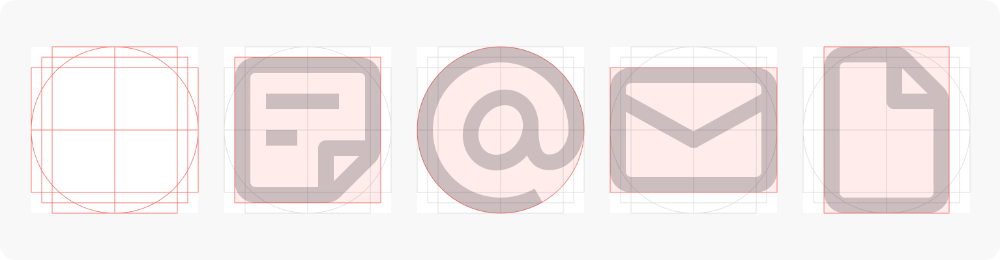
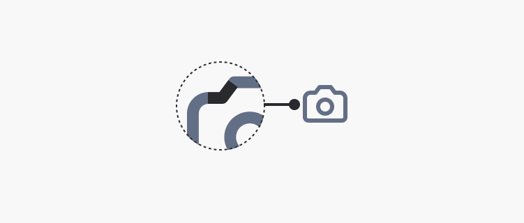
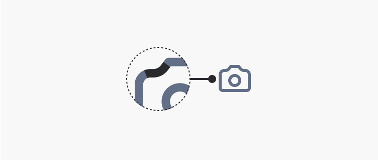
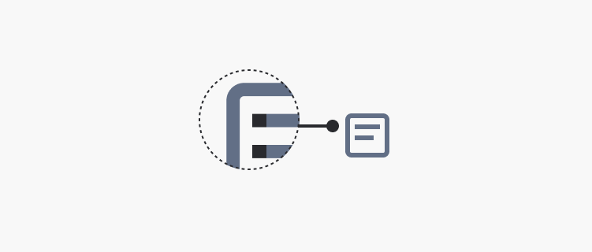
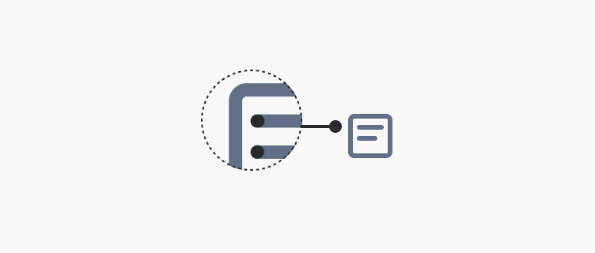

# Iconography
Icons are visual representations of commands, features, directories, or common actions.

Icons are symbols designed to represent concepts or specific features. A company's iconography style can express a lot about a brand and its values.

Atlassian's iconography has rounded corners and curves to align with our typography and other rounded UI elements, whilst square end terminals add boldness to create a harmonious app expression of Atlassian's broader design language.

## Iconography principles
Follow these principles to design and use Atlassian icons in a cohesive, useful, and legible way.

#### Design for universal understanding

Design icons that use widely recognized symbols and established visual metaphors. Ensure icons are easily understood by a diverse audience by avoiding specific cultural or language aspects.

#### Balance simplicity and detail to create legibility

Craft icons that are simple enough for quick recognition, yet detailed enough to convey meaning effectively, even at small sizes.

#### Maintain visual harmony

Ensure icons work together as a cohesive system by adhering to consistent size, shape, and style guidelines across the entire set.

#### Use icons intentionally

Icons are powerful signifiers that can aid comprehension and help with navigation. They can also add clutter or confuse people when used poorly. Use text labels to support icons wherever possible, and avoid using icons where they aren’t necessary.

## Using Atlassian icons
Atlassian icons are available as a component (React), Figma library, and in our documentation:

- View Atlassian icons
- Icon component usage
- Icon tile component
- Figma library of Atlassian icons (Atlassian employees only)

## Visual style
Atlassian’s icon style has a 1.5px stroke width with shapes that pair rounded corners with sharp interior corners and square line caps.

### Simplicity and metaphor
Wherever possible, use existing icons to maintain consistency and reinforce visual concepts across Atlassian apps so they become familiar to customers.

> 
> **Do**
>
> Use an existing icon or visual metaphor for consistency and clarity wherever possible.

> 
> **Don’t**
>
> Create a new icon if a suitable one already exists to represent the same metaphor.

Use simplified shapes with the minimum detail required to express a metaphor. The goal of an icon is to aid clear, quick comprehension — excess detail can distract and do the opposite. The small size of icons makes it harder to see fine details, so optimise for simplicity and legibility.

> 
> **Do**
>
> Use simple shapes with the minimum detail required to express a metaphor with clarity and legibility.

> 
> **Don’t**
>
> Don’t add excess detail. This may distract and be challenging to understand at a small sizes.

When creating a new icon, use symbols that clearly represent a concept. Try to use metaphors with clear and established associations wherever possible.

> 
> **Do**
>
> Use familiar symbols with clear and established associations that clearly represent a concept.

> 
> **Don’t**
>
> Use caution when creating an icon that isn’t a widely recognized symbol. It may be confused with another concept or misunderstood.

### Perspective and angles
Shapes should appear straight on or from a full 90 degree profile. Don’t use diagonal perspectives to create 3D shapes because these can be hard to discern at a glance, especially for people with some cognitive disabilities.

> 
> **Do**
>
> Use shapes that appear straight on without dimensionality.

> 
> **Don’t**
>
> Don’t use diagonal perspectives to create 3D shapes as they can be hard to discern at a glance.

### Size and spacing
System icons are drawn within a 16 × 16px bounding box and are available in two sizes:

#### Medium (16px) — use in most cases
Medium icons are 16 × 16px in size and are the default size in our system. This size balances harmoniously with body text and the density of Atlassian’s apps.

#### Small (12px) — Use sparingly
Small icons are 12 × 12px in size and are downscaled from their 16px counterpart. This size should be used sparingly as they aren't as legible as 16px icons. Limit usage of 12px icons to the following uses:

- Chevrons — always use 12px chevrons, particularly within buttons, icon buttons, and dropdowns to maintain cohesion with Atlassian's visual language.

- Field validation messaging — use 12px status icons for information, warnings, and errors.

- Within small contained elements — 12px icons balance with small text within tags, badges, statuses, and other similar compact elements.

- App affiliation — use 12px icons for "Powered by Atlassian Intelligence" or other Atlassian app affiliations.

- Secondary actions — use 12px icons to communicate hierarchy between primary way-finding icons and secondary actions so they don’t compete for attention.

- Supporting role — use 12px icons for supporting actions that shouldn't draw attention away from important content.

To apply spacing around an icon, we recommend placing it within a Box primitive with a padding value applied from our spacing system.

When larger icons sizes are needed for decorative purposes, consider using an icon tile which places the icon on a colored background tile. Icon tiles are available in multiple sizes and provides accessible icon and background color pairings.

### Shapes
Icons use consistent shapes to ensure a consistent look and feel across the set. We’ve designed each shape for optical scale and balance, so that taller, thinner shapes don’t feel like a different scale from shorter or wider shapes.

When designing new icons, you can use our icon template with built-in keyline shapes to guide your designs.

Reusing existing shapes from other icons can also help with consistency across the set. Make sure to use shapes that best represent the object metaphor you are expressing.

### Corners and curves
Curved edges lend to a friendlier feel, but keep internal edges sharp to maintain clarity.

> 
> **Do**
>
> Where possible, keep internal angles sharp.

> 
> **Don’t**
>
> Don’t apply curves on internal anchor points.

### End caps
End points should be squared off, not rounded.

> 
> **Do**
>
> Set end point style to "none" to ensure the path aligns with a pixel edge to prevent blurry results.

> 
> **Don’t**
>
> Don’t use "round" or "square" stroke end point styles.

### Color
Like most elements in our system, icons use design tokens for colors. Icons can use icon-specific color tokens or text color tokens for when you're matching an icon and text color. You can set the color of the icon using the icon component.

Both icon and text color tokens are designed to have enough color contrast against backgrounds and surfaces in Atlassian apps.

## Contribution and adding new icons
Currently Atlassian teams can contribute icons to our system for new designs and features.

- Before contributing an icon, look at our existing icon library and consider the following questions:
- Is the icon I’m contributing very similar to another system icon?
- Can I use an existing multi-purpose icon?
- Could my icon be confused with another concept that exists in apps?
- Does this design really require an icon at all? - Would a text label, button, or other approach provide a clearer affordance for customer understanding?
- To contribute a new icon, follow the contribution guide (Atlassian employees only).

## Related
- Browse all icons and learn how to use them in apps with the icon component.
