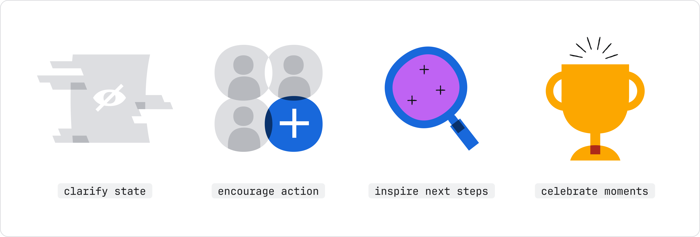
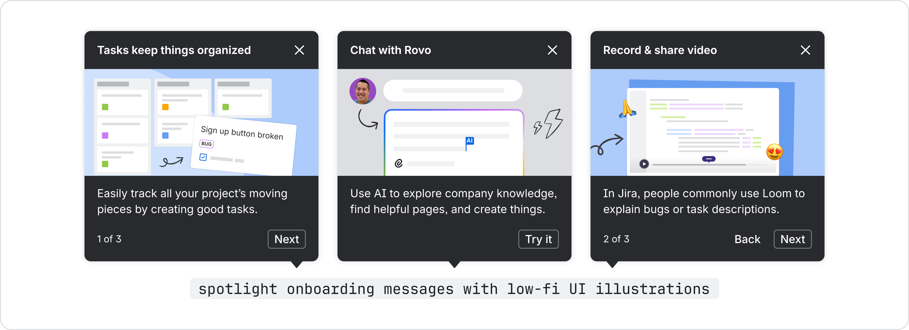
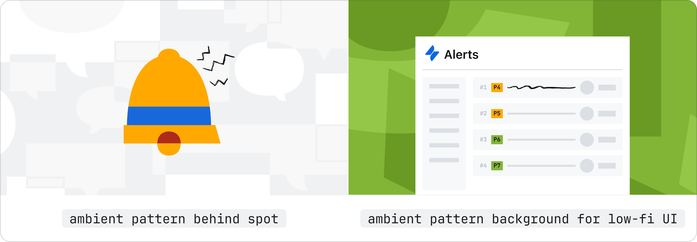
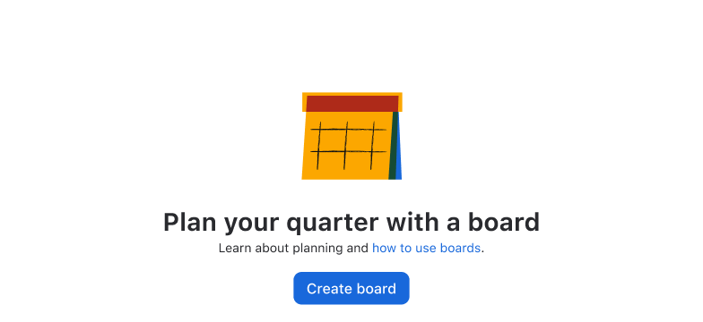
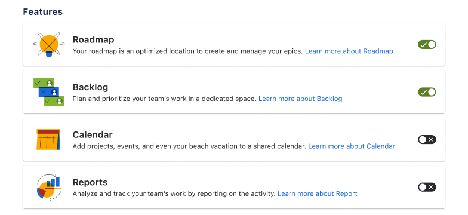

# Illustrations
Illustrations help convey complex ideas in a simple way. They should be meaningful and reflect a user's context and emotional state.

Use illustrations to guide users through tasks, explain complex workflows, or provide context in empty and error states. When applied correctly, illustrations add clarity and brand personality to Atlassian product experiences.

## Types of illustrations
Follow the in-product illustration guidance (Atlassian only) when composing UI with illustrations.

### Spot
Spot illustrations represent a single concept. Use them for empty states, error states, or celebrating big wins. Colorful spots add emphasis, while neutral spots work for more common tasks and less celebratory moments.

Access Spot gallery (Atlassian only)

### Low-fidelity UI
Use low-fidelity UI for onboarding, spotlight feature tours, or explaining complex workflows where active UI would be overwhelming. Don't use actual screenshots in product, which creates a screen-within-screen appearance that can be confusing. Instead, use basic shapes, sharp corners, and mostly gray tones to compose low-fi UI.

View low-fi UI guide (Atlassian only)

### Ambient pattern
Patterns add texture and brand personality as background elements. Use patterns for messages or promotional areas that need visual interest but don't require a specific conceptual image.

Access ambient pattern options (Atlassian only)

### Choosing the right illustration type (quick reference)

| Type | Best for | Guidelines |
| --- | --- | --- |
| **Spot** | Empty states, error states, celebrating big wins | Spot gallery in Brand Foundations library (Atlassian only) |
| **Low-fidelity UI** | Onboarding, spotlight feature tours, explaining workflows | Low-fi UI guidance (Atlassian only) |
| **Ambient pattern** | Background elements for messages and promotional areas | Patterns in Brand Foundations Library (Atlassian only) |

## Best practices
Always follow the brand guidance for product illustrations (Atlassian only).

### Use illustration intentionally
Before you start choosing an illustration, decide if it is really necessary. Visuals in product should always support the goal and context for the user, rather than being purely decorative.

> 
> **Do**
>
> Use illustration to support copy and surrounding elements. Illustration should work with the message, not replace it.

> 
> **Don’t**
>
> Excessive illustrations increase cognitive load. Consider icons, copy, ambient pattern, or other affordances before using illustrations.

### Don't use Collage or decorative-only images in product
Collage is for marketing landing pages and communications only — it's too visually busy for in-product use.

> 
> **Don’t**
>
> Don't use collage-styled or purely decorative illustrations in product (app) experiences.

> 
> **Do**
>
> Use meaningful spots, low-fidelity UI, or ambient patterns for in-product illustrations.

### Using existing illustrations vs. designing new ones
Most cases call for using existing brand assets.

For big launches or complex new features requiring unique stories, custom illustrations may be needed. These require more time and usually involve working with creative and motion teams.

Get help from the brand team for complex or new illustrations (Atlassian only)

## Other visual aids
Avatars, icons, and logos represent users, actions, and brands within the product.

- Avatars represent users, projects, or other Atlassian entities.
- Icons represent common actions and concepts along with text labels. Note that brand icons are different to product icons.
- Logos represent branded Atlassian products and services.
- Image component displays photos and illustrations with dark mode and responsive scaling support.

## Resources (Atlassian only)
- Browse all illustrations: Brand Foundations Figma Library
- Download all brand assets and access detailed guidelines: Mosaic: brand assets and guidelines
- Get help from the brand team: Brand illustration office hours (Atlassian only)
