# Logos
A logo is a visual representation of a brand or app (product). It can be a word or an image, or a combination of both.

> **Download logos**
>
> The full set of app (product) logos are available in Atlassian Mosaic.
>
> Logos used to represent third-party integrations are available in Atlaskit staging (Atlassians only).

This page includes downloadable logo files for use in marketing contexts as well as specific usage guidance for app or marketing contexts.

If you want to add logos to app (product) experiences, use the logo component.

## Download the logos
Each downloadable file includes variations of color and layout in approved formats and the below elements combined together:

- logomarks – the icon portion of a logo
- wordmarks – the name of the app (product) or property
- straplines or other secondary text.

Assets for isolated logomarks are also included.

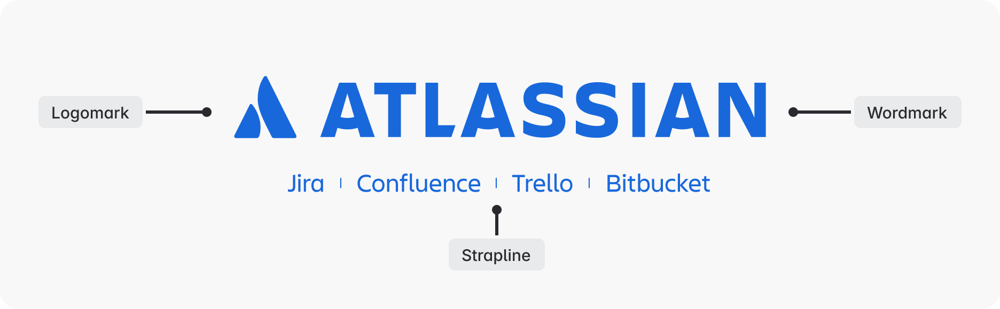

### Our iconic Atlassian logo
Our iconic company logo.

Include `Atlassian` as the alt-text for the logo in digital experiences.

[Atlassian (106.35KB)](./Atlassian/)

#### Atlassian app strapline
The Atlassian logomark and wordmark can be coupled with a list of app (product) names under it. Follow the below guidance when using logos that contain straplines:

- Always centre the app names under the logo and don’t scale the logo below 280px wide.
- Write Atlassian and the app name in the alt-text in digital experiences.

### Attribution logos
The attribution logos are a type of lockup that combine app (product) or property logomarks with the Atlassian strapline.

They create consistency in our portfolio, and help customers connect them with our overall Atlassian brand. Follow the below guidance when using attribution logos:

- Only use attribution logos when the Atlassian context is not clear. For example, in advertisements, videos, and white papers. You don’t need to use them on Atlassian properties like www.atlassian.com or in app (product) user interfaces.
- Never compose your own attribution logos or deconstruct the official assets.
- Write the name of the app (product)/property and Atlassian in the alt-text for in digital experiences.

[Analytics (53.30KB)](<./analytics attribution/>)

[Assets (41.47KB)](./assets/)

[Atlas (43.10KB)](<./Atlas Attribution/>)

[Bitbucket (55.91KB)](<./bitbucket attribution/>)

[Compass (53.95KB)](<./compass attribution/>)

[Confluence (62.51KB)](<./confluence attribution/>)

[Customer Service Management (222.59KB)](<./customer service management attribution/>)

[Focus (31.53KB)](./focus/)

[Goals (37.33KB)](./goals/)

[Guard (30.81KB)](./guard/)

[Home (40.91KB)](<./home attribution/>)

[Hub (36.26KB)](<./hub attribution/>)

[Jira (46.08KB)](<./jira attribution/>)

[Jira Align (71.36KB)](<./jira align attribution/>)

[Jira Product Discovery (174.83KB)](<./jira product discovery attribution/>)

[Jira Service Management (178.94KB)](<./jira service management attribution/>)

[Loom (100.34KB)](<./loom attribution/>)

[Opsgenie (62.16KB)](<./opsgenie attribution/>)

[Projects (53.13KB)](<./projects attribution/>)

[Rovo (364.68KB)](<./rovo attribution/>)

[Search (53.32KB)](<./search attribution/>)

[Sourcetree (66.89KB)](<./sourcetree attribution/>)

[Statuspage (71.90KB)](<./statuspage attribution/>)

[Studio (49.11KB)](<./studio attribution/>)

[Talent (56.04KB)](<./talent attribution/>)

[Teams (54.06KB)](<./teams attribution/>)

[Trello (45.93KB)](<./trello attribution/>)

### Property logos
The Atlassian program and property logos are a lockup of the Atlassian logomark and wordmark and the name in Charlie Sans. Follow the below guidance when using property logos:

- On a white background, the program name is rendered in neutral with the logo in primary blue. On darker backgrounds, both program and logo are white.
- Write Atlassian and the name of the property as the alt-text in digital experiences.

[Atlassian Access (38.85KB)](<./Atlassian Access/>)

[Atlassian Blog (76.80KB)](./Blog/)

[Atlassian Certification (96.71KB)](./Certification/)

[Atlassian Community (92.07KB)](./Community/)

[Atlassian Design (80.31KB)](./Design/)

[Atlassian Developer (94.65KB)](./Developer/)

[Atlassian Documentation (103.78KB)](./Documentation/)

[Atlassian Ecosystem (98.98KB)](./Ecosystem/)

[Atlassian Enterprise (87.11KB)](./Enterprise/)

[Atlassian Foundation (88.42KB)](./Foundation/)

[Atlassian Marketplace (101.96KB)](./Marketplace/)

[Atlassian Partner (76.61KB)](./Partner/)

[Atlassian Support (82.56KB)](./Support/)

[Atlassian University (91.84KB)](./University/)

### App (product) Logos
With the Atlassian System of Work and collections framework our primary products, secondary products and plaftform features are now referred to as apps.

We’ve updated our logos to reflect this change, using marks that symbolize functionality, contained in a tile. An app’s glyph is chosen based on the apps functionality; its tile color refers to its collection.

The logomarks are contained by a tile shape, colored with their associated collection. Follow the below guidance when using App (product) logos:

- Use when the Atlassian context is clear.
- If you need to connect the app to Atlassian, use an attribution logo instead. For example, in a video or advertisement.
- Write the name of the apps in the alt-text in digital experiences.

Assets include both isolated logomarks and lockups with wordmarks.

[Home (25.42KB)](./home/)

[Jira (24.81KB)](./jira/)

[Confluence (46.87KB)](./confluence/)

[Loom (64.05KB)](./loom/)

[Focus (31.53KB)](./focus/)

[Talent (46.02KB)](./talent/)

[Jira Product Discovery (141.86KB)](<./jira product discovery/>)

[Compass (37.94KB)](./compass/)

[Bitbucket (39.57KB)](./Bitbucket/)

[Jira Service Management (146.18KB)](<./jira service management/>)

[Assets (41.47KB)](./assets/)

[Opsgenie (46.95KB)](./opsgenie/)

[Trello (30.17KB)](./trello/)

[Goals (37.33KB)](./goals/)

[Teams (38.56KB)](./teams/)

[Search (37.77KB)](./search/)

[Chat (26.41KB)](./chat/)

[Studio (33.84KB)](./studio/)

[Analytics (37.97KB)](./analytics/)

[Hub (19.73KB)](./hub/)

[Projects (38.30KB)](./projects/)

[Guard (30.81KB)](./guard/)

[Rovo (472.25KB)](./rovo/)

[Sourcetree (51.53KB)](./sourcetree/)

[Customer Service Management (183.66KB)](<./customer service management/>)

[Statuspage (56.44KB)](./statuspage/)

[Jira Align (68.74KB)](<./jira align/>)

[Atlas (49.53KB)](./Atlas/)

[Bamboo (44.99KB)](./Bamboo/)

[Clover (39.06KB)](./Clover/)

[Crowd (38.12KB)](./Crowd/)

[Crucible (40.70KB)](./Crucible/)

[Fisheye (41.67KB)](./Fisheye/)

#### Logomarks
A logomark is a symbol or icon shown without the app (product)/property name or brand workmark. For an app (product), this refers to the tile. Follow the below guidance when using logomarks:

- If you’re including the logomark in product experiences, use the icon variant of the logo component.
- Only use logomarks on their own when the context is very clear and where possible pair with descriptive text.
- Write `Atlassian` or the app/property name in the alt-text in digital experiences.

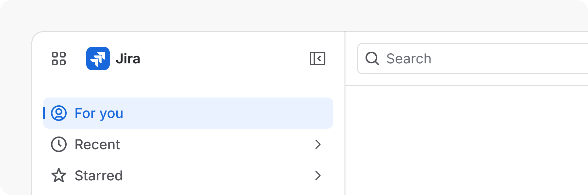

Logomarks are paired with native text in top navigations

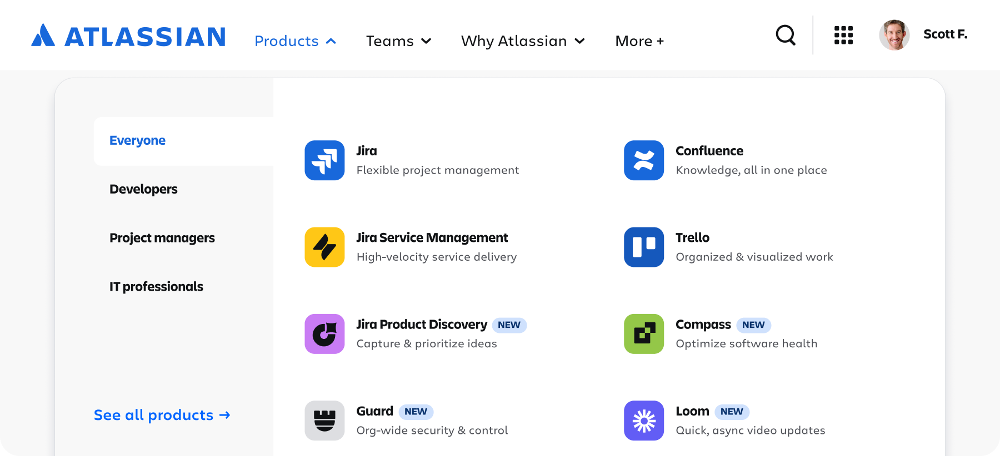

Logomarks are suitable when rendering the app name natively in its environment is more legible and user-friendly.

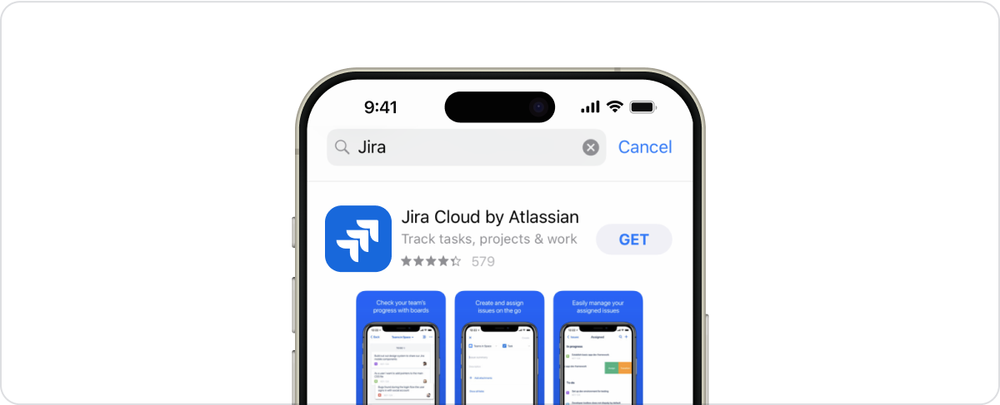

Logomarks can be used when environmental restrictions do not allow for proper clearance guidelines to be followed for full logos.

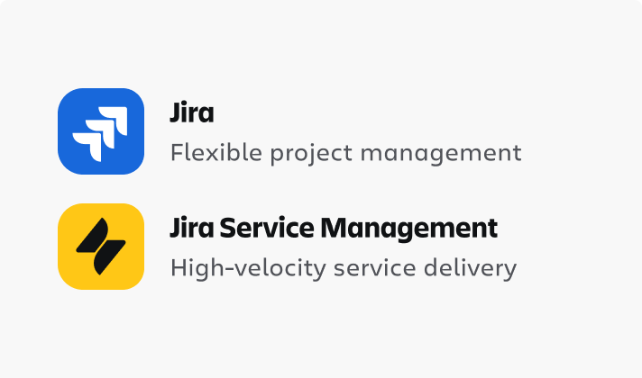

Logomarks can be paired with native text in product lists when the product names are rendered by the interface.

#### Logomark shape and size
The logo component comes in specific sizes and the logomark has a pre-defined radius. These should not be altered.

The exception to this is when appearing on external sources such as Apple mobile apps and Google Marketplace where specific container shapes need to be used.

Logomarks should never be nested inside additional containers.

> 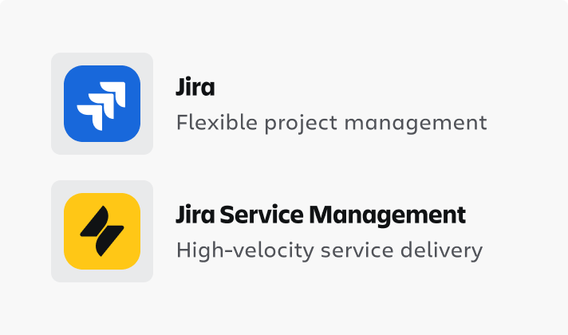
> **Don’t**
>
> Don’t nest logomarks inside additional containers.

> 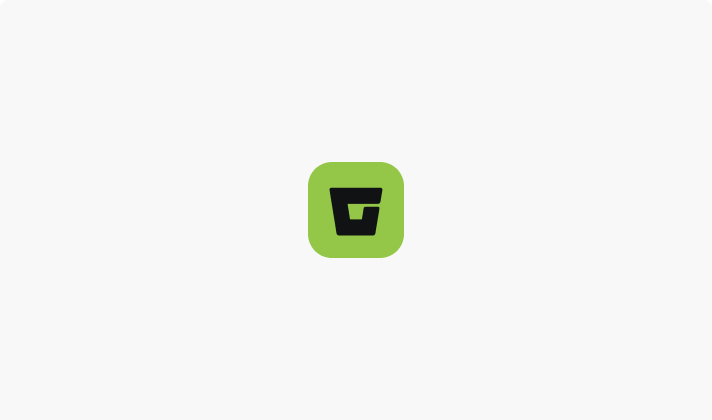
> **Do**
>
> Use the default radius values that are applied to the backgrounds of app logo icons.

> 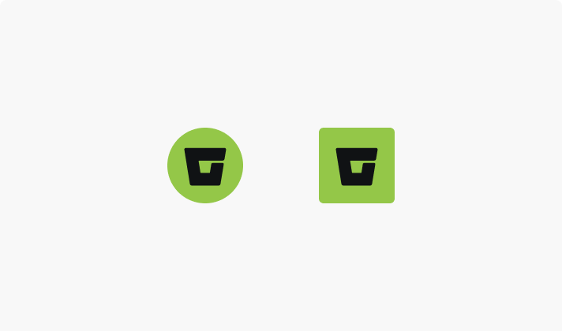
> **Don’t**
>
> Don’t adjust the radius values of the backgrounds of product logo icons.

> 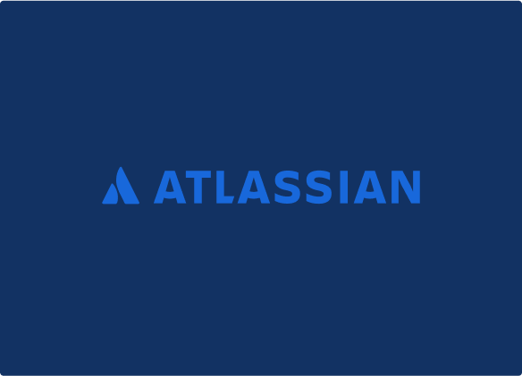
> **Don’t**
>
> Don’t use unapproved color combinations.

### Aligning logos

#### Align logomarks with other Elements
- Middle align with the logo mark when the copy is less than the height of the container.
- Top-align or stack below with center-alignment if it’s taller than the container.

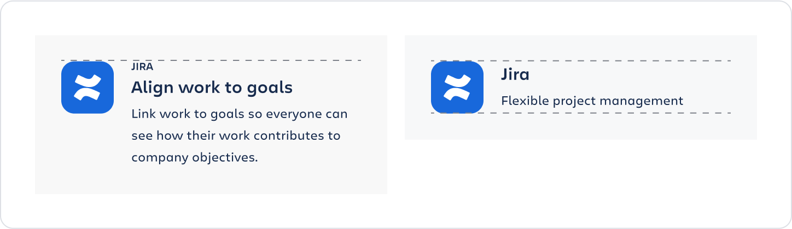

#### Aligning app (product) logos
Where app (product) logos are arranged in a vertical or horizontal list, use the height or weight of the logomark portion to align.

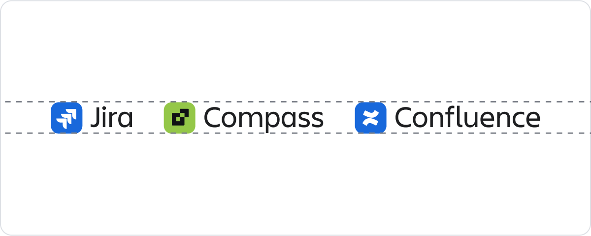

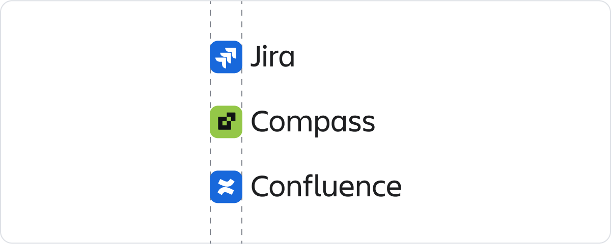

## Logo clearance
When displaying logos outside of an app UI, surround them with clear space free of type, graphics, and other elements that might cause visual clutter.

#### Ideal clearance — Atlassian logo

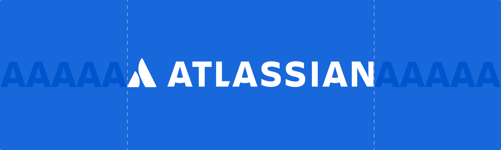

#### Minimum clearance — Atlassian logo
Use the capital "A" of the Atlassian wordmark to define the minimum clearance around the logo.

#### Ideal clearance — app (product) Logo

#### Minimum clearance — app (product) Logo
Use the height and width of the logo wordmark to find the minimum clearance around the logo.

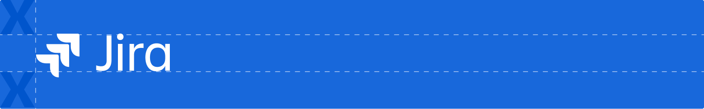

## Color options
Logos are available in three color options to suit different colored environments – Brand, inverse and neutral.

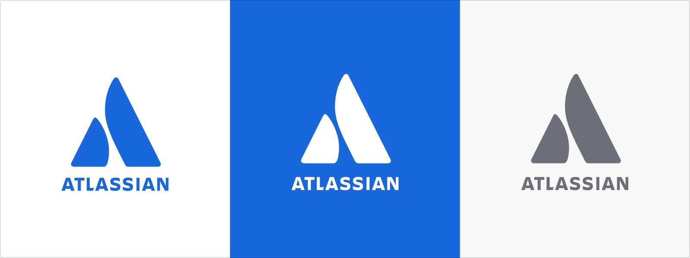

Don’t edit or place logos in ways that reduce the clarity and legibility of the image.

> 
> **Don’t**
>
> Don’t use unapproved color combinations.

> 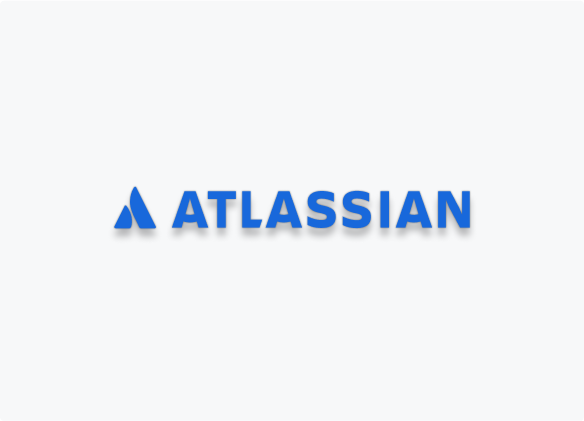
> **Don’t**
>
> Don’t use a drop shadow.

> 
> **Don’t**
>
> Don’t use the logo on top of complex backgrounds.

> 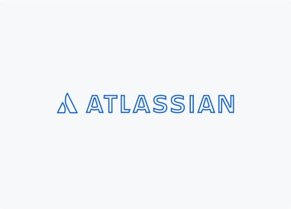
> **Don’t**
>
> Don’t outline the logo.
