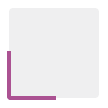
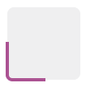
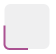
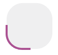
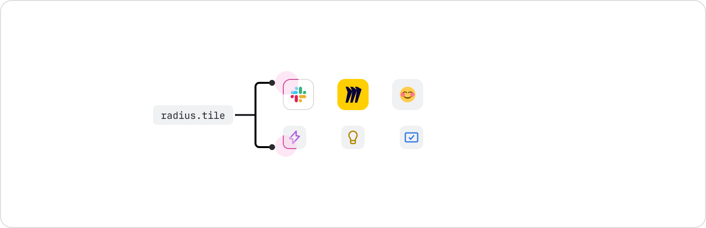
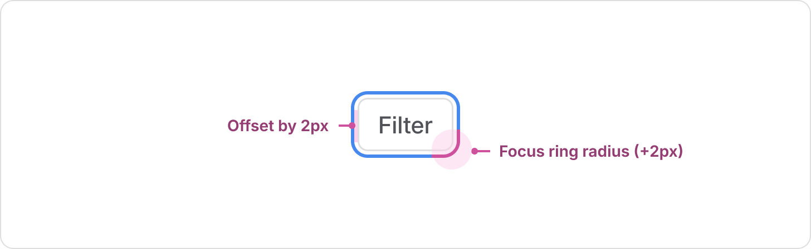
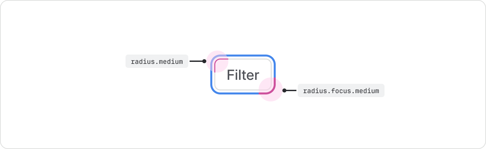

# Radius
Define and standardize the corner roundness for visual elements.

## About radius tokens
Radius tokens standardize corner roundness, ensuring consistency and cohesion throughout all of our apps. Pair radius tokens with radius focus tokens to bring focus to the selected element. This helps users identify which element is active.

## Radius tokens and usage guidelines
Use radius tokens to apply roundness across different states and use cases.

| Token name | Suitable for | Value* | Visual preview |
|---|---|---|---|
| `radius.xsmall` | Small detail elements: badges, checkboxes, avatar labels, keyboard shortcuts. | 2px | |
| `radius.small` | Supporting elements: labels, lozenges, timestamps, tags, dates, tooltip containers, imagery inside a table, compact buttons. | 4px | |
| `radius.medium` | Interactive elements: buttons, inputs, text areas, selects, navigation items, smart links. | 6px | |
| `radius.large` | Containment elements: cards, in-page containers, floating UI, dropdown menus. | 8px | |
| `radius.xlarge` | Large page elements: full-page containers, large containers, modals, Kanban columns, tables. | 12px | |
| `radius.xxlarge` | Video player containers. | 16px | |
| `radius.full` | Circular elements (user/people related): avatars, names, user-related UI, emoji reactions. | 999px | |
| `radius.tile` | Use this specific radius token exclusively for the tile component system. | Calculated 25% | |

* Token values are subject to change and should be used as an indication only.

## Radius examples and usage

### Extra small
Use the `radius.xsmall` token for extra small detail elements like badges, checkboxes, avatar labels, and keyboard shortcuts.

### Small
Use the `radius.`small token for small elements like labels, lozenges, timestamps, tags, dates, tooltip containers, imagery inside tables, and compact buttons.

### Medium
Use the `radius.medium` token for interactive elements like buttons, inputs, text areas, selects, navigation items, and smart links.

### Large
Use the radius.large token for elements like cards, in-page containers, floating UIs, and dropdown menus.

### Extra large
Use the `radius.xlarge` token for full-page containers, large containers, modal dialogs, Kanban columns, and tables.

### Extra extra large
Use the `radius.xxlarge` token for video players.

### Full
Use the `radius.full` token for avatars, names, user-related UI, and emoji reactions. This token can also be used for dividers and other pill-shaped elements since it results in a fully round radius.

### Tile
Use the `radius.tile` token exclusively for tile components, such as icon tile or object tile. This token should not be used outside of tiles.

## Radius token for focus state
A component's focus state is critical for accessibility. The corner radius of the focus ring must align visually with the component it surrounds.

### Focus state design specifications

The focus ring is implemented in two key ways:

1. **Offset**: The focus ring is positioned 2px away from the component's bounding box.
2. **Radius value**: The corner radius of the focus ring is always +2px greater than the component’s base corner radius value.

### How to implement the focus ring for code and design
The focus ring is managed differently between code and design:

- **In code**: When you’re using interactive design system components, focus rings are automatically applied. When you’re building custom components, use the focusable component. The 2px visual offset and the radius calculation (component radius +2px) are automatically handled by the focusable component's logic. This means developers never need to apply a separate radius token for the focus state.
- **In design**: Automatic calculations aren’t possible in design tools, so designers must use a dedicated set of tokens to enforce the correct radius relationship. These tokens mirror the component radius names but carry the calculated +2px value to ensure visual accuracy in design files.

| Element radius token | Focus radius token to pair with | Focus ring radius value* |
| --- | --- | --- |
| `radius.xsmall` | `radius.focus.xsmall` | 4px (`xsmall` + 2px offset) |
| `radius.small` | `radius.focus.small` | 6px (`small` + 2px offset) |
| `radius.medium` | `radius.focus.medium` | 8px (`medium` + 2px offset) |
| `radius.large` | `radius.focus.large` | 10px (`large` + 2px offset) |
| `radius.xlarge` | `radius.focus.xlarge` | 14px (`xlarge` + 2px offset) |
| `radius.xxlarge` | `radius.focus.xxlarge` | 18px (`xxlarge` + 2px offset) |

* Token values are subject to change and should be used as an indication only.
