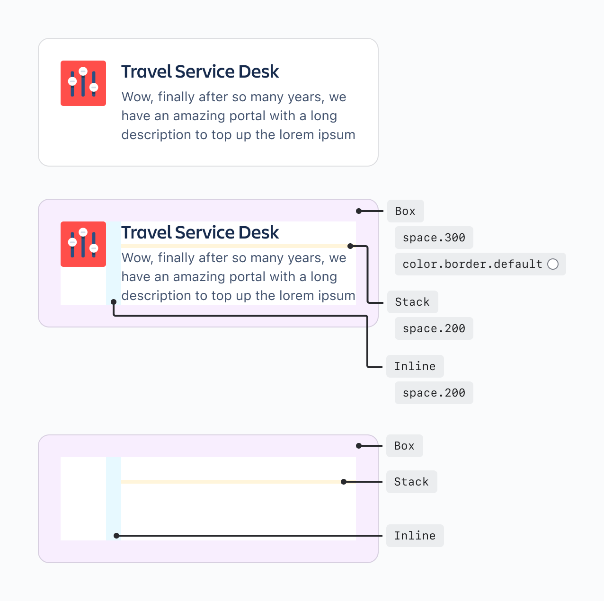
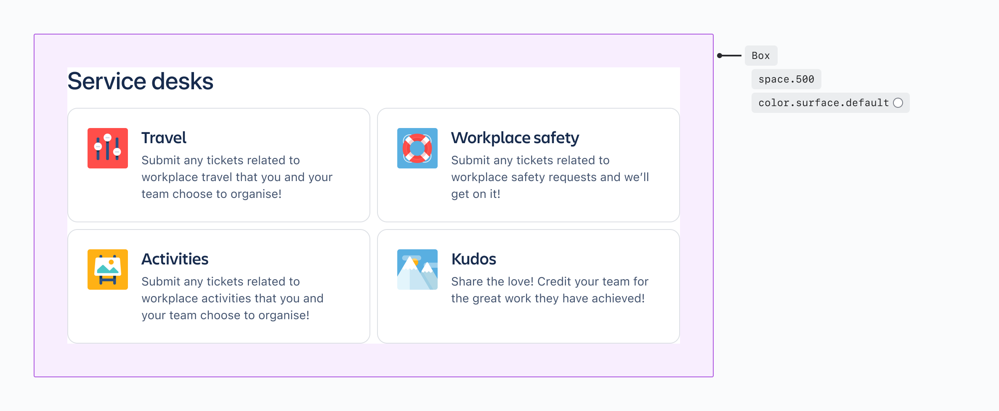
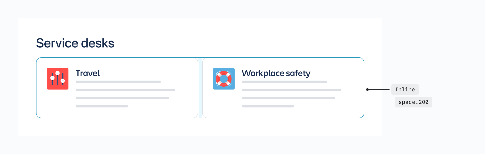
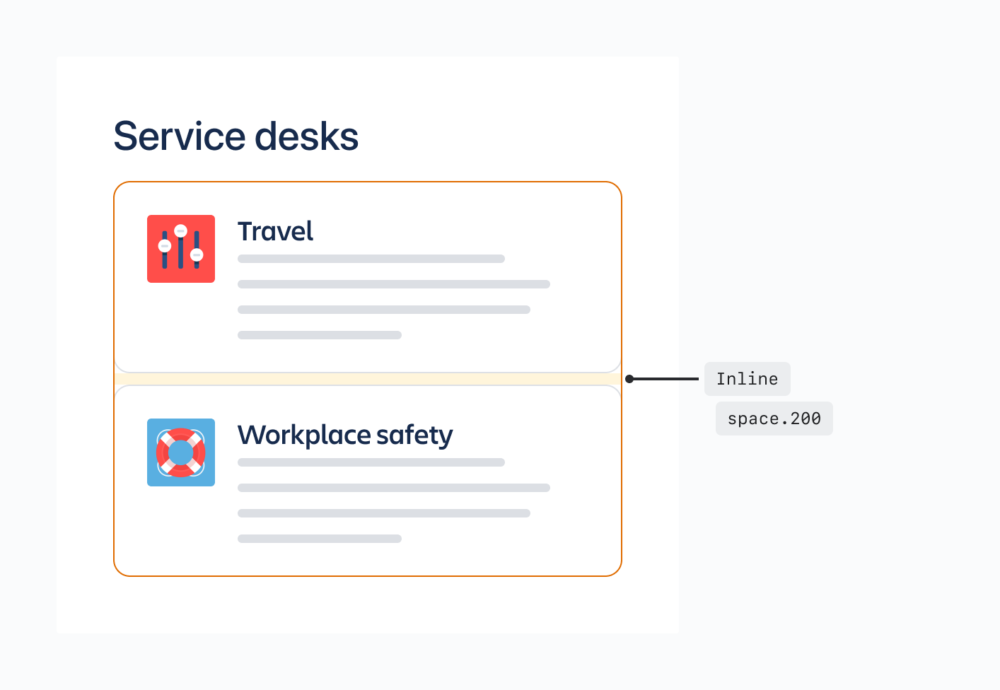

# Layout Primitives
Primitives are composable components that provide opinionated solutions to common design and layout problems.

Primitive components are a new type of component that assist with layout and the visual placement of child elements. They act as building blocks to compose different parts of the user experience, from the smallest design decisions (for example the spacing around an icon) to more complex layout decisions with multiple primitives used in conjunction (for example how a page is structured).

Primitives are designed to work hand in hand with design tokens, to provide opinionated solutions for common low-level design decisions, such as color choice or spacing between elements. They make it easier to implement our design tokens and best practices.

Primitive components are implemented in code, but it is important for designers to understand how they may be used in their designs. There are currently three primitives available for use, and each is responsible for a different layout behaviour.

## Box
A generic container with managed access to design tokens. Box is a flexible and fundamental building block for a UI, and can be the primary way to apply styling to its contents.

In the example below, a box encapsulates the card components and is used to set both the margin spacing, as well as the background color styling.

It’s important to note that a box could also be used for each of the cards themselves to apply further spacing and specific styling.

## Inline
A layout container that lays out child elements horizontally (inline with each other).

In the example below, an inline contains the card components and sets the horizontal spacing between them.

## Stack
A layout container that stacks child elements vertically.

In the example below, a stack is used to vertically divide the heading from the card components, and a second stack is used to vertically divide the card components, each with different spacing.

## Figma auto layout
For designers using Figma, auto layout is the tool of choice for creating responsive layouts. Auto Layout works by applying vertical or horizontal layouts to Frames. These Frames can then be nested and have specific spacing applied (using the `space between items` control in dimensions) in order to create more complex but flexible designs.

Primitives behave in very similar way to frames using Figma auto layout:

- A Box can be thought of as a frame through which specific styling can be applied to the contents, and the `horizontal padding` and `vertical padding` applied around it.
- An Inline can be thought of as a frame with `horizontal space between items` applied.
- A Stack can be thought of as a frame with `vertical space between items` applied.

When working in Figma a designer is combining the concept of a box as a container with either an inline or stack to create layouts. In code, these layers are represented separately, with a box often being an outer container with an inline or stack nested inside (with potentially more nested primitives inside).

Just as it’s very unlikely to use only a single Frame in your design, Primitives are designed to be used in conjunction with one another in order to fully represent more complex designs.

## Handover
Because primitive components are not surfaced in Figma, designers will not be using these components directly. However, it’s important for designers to understand how they work and how they might be used in code, as primitives will increase parity between components in designs and code.

The most useful way designers can help with the implementation of primitives is using Figma Auto Layout in their designs thoughtfully, and ensuring that designs use space tokens in their designs where possible.

## Related
- Implementing Primitive components in code
- Use box for a generic container with access to design tokens
- Manage horizontal layout using an inline component
- Manage vertical layout using a stack component
