# App typefaces and scale
Learn about our app typefaces and their scale considerations.

## Our typefaces
We use two typefaces, Atlassian Sans for headings and body copy and Atlassian Mono for all instances of code within our apps.

### Atlassian Sans
Atlassian Sans is our derivative of the Inter Variable typeface which streamlines the font to optimize for certain type features to create an app (product) typeface that compliments our brand font. We use this typeface for all UI in our apps other than instances where we are representing code.

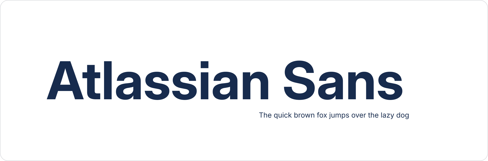

### OpenType features
We use a select set of type features to enhance legibility and readability of our UI. Most are used consistently but some are more case specific such as the slashed zero.

| Preview | Description | Notes |
| --- | --- | --- |
| 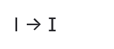 | Upper-case i with serif | Use always | |
|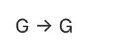 | Capital G with spur | Use always | |
| 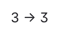 | Flat-top 3 | Use always | |
| 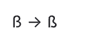 | Alternate German double s | Use always | |
| 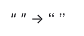 | Square punctuation and square quotes | Use always | |
| 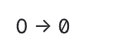 | Slashed zero | To be used selectively with data points | |
| 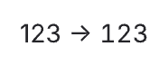 | Tabular figures | For use in tables and lists | |

### Atlassian Mono
Atlassian Mono is our derivative of the JetBrains Mono typeface which seamlessly integrates with Atlassian Sans. We use this typeface for all instances of code in our apps.

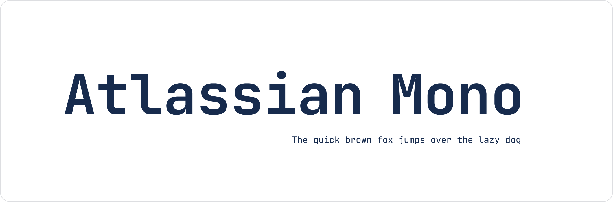

#### OpenType features
We are using specific type settings that enhance the usability and clarity of this font when applied in real-world scenarios.

| Preview | Description | Notes |
| --- | --- | --- |
| Slashed zero | Use always | |
| Ligatures | Do not use | |

## Scale

### Typescale
We use a minor third type scale for our typography system. Sizes scale up or down by a factor of 1.2 rounded to the nearest multiple of 4 and are formed around a base rem unit of 16px.

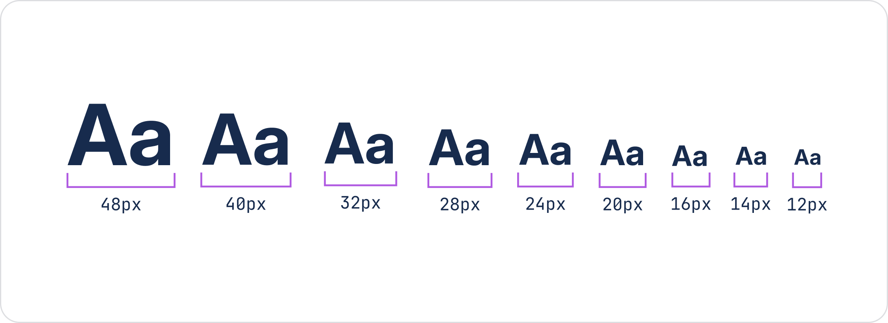

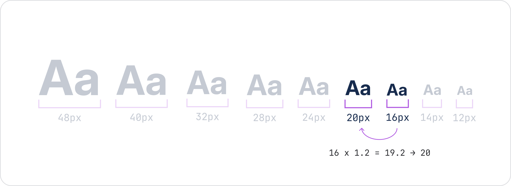

### Line height
To determine line heights in headings, we multiply the font sizes by ~1.2 times and for body ~1.5 times. These are also rounded to the nearest multiple of 4 to align with other foundations like spacing and iconography.

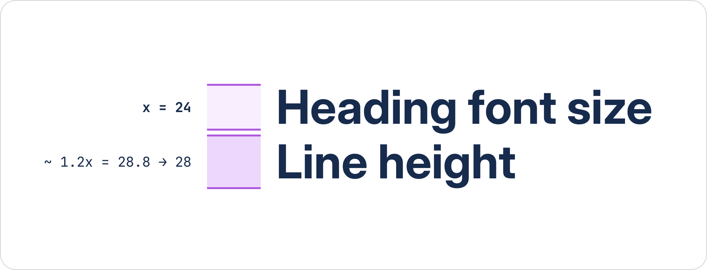

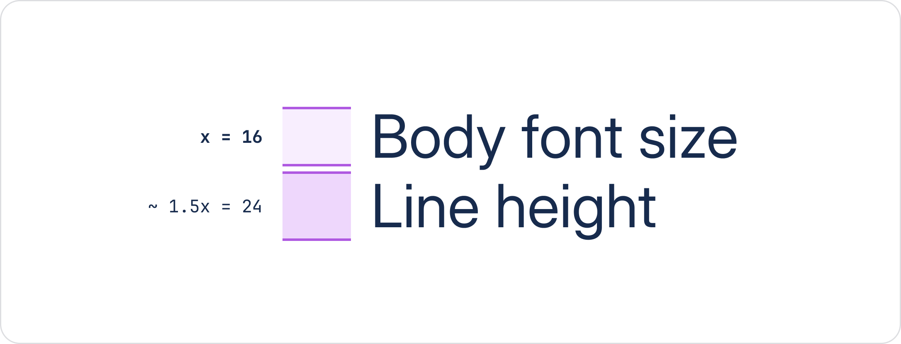
