# Typography
Typography is our system of fonts and text styles. It enhances communication, reinforces brand, and guides users' emotions.

## Overview
We have moved our app suite to a refreshed typography system. Using our app (product) typefaces, Atlassian Sans and Atlassian Mono, will create a consistent experience across all browsers. As apps move to this system, we provide support to help transition smoothly between systems.

## Typographic principles
Follow these principles to create legible and visually balanced typography. Use in conjunction with the Atlassian color tokens and space tokens in app experiences.

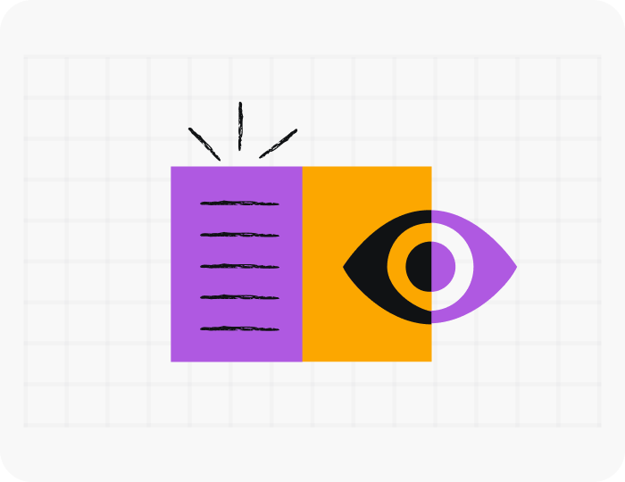
#### Optimize for readability
Help readers understand communications easily and enhance their experience, regardless of their abilities.

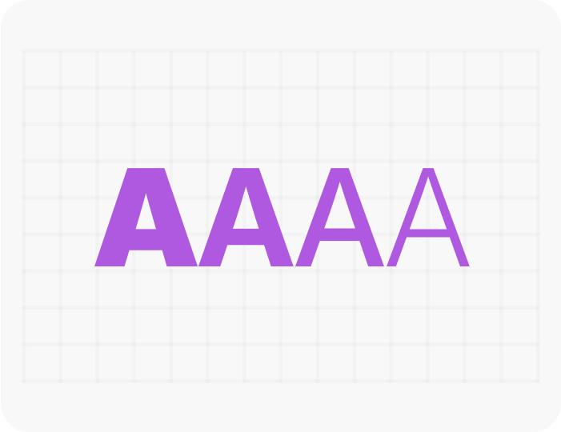
#### Create visual harmony
Typography should be consistent and cohesive. Use visual hierarchy and space to simplify complex information.

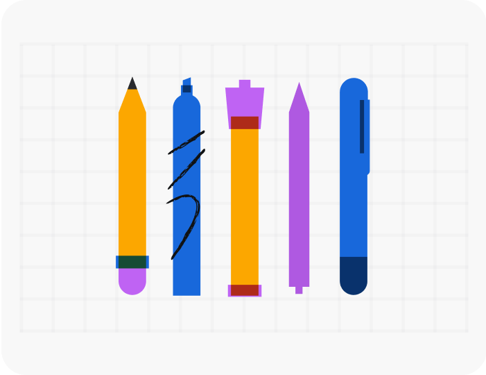
#### Contextualize for different users
Tailor for different preferences, operating systems and applications, while keeping in mind how people consume and process information.

## Brand fonts
When you need to express the Atlassian brand, such as in marketing, we use our custom brand font, Charlie Sans. Only authenticated users can download our brand fonts.

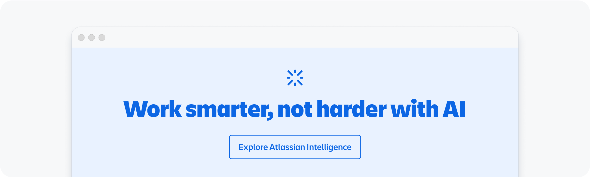

## App fonts
For all in-app experiences, we use our Atlassian fonts, Atlassian Sans and Atlassian Mono. This ensures the UI is optimized, performs well and is frictionless as you move between Atlassian apps and experiences regardless of platform. For apps not yet using our refreshed system, we use system fonts via our modernized or legacy systems.

All app fonts are available for download in Atlassian Mosaic in TTF format.

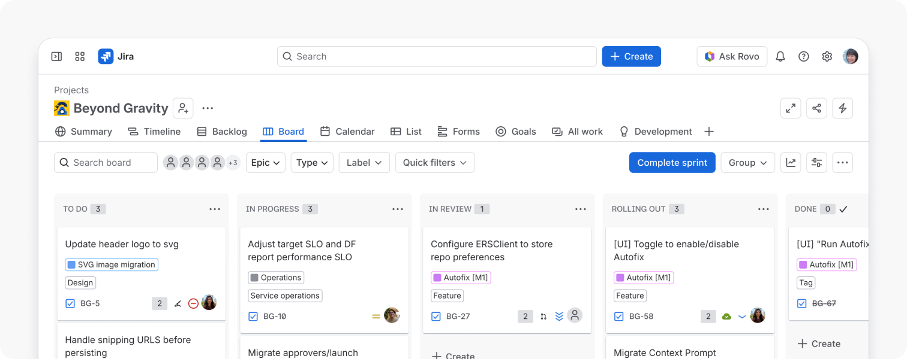

## Text styles and tokens
Text styles and typography tokens are made up of specific font values, including font family, font size, and line height. Where text styles appear in design and Figma, typography tokens are used in code.

Use heading, body and code text styles and tokens in your designs. Each style has optimized spacing values based on font size, and is designed to work with our other foundations such as spacing and color. These typographic decisions are built into typography tokens and will enable typography theming in the future.

We also recommend using heading and text components in code to simplify implementation of typography tokens.

Learn more about applying typography tokens and text styles.

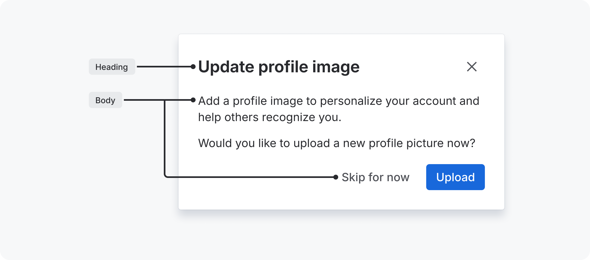

### Rem units in tokens
Typography tokens use rem units instead of pixel values for font-size and line-heights. Font size is calculated dynamically by multiplying the rem unit with the browser default size of 16px (i.e. 1rem is equal to 16px).

Unlike pixels which are absolute (or fixed), rem are relative units that adjust according to the root element (html) size. Using rem units allow users to adjust the size of text depending on their needs or browser size, improving the responsiveness and accessibility of designs.

### Heading
Use headings for page titles or subheadings to introduce content. Headings are sized to contrast with content, increase visual hierarchy, and help readers easily understand the structure of content.

Headings should be used to introduce a new section of content. Use heading styles, rather than bold or a change of font size, as they’re important for accessibility.

Heading levels help users navigate a page, especially users of screen readers and other assistive technology. Using the right heading levels also helps to group content so it’s easier to scan.

Heading levels (`<h1>` to `<h6>`) should be used in a descending sequence. Only use one h1 per page (usually the page title) and don’t skip a level (for example, use an h2 then an h4).

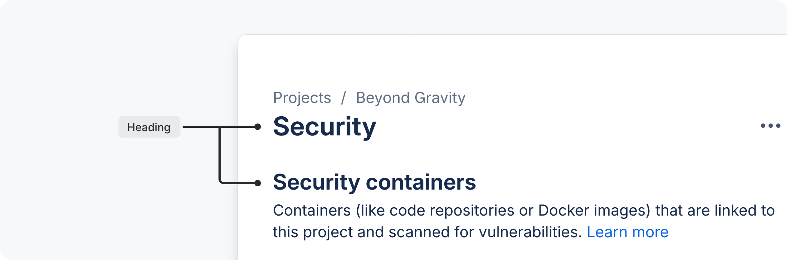

Headings come in a range of sizes, for use in different contexts:

- XXL and XL are suitable for brand and marketing content.
- XL and L are suitable for page titles in apps such as a form title.
- M can be used in large components where space is not limited and perfectly balances with Body M, such as modals.
- S and XS are for titles in small components where space is limited, such as flags.
- XXS should be used sparingly and is suitable when matched with Body S, for example, in fine print.

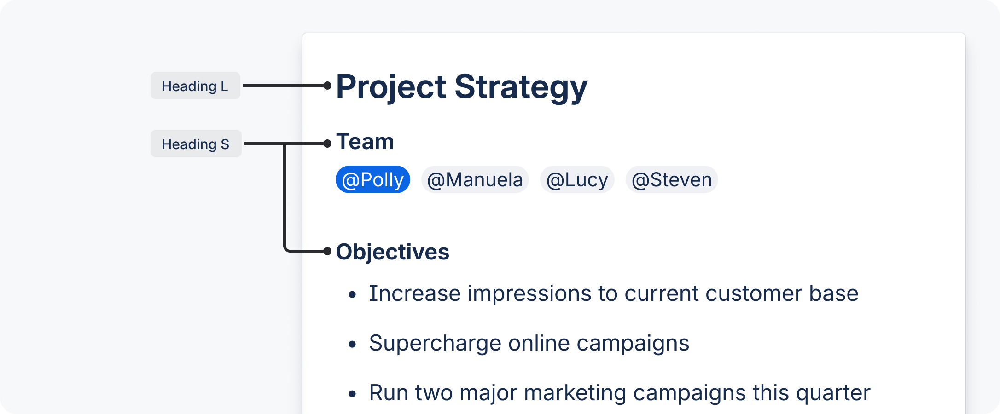

| Preview | Token | Font weight | Font size | Line height |
| --- | --- | --- | --- | --- |
| Aa | `font.heading.xxlarge` | Bold | 2 rem / 32 px | 2.25 rem / 36 px |
| Aa | `font.heading.xlarge` | Bold | 1.75 rem / 28 px | 2 rem / 32 px |
| Aa | `font.heading.large` | Bold | 1.5 rem / 24 px | 1.75 rem / 28 px |
| Aa | `font.heading.medium` | Bold | 1.25 rem / 20 px | 1.5 rem / 24 px |
| Aa | `font.heading.small` | Bold | 1 rem / 16 px | 1.25 rem / 20 px |
| Aa | `font.heading.xsmall` | Bold | 0.875 rem / 14 px | 1.25 rem / 20 px |
| Aa | `font.heading.xxsmall` | Bold | 0.75 rem / 12 px | 1 rem / 16 px |

### Body
Use body text for main content. They typically appear after headings or subheadings as detailed descriptions and messages, but also as standalone text in components. Body text includes additional paragraph spacing for readability and flow in blocks of text.

Body text comes in three sizes, for use in different contexts:

- Body L is the default size for long-form content. Use this size for a comfortable reading experience such as in blogs.
- Body M (Default) is the default size in components or where space is limited, for detailed or descriptive content such as primary descriptions in flags.
- Body S should be used sparingly and is for secondary level content such as fine print or semantic messaging.

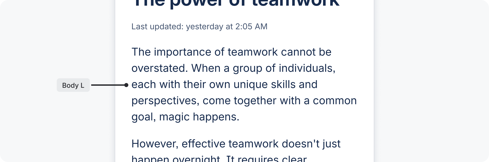
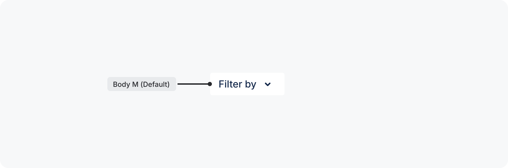
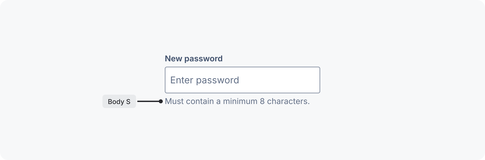

| Preview | Token | Font weight | Font size | Line height | Paragraph spacing* |
| --- | --- | --- | --- | --- | --- |
| Aa | `font.body.large` | Regular | 1 rem / 16 px | 1.5 rem / 24 px | 1 rem / 16 px |
| Aa | `font.body` | Regular | 0.875 rem / 14 px | 1.25 rem / 20 px | 0.75 rem / 12 px |
| Aa | `font.body.small` | Regular | 0.75 rem / 12 px | 1 rem / 16 px | 0.5 rem / 8 px |

* See paragraph spacing below.

#### Paragraph spacing
Paragraph spacing is set in Figma text style libraries only. To represent paragraphs in code, use separate text components for each paragraph and manage paragraph spacing with the stack component.

#### Body font weight
Font weight is applied through the choice of text style in Figma, or through font weight tokens in code. Three weights are available for body text:

- **Regular** weight is for generic paragraphs to contrast with headings, and medium text in components.
- **Medium** weight is for alignment with iconography. Use this weight in most components and whenever text could be seen beside line icons.
- **Bold** weight is for unique cases where text needs to be differentiated or given more emphasis. Use this weight sparingly.

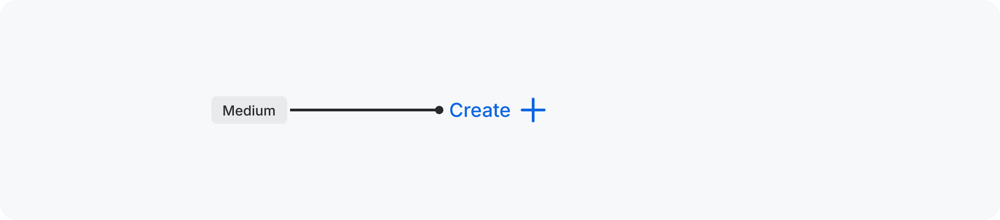
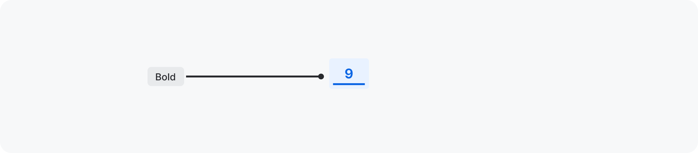

### Metric
Use metric when you want to emphasize certain numbers. Understand when to use this style, with our do and don’t examples.

Metric style do and don't examples

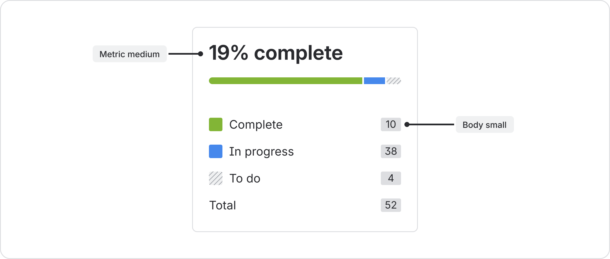
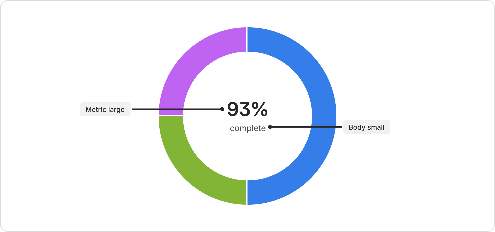

| Preview | Token | Font weight | Font size | Line height |
| --- | --- | --- | --- | --- |
| Aa | `font.metric.large` | Bold | 1.75 rem / 28 px | 2 rem / 32 px |
| Aa | `font.metric.medium` | Bold | 1.5 rem / 24 px | 1.75 rem / 28 px |
| Aa | `font.metric.small` | Bold | 1 rem / 16 px | 1.25 rem / 20 px |

### Code
The code text style is reserved for representing code in our code block component.

| Preview | Token | Font weight | Font size | Line height |
| --- | --- | --- | --- | --- |
| Aa | `font.code` | Regular | 12 px | 20 px |

Code can also appear inline following the style settings of the block of text it sits within. In this context, this token is relative to its container's font size. Assuming a container font size of 14 px (0.875 rem), this token will have a font size of 12.25 px. The line height is equal to the font size.
